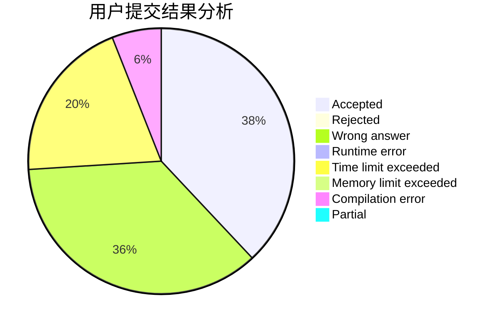
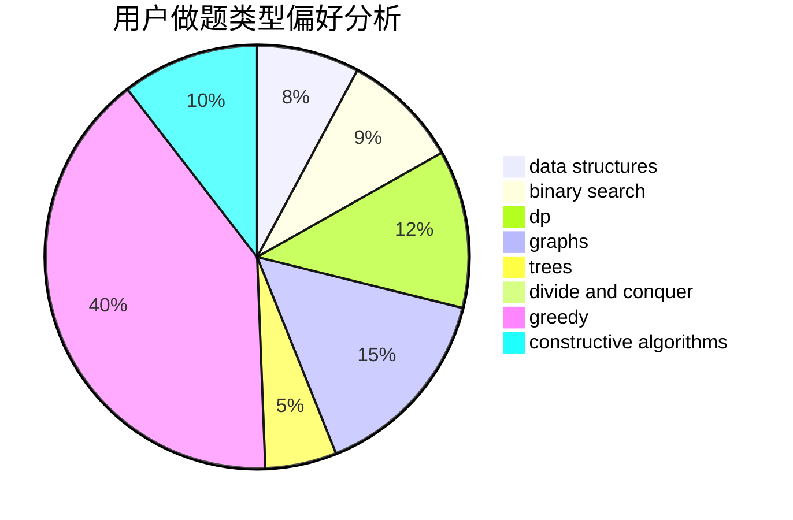
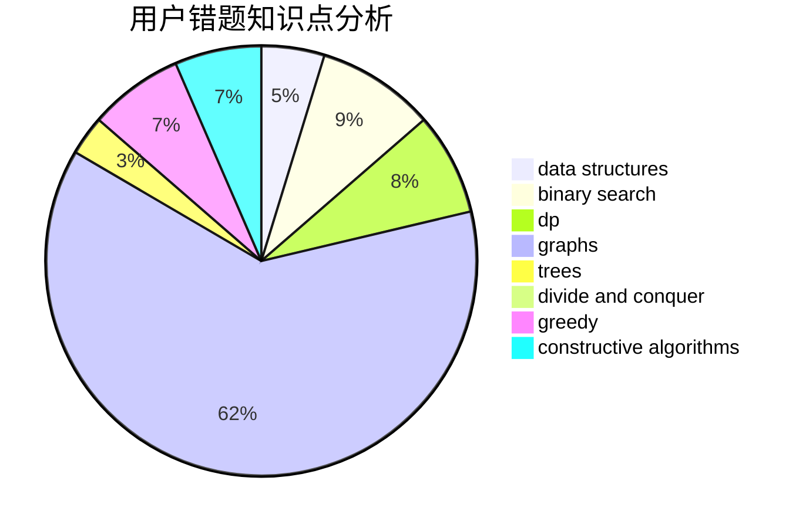

# panjinhua

<!-- tabs:start -->

#### **用户提交结果分析**

#### **用户做题类型偏好分析**

#### **用户错题知识点分析**

<!-- tabs:end -->
# 推荐题目
[1361B](https://codeforces.com/contest/1361/problem/B)		greedy,
                        implementation,
                        math,
                        sortings		  
[1461B](https://codeforces.com/contest/1461/problem/B)		brute force,
                        dp,
                        implementation		  
[686C](https://codeforces.com/contest/686/problem/C)		dsu,graphs,sortings,trees		  
[1107F](https://codeforces.com/contest/1107/problem/F)		dp,
                        flows,
                        graph matchings,
                        graphs,
                        sortings		  
[1367E](https://codeforces.com/contest/1367/problem/E)		brute force,
                        dfs and similar,
                        dp,
                        graphs,
                        greedy,
                        number theory		  
[1270E](https://codeforces.com/contest/1270/problem/E)		constructive algorithms,
                        geometry,
                        math		  
[469A](https://codeforces.com/contest/469/problem/A)		greedy,
                        implementation		  
[297D](https://codeforces.com/contest/297/problem/D)		constructive algorithms		  
[543B](https://codeforces.com/contest/543/problem/B)		constructive algorithms,
                        graphs,
                        shortest paths		  
[1184E3](https://codeforces.com/contest/1184E/problem/3)		data structures,
                        dsu,
                        graphs,
                        trees		  
