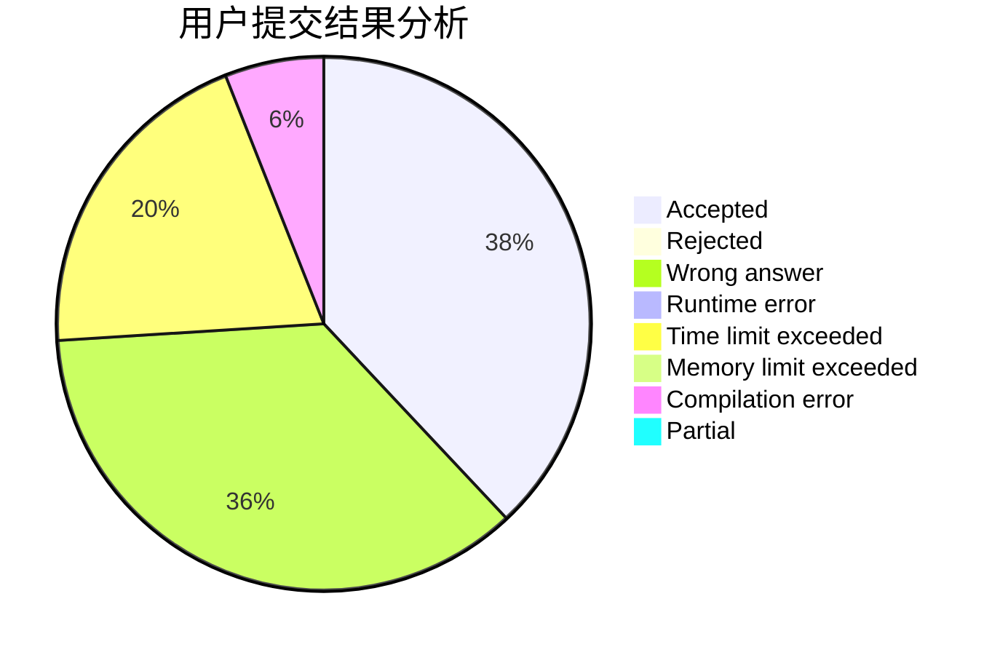
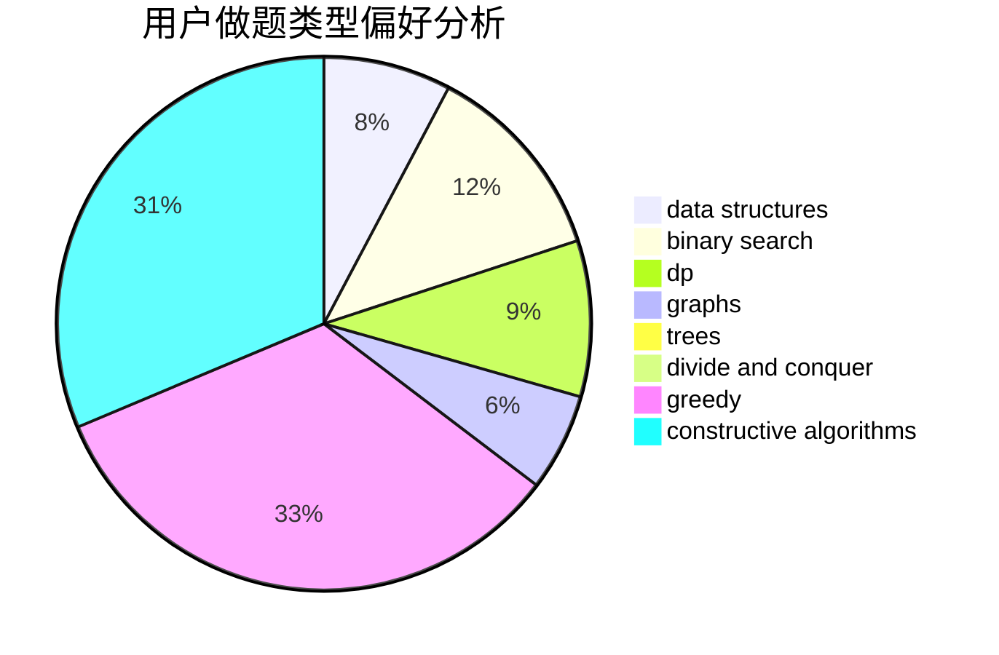
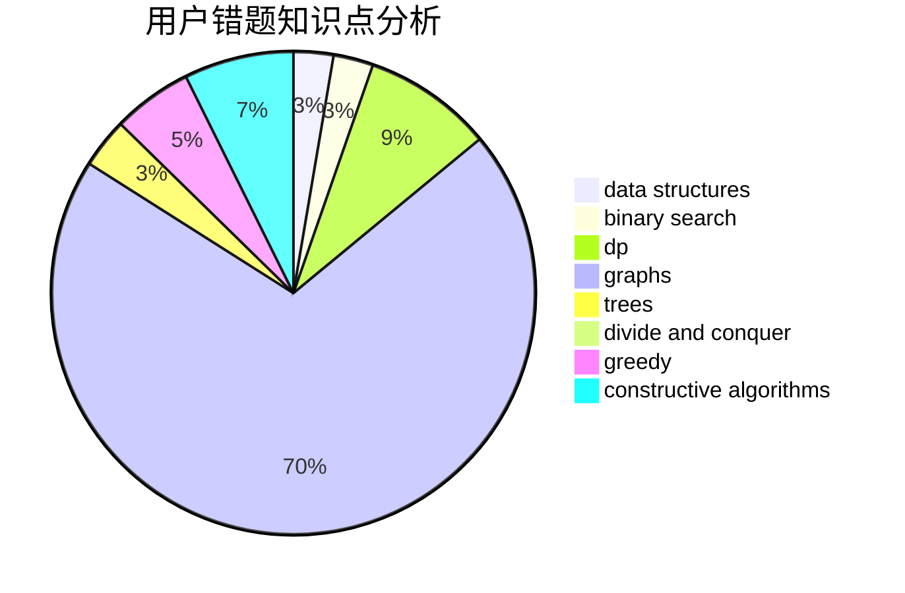

# panjinhua

<!-- tabs:start -->

#### **用户提交结果分析**

#### **用户做题类型偏好分析**

#### **用户错题知识点分析**

<!-- tabs:end -->
# 推荐题目
[1369B](https://codeforces.com/contest/1369/problem/B)		greedy,
                        implementation,
                        strings		  
[1468L](https://codeforces.com/contest/1468/problem/L)		binary search,
                        greedy,
                        math,
                        number theory		  
[708C](https://codeforces.com/contest/708/problem/C)		data structures,
                        dfs and similar,
                        dp,
                        graphs,
                        greedy,
                        trees		  
[1108A](https://codeforces.com/contest/1108/problem/A)		implementation		  
[1374B](https://codeforces.com/contest/1374/problem/B)		math		  
[1279E](https://codeforces.com/contest/1279/problem/E)		combinatorics,
                        dp		  
[489B](https://codeforces.com/contest/489/problem/B)		dfs and similar,
                        dp,
                        graph matchings,
                        greedy,
                        sortings,
                        two pointers		  
[314C](https://codeforces.com/contest/314/problem/C)		data structures,
                        dp		  
[567D](https://codeforces.com/contest/567/problem/D)		binary search,
                        data structures,
                        greedy,
                        sortings		  
[1188E](https://codeforces.com/contest/1188/problem/E)		combinatorics		  
