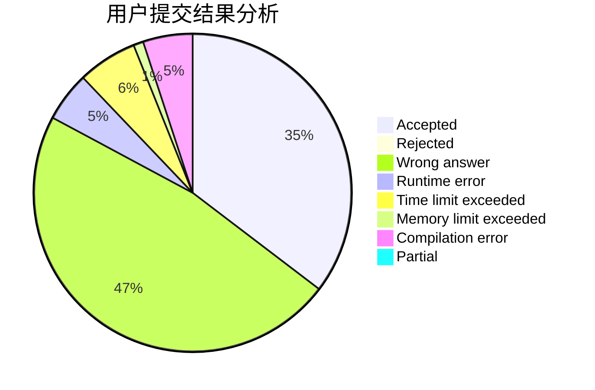
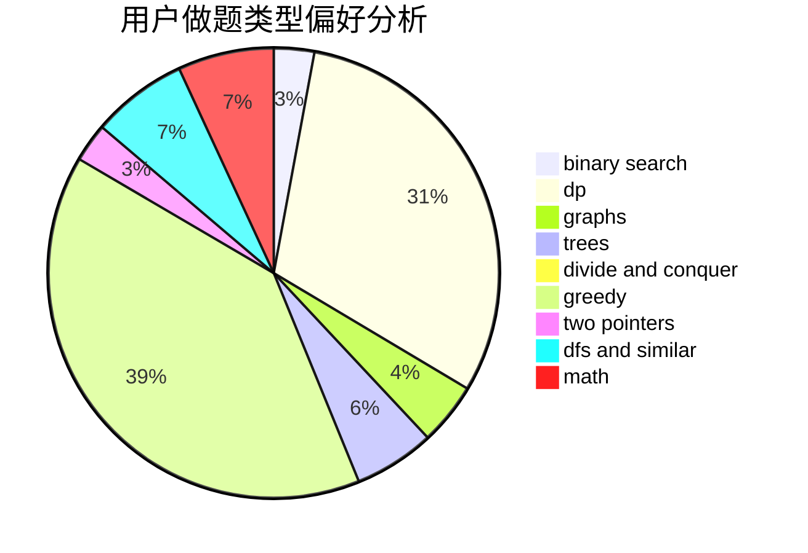

# panmotian_2018

<!-- tabs:start -->

#### **用户提交结果分析**

#### **用户做题类型偏好分析**

<!-- tabs:end -->
# 推荐题目
[959B](https://codeforces.com/contest/959/problem/B)
[1396C](https://codeforces.com/contest/1396/problem/C)
[266B](https://codeforces.com/contest/266/problem/B)
[1415E](https://codeforces.com/contest/1415/problem/E)
[313E](https://codeforces.com/contest/313/problem/E)
[1290F](https://codeforces.com/contest/1290/problem/F)
[788D](https://codeforces.com/contest/788/problem/D)
[268A](https://codeforces.com/contest/268/problem/A)
[896A](https://codeforces.com/contest/896/problem/A)
[909A](https://codeforces.com/contest/909/problem/A)
