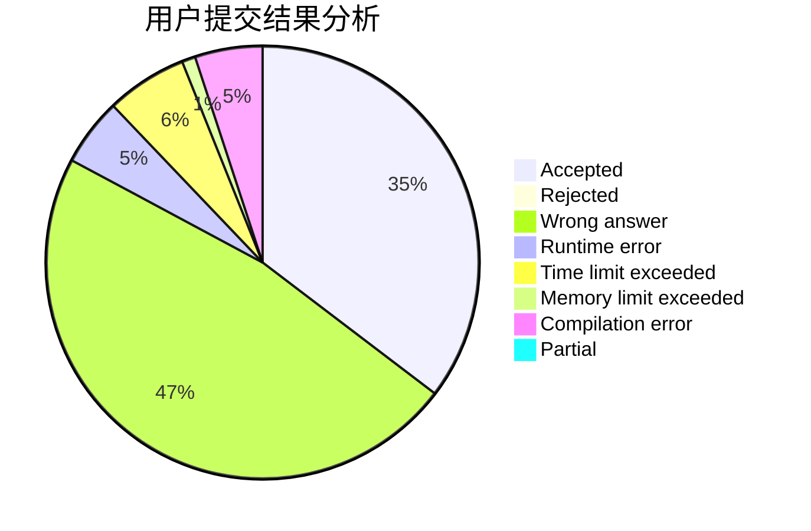
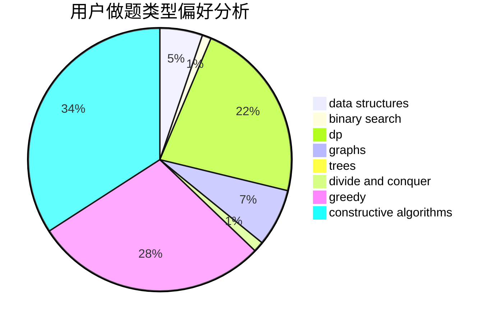
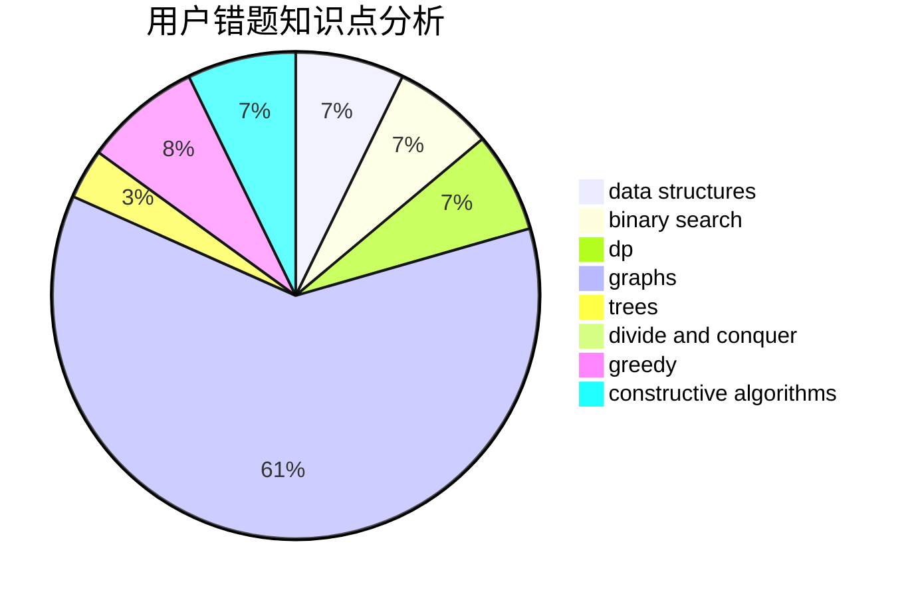

# panmotian_2018
<!-- tabs:start -->
#### **用户提交结果分析**

#### **用户做题类型偏好分析**

#### **用户错题知识点分析**

<!-- tabs:end -->
# 推荐题目
[Nastya and Scoreboard](http://codeforces.com/problemset/problem/1340/B)		bitmasks,
                        dp,
                        graphs,
                        greedy		  
[Tanya and Stairways](http://codeforces.com/problemset/problem/1005/A)		implementation		  
[New York Hotel](http://codeforces.com/problemset/problem/491/B)		greedy,
                        math		  
[A pile of stones](http://codeforces.com/problemset/problem/1159/A)		implementation,
                        math		  
[The Same Calendar](http://codeforces.com/problemset/problem/678/B)		implementation		  
[Dominoes](http://codeforces.com/problemset/problem/394/C)		constructive algorithms,
                        greedy		  
[Set of Points](http://codeforces.com/problemset/problem/277/B)		constructive algorithms,
                        geometry		  
[Command Line Arguments](http://codeforces.com/problemset/problem/291/B)		*special problem,
                        implementation,
                        strings		  
[Game of Stones](http://codeforces.com/problemset/problem/768/E)		bitmasks,
                        dp,
                        games		  
[Fox and Number Game](http://codeforces.com/problemset/problem/389/A)		greedy,
                        math		  
<!-- tabs:start -->
#### **data structures**
[Nastya and Scoreboard](http://codeforces.com/problemset/problem/847/B)		binary search,
                        data structures		  
[Tanya and Stairways](http://codeforces.com/problemset/problem/527/D)		data structures,
                        dp,
                        greedy,
                        implementation,
                        sortings		  
[New York Hotel](http://codeforces.com/problemset/problem/802/O)		binary search,
                        data structures,
                        flows		  
[A pile of stones](http://codeforces.com/problemset/problem/685/B)		data structures,
                        dfs and similar,
                        dp,
                        trees		  
[The Same Calendar](http://codeforces.com/problemset/problem/1260/F)		data structures,
                        trees		  
[Dominoes](http://codeforces.com/problemset/problem/246/E)		binary search,
                        data structures,
                        dfs and similar,
                        dp,
                        sortings		  
[Set of Points](http://codeforces.com/problemset/problem/1493/D)		brute force,
                        data structures,
                        hashing,
                        implementation,
                        math,
                        number theory,
                        sortings,
                        two pointers		  
[Command Line Arguments](http://codeforces.com/problemset/problem/1404/C)		binary search,
                        constructive algorithms,
                        data structures,
                        greedy,
                        two pointers		  
[Game of Stones](http://codeforces.com/problemset/problem/1386/B)		*special problem,
                        data structures,
                        geometry,
                        math,
                        sortings		  
[Fox and Number Game](http://codeforces.com/problemset/problem/1442/D)		data structures,
                        divide and conquer,
                        dp,
                        greedy		  
#### **binary search**
[Nastya and Scoreboard](http://codeforces.com/problemset/problem/847/B)		binary search,
                        data structures		  
[Tanya and Stairways](http://codeforces.com/problemset/problem/802/O)		binary search,
                        data structures,
                        flows		  
[New York Hotel](http://codeforces.com/problemset/problem/216/D)		binary search,
                        sortings,
                        two pointers		  
[A pile of stones](http://codeforces.com/problemset/problem/246/E)		binary search,
                        data structures,
                        dfs and similar,
                        dp,
                        sortings		  
[The Same Calendar](http://codeforces.com/problemset/problem/1404/C)		binary search,
                        constructive algorithms,
                        data structures,
                        greedy,
                        two pointers		  
[Dominoes](http://codeforces.com/problemset/problem/1492/C)		binary search,
                        data structures,
                        dp,
                        greedy,
                        two pointers		  
[Set of Points](http://codeforces.com/problemset/problem/1463/D)		binary search,
                        constructive algorithms,
                        greedy,
                        two pointers		  
[Command Line Arguments](http://codeforces.com/problemset/problem/1490/G)		binary search,
                        data structures,
                        math		  
[Game of Stones](http://codeforces.com/problemset/problem/1479/D)		binary search,
                        bitmasks,
                        brute force,
                        data structures,
                        probabilities,
                        trees		  
[Fox and Number Game](http://codeforces.com/problemset/problem/1436/E)		binary search,
                        data structures,
                        two pointers		  
#### **dp**
[Nastya and Scoreboard](http://codeforces.com/problemset/problem/1340/B)		bitmasks,
                        dp,
                        graphs,
                        greedy		  
[Tanya and Stairways](http://codeforces.com/problemset/problem/768/E)		bitmasks,
                        dp,
                        games		  
[New York Hotel](http://codeforces.com/problemset/problem/429/B)		dp		  
[A pile of stones](http://codeforces.com/problemset/problem/245/H)		dp,
                        hashing,
                        strings		  
[The Same Calendar](http://codeforces.com/problemset/problem/431/C)		dp,
                        implementation,
                        trees		  
[Dominoes](http://codeforces.com/problemset/problem/527/D)		data structures,
                        dp,
                        greedy,
                        implementation,
                        sortings		  
[Set of Points](http://codeforces.com/problemset/problem/917/C)		combinatorics,
                        dp,
                        matrices		  
[Command Line Arguments](http://codeforces.com/problemset/problem/626/F)		dp		  
[Game of Stones](http://codeforces.com/problemset/problem/685/B)		data structures,
                        dfs and similar,
                        dp,
                        trees		  
[Fox and Number Game](http://codeforces.com/problemset/problem/1393/E1)		dp,
                        hashing,
                        implementation,
                        string suffix structures,
                        strings		  
#### **graph**
[Nastya and Scoreboard](http://codeforces.com/problemset/problem/1340/B)		bitmasks,
                        dp,
                        graphs,
                        greedy		  
[Tanya and Stairways](http://codeforces.com/problemset/problem/875/F)		dsu,
                        graphs,
                        greedy		  
[New York Hotel](http://codeforces.com/problemset/problem/505/B)		dfs and similar,
                        dp,
                        dsu,
                        graphs		  
[A pile of stones](http://codeforces.com/problemset/problem/1472/C)		dp,
                        graphs		  
[The Same Calendar](http://codeforces.com/problemset/problem/893/C)		dfs and similar,
                        graphs,
                        greedy		  
[Dominoes](http://codeforces.com/problemset/problem/1133/F1)		graphs		  
[Set of Points](http://codeforces.com/problemset/problem/1487/C)		brute force,
                        constructive algorithms,
                        dfs and similar,
                        graphs,
                        greedy,
                        implementation,
                        math		  
[Command Line Arguments](http://codeforces.com/problemset/problem/1437/C)		dp,
                        flows,
                        graph matchings,
                        greedy,
                        math,
                        sortings		  
[Game of Stones](http://codeforces.com/problemset/problem/1470/D)		constructive algorithms,
                        dfs and similar,
                        graph matchings,
                        graphs,
                        greedy		  
[Fox and Number Game](http://codeforces.com/problemset/problem/1476/C)		dp,
                        graphs,
                        greedy		  
#### **trees**
[Nastya and Scoreboard](http://codeforces.com/problemset/problem/431/C)		dp,
                        implementation,
                        trees		  
[Tanya and Stairways](http://codeforces.com/problemset/problem/685/B)		data structures,
                        dfs and similar,
                        dp,
                        trees		  
[New York Hotel](http://codeforces.com/problemset/problem/1260/F)		data structures,
                        trees		  
[A pile of stones](http://codeforces.com/problemset/problem/1283/F)		constructive algorithms,
                        greedy,
                        trees		  
[The Same Calendar](http://codeforces.com/problemset/problem/1479/D)		binary search,
                        bitmasks,
                        brute force,
                        data structures,
                        probabilities,
                        trees		  
[Dominoes](http://codeforces.com/problemset/problem/1511/C)		brute force,
                        data structures,
                        implementation,
                        trees		  
[Set of Points](http://codeforces.com/problemset/problem/1499/F)		combinatorics,
                        dfs and similar,
                        dp,
                        trees		  
[Command Line Arguments](http://codeforces.com/problemset/problem/1491/E)		brute force,
                        dfs and similar,
                        divide and conquer,
                        number theory,
                        trees		  
[Game of Stones](http://codeforces.com/problemset/problem/1466/D)		data structures,
                        greedy,
                        sortings,
                        trees		  
[Fox and Number Game](http://codeforces.com/problemset/problem/1495/D)		combinatorics,
                        dfs and similar,
                        graphs,
                        math,
                        shortest paths,
                        trees		  
#### **divide and conquer**
[Nastya and Scoreboard](http://codeforces.com/problemset/problem/1442/D)		data structures,
                        divide and conquer,
                        dp,
                        greedy		  
[Tanya and Stairways](http://codeforces.com/problemset/problem/1461/D)		binary search,
                        brute force,
                        data structures,
                        divide and conquer,
                        implementation,
                        sortings		  
[New York Hotel](http://codeforces.com/problemset/problem/1466/G)		combinatorics,
                        divide and conquer,
                        hashing,
                        math,
                        string suffix structures,
                        strings		  
[A pile of stones](http://codeforces.com/problemset/problem/1490/D)		dfs and similar,
                        divide and conquer,
                        implementation		  
[The Same Calendar](https://codeforces.com/contest/1483/problem/C)		data structures,
                        divide and conquer,
                        dp		  
[Dominoes](http://codeforces.com/problemset/problem/1491/E)		brute force,
                        dfs and similar,
                        divide and conquer,
                        number theory,
                        trees		  
[Set of Points](http://codeforces.com/problemset/problem/1303/G)		data structures,
                        divide and conquer,
                        geometry,
                        trees		  
[Command Line Arguments](http://codeforces.com/problemset/problem/1494/D)		constructive algorithms,
                        data structures,
                        dfs and similar,
                        divide and conquer,
                        dsu,
                        greedy,
                        sortings,
                        trees		  
[Game of Stones](http://codeforces.com/problemset/problem/1482/E)		data structures,
                        divide and conquer,
                        dp		  
[Fox and Number Game](http://codeforces.com/problemset/problem/566/C)		dfs and similar,
                        divide and conquer,
                        trees		  
#### **greedy**
[Nastya and Scoreboard](http://codeforces.com/problemset/problem/1340/B)		bitmasks,
                        dp,
                        graphs,
                        greedy		  
[Tanya and Stairways](http://codeforces.com/problemset/problem/491/B)		greedy,
                        math		  
[New York Hotel](http://codeforces.com/problemset/problem/394/C)		constructive algorithms,
                        greedy		  
[A pile of stones](http://codeforces.com/problemset/problem/389/A)		greedy,
                        math		  
[The Same Calendar](http://codeforces.com/problemset/problem/891/B)		constructive algorithms,
                        greedy		  
[Dominoes](http://codeforces.com/problemset/problem/527/D)		data structures,
                        dp,
                        greedy,
                        implementation,
                        sortings		  
[Set of Points](http://codeforces.com/problemset/problem/1156/B)		dfs and similar,
                        greedy,
                        implementation,
                        sortings,
                        strings		  
[Command Line Arguments](http://codeforces.com/problemset/problem/875/F)		dsu,
                        graphs,
                        greedy		  
[Game of Stones](http://codeforces.com/problemset/problem/1283/F)		constructive algorithms,
                        greedy,
                        trees		  
[Fox and Number Game](http://codeforces.com/problemset/problem/1231/C)		greedy		  
#### **constructive algorithms**
[Nastya and Scoreboard](http://codeforces.com/problemset/problem/394/C)		constructive algorithms,
                        greedy		  
[Tanya and Stairways](http://codeforces.com/problemset/problem/277/B)		constructive algorithms,
                        geometry		  
[New York Hotel](http://codeforces.com/problemset/problem/297/A)		constructive algorithms		  
[A pile of stones](http://codeforces.com/problemset/problem/891/B)		constructive algorithms,
                        greedy		  
[The Same Calendar](http://codeforces.com/problemset/problem/1333/E)		brute force,
                        constructive algorithms		  
[Dominoes](http://codeforces.com/problemset/problem/638/A)		*special problem,
                        constructive algorithms,
                        math		  
[Set of Points](http://codeforces.com/problemset/problem/1283/F)		constructive algorithms,
                        greedy,
                        trees		  
[Command Line Arguments](http://codeforces.com/problemset/problem/894/C)		constructive algorithms,
                        math		  
[Game of Stones](http://codeforces.com/problemset/problem/1404/C)		binary search,
                        constructive algorithms,
                        data structures,
                        greedy,
                        two pointers		  
[Fox and Number Game](http://codeforces.com/problemset/problem/1148/C)		constructive algorithms,
                        sortings		  
#### **sortings**
[Nastya and Scoreboard](http://codeforces.com/problemset/problem/527/D)		data structures,
                        dp,
                        greedy,
                        implementation,
                        sortings		  
[Tanya and Stairways](http://codeforces.com/problemset/problem/1156/B)		dfs and similar,
                        greedy,
                        implementation,
                        sortings,
                        strings		  
[New York Hotel](http://codeforces.com/problemset/problem/216/D)		binary search,
                        sortings,
                        two pointers		  
[A pile of stones](http://codeforces.com/problemset/problem/246/E)		binary search,
                        data structures,
                        dfs and similar,
                        dp,
                        sortings		  
[The Same Calendar](http://codeforces.com/problemset/problem/1493/D)		brute force,
                        data structures,
                        hashing,
                        implementation,
                        math,
                        number theory,
                        sortings,
                        two pointers		  
[Dominoes](http://codeforces.com/problemset/problem/937/A)		implementation,
                        sortings		  
[Set of Points](http://codeforces.com/problemset/problem/1148/C)		constructive algorithms,
                        sortings		  
[Command Line Arguments](http://codeforces.com/problemset/problem/1386/B)		*special problem,
                        data structures,
                        geometry,
                        math,
                        sortings		  
[Game of Stones](https://codeforces.com/contest/1496/problem/C)		geometry,
                        greedy,
                        math,
                        sortings		  
[Fox and Number Game](http://codeforces.com/problemset/problem/1495/A)		geometry,
                        greedy,
                        math,
                        sortings		  
<!-- tabs:end -->
