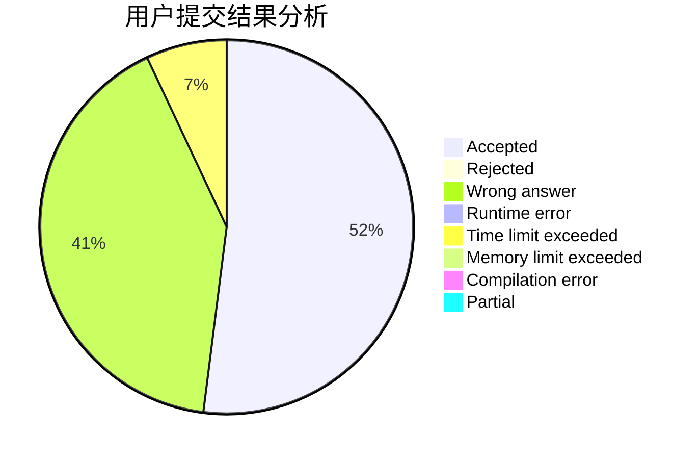
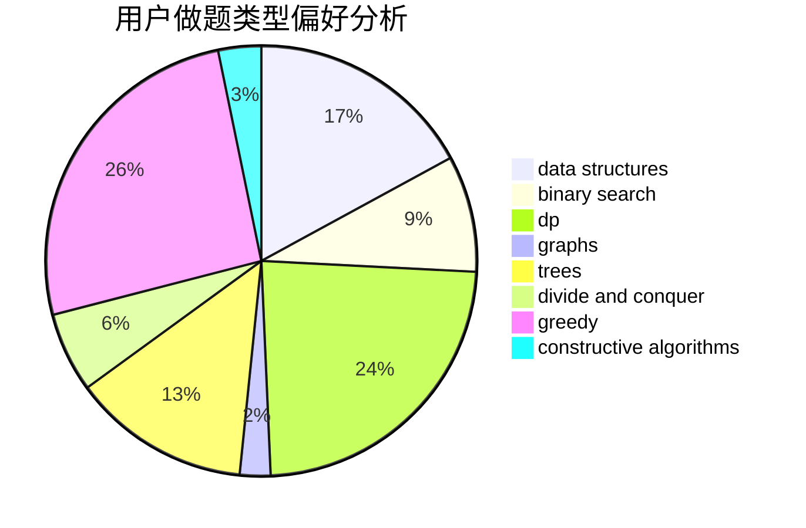
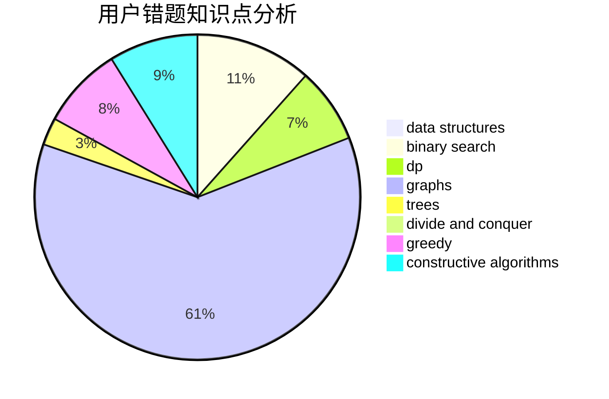

# panole

<!-- tabs:start -->

#### **用户提交结果分析**

#### **用户做题类型偏好分析**

#### **用户错题知识点分析**

<!-- tabs:end -->
# 推荐题目
[803D](https://codeforces.com/contest/803/problem/D)		binary search,
                        greedy		  
[736B](https://codeforces.com/contest/736/problem/B)		dsu,graphs,sortings,trees		  
[828C](https://codeforces.com/contest/828/problem/C)		dsu,graphs,sortings,trees		  
[349B](https://codeforces.com/contest/349/problem/B)		data structures,
                        dp,
                        greedy,
                        implementation		  
[727A](https://codeforces.com/contest/727/problem/A)		brute force,
                        dfs and similar,
                        math		  
[784C](https://codeforces.com/contest/784/problem/C)		*special problem,
                        implementation		  
[807C](https://codeforces.com/contest/807/problem/C)		dsu,graphs,sortings,trees		  
[1197C](https://codeforces.com/contest/1197/problem/C)		greedy,
                        sortings		  
[189B](https://codeforces.com/contest/189/problem/B)		brute force,
                        math		  
[116C](https://codeforces.com/contest/116/problem/C)		dsu,graphs,sortings,trees		  
