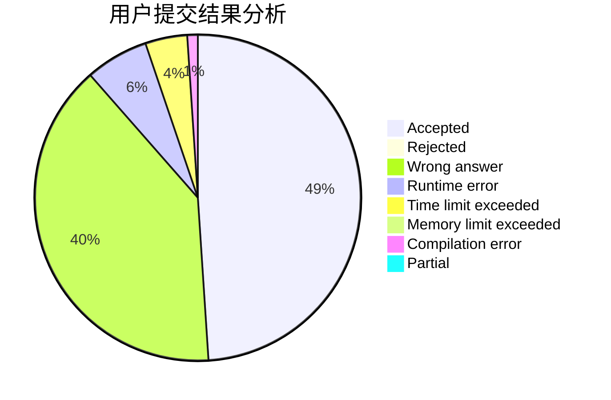
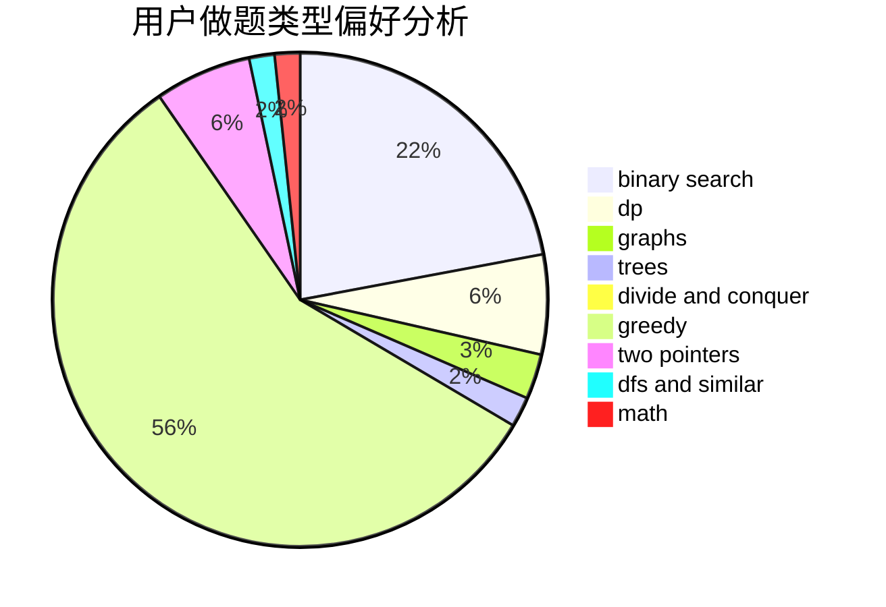

# parallelist

<!-- tabs:start -->

#### **用户提交结果分析**

#### **用户做题类型偏好分析**

<!-- tabs:end -->
# 推荐题目
[1771](https://codeforces.com/contest/177/problem/1)
[573C](https://codeforces.com/contest/573/problem/C)
[1298D](https://codeforces.com/contest/1298/problem/D)
[97D](https://codeforces.com/contest/97/problem/D)
[453D](https://codeforces.com/contest/453/problem/D)
[295D](https://codeforces.com/contest/295/problem/D)
[523A](https://codeforces.com/contest/523/problem/A)
[1159C](https://codeforces.com/contest/1159/problem/C)
[1105E](https://codeforces.com/contest/1105/problem/E)
[627F](https://codeforces.com/contest/627/problem/F)
