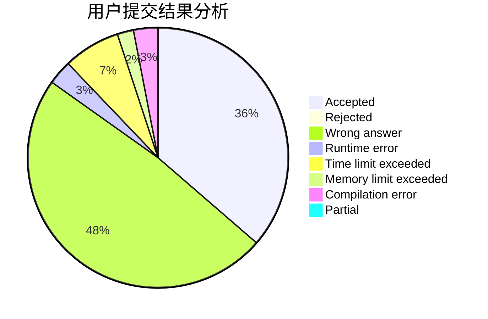
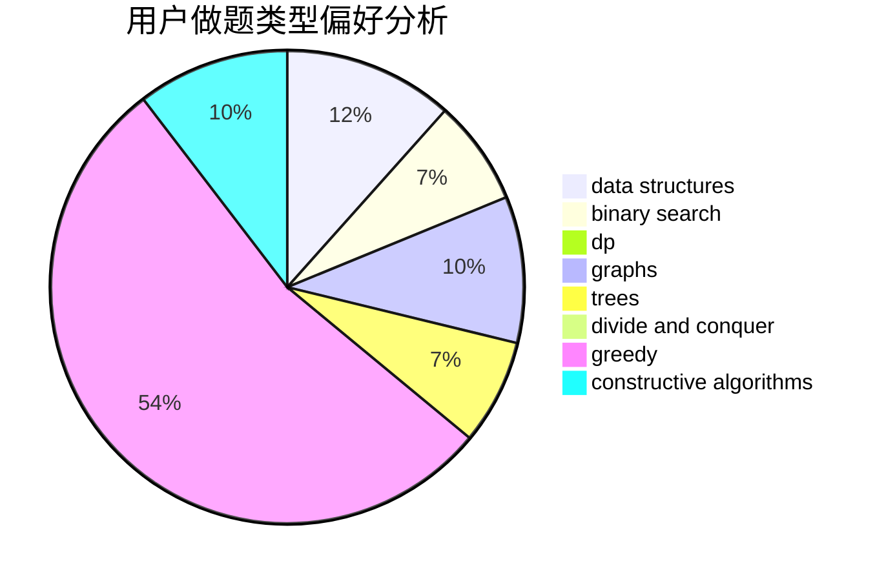
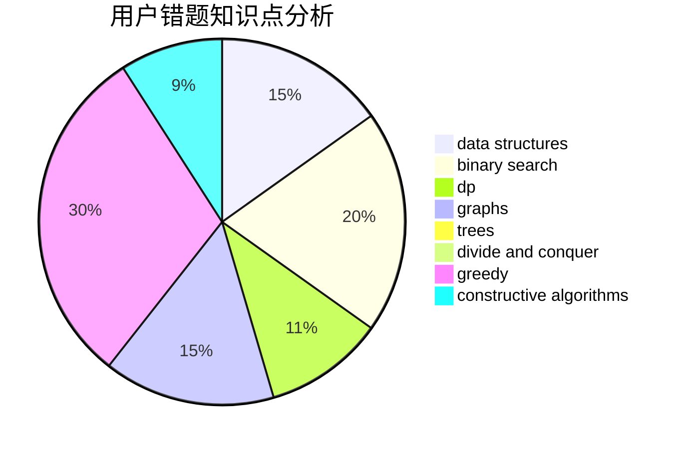

# parker0523

<!-- tabs:start -->

#### **用户提交结果分析**

#### **用户做题类型偏好分析**

#### **用户错题知识点分析**

<!-- tabs:end -->
# 推荐题目
[1332B](https://codeforces.com/contest/1332/problem/B)		brute force,
                        constructive algorithms,
                        greedy,
                        math,
                        number theory		  
[911E](https://codeforces.com/contest/911/problem/E)		constructive algorithms,
                        data structures,
                        greedy,
                        implementation		  
[954B](https://codeforces.com/contest/954/problem/B)		implementation,
                        strings		  
[1268A](https://codeforces.com/contest/1268/problem/A)		constructive algorithms,
                        greedy,
                        implementation,
                        strings		  
[1227G](https://codeforces.com/contest/1227/problem/G)		constructive algorithms		  
[869E](https://codeforces.com/contest/869/problem/E)		data structures,
                        hashing		  
[1188D](https://codeforces.com/contest/1188/problem/D)		dp		  
[768D](https://codeforces.com/contest/768/problem/D)		dp,
                        math,
                        probabilities		  
[166E](https://codeforces.com/contest/166/problem/E)		dp,
                        math,
                        matrices		  
[1092E](https://codeforces.com/contest/1092/problem/E)		constructive algorithms,
                        dfs and similar,
                        greedy,
                        trees		  
