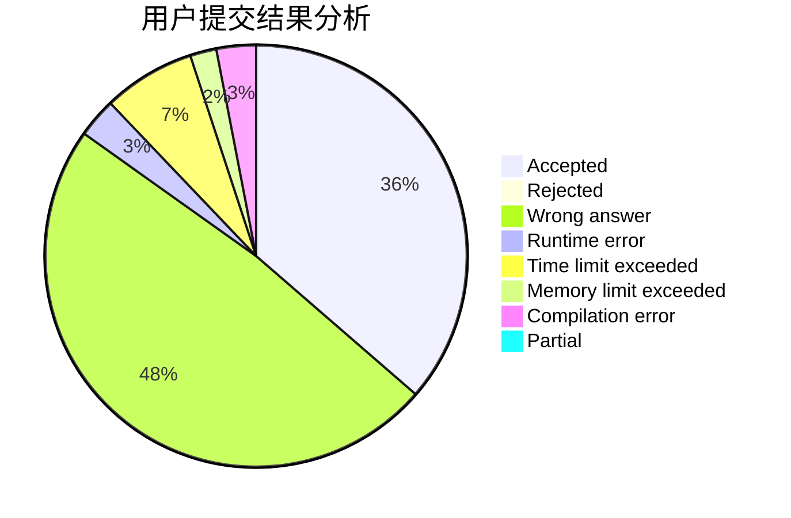
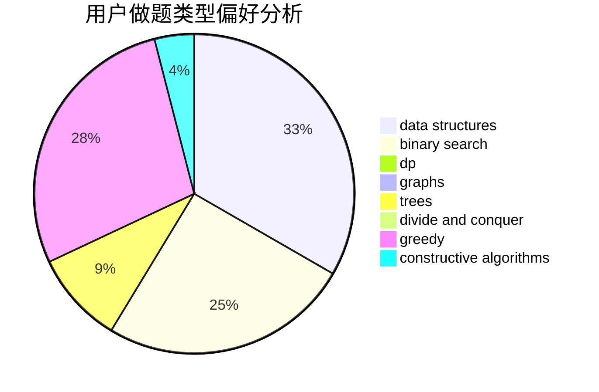
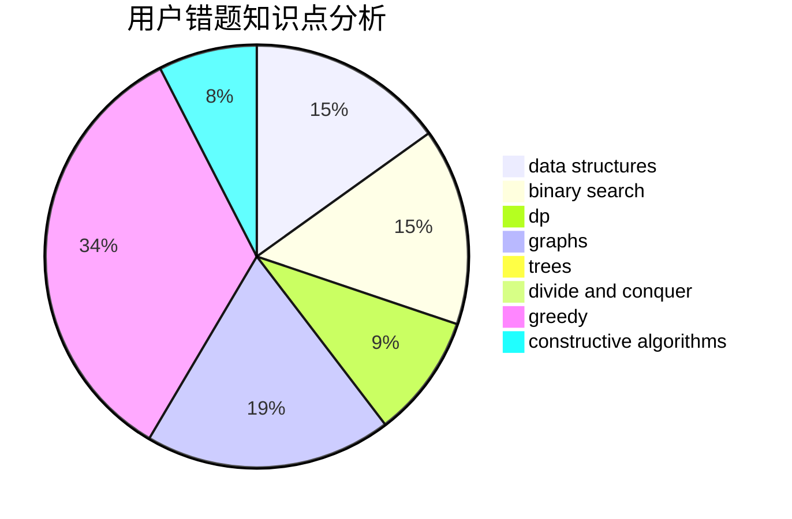

# parker0523

<!-- tabs:start -->

#### **用户提交结果分析**

#### **用户做题类型偏好分析**

#### **用户错题知识点分析**

<!-- tabs:end -->
# 推荐题目
[1338D](https://codeforces.com/contest/1338/problem/D)		constructive algorithms,
                        dfs and similar,
                        dp,
                        math,
                        trees		  
[930A](https://codeforces.com/contest/930/problem/A)		dfs and similar,
                        graphs,
                        trees		  
[976A](https://codeforces.com/contest/976/problem/A)		implementation		  
[1277B](https://codeforces.com/contest/1277/problem/B)		greedy,
                        number theory		  
[1236E](https://codeforces.com/contest/1236/problem/E)		binary search,
                        data structures,
                        dp,
                        dsu		  
[889D](https://codeforces.com/contest/889/problem/D)		dsu,graphs,sortings,trees		  
[1194A](https://codeforces.com/contest/1194/problem/A)		math		  
[788C](https://codeforces.com/contest/788/problem/C)		dfs and similar,
                        graphs,
                        shortest paths		  
[193B](https://codeforces.com/contest/193/problem/B)		brute force		  
[1093B](https://codeforces.com/contest/1093/problem/B)		constructive algorithms,
                        greedy,
                        sortings,
                        strings		  
