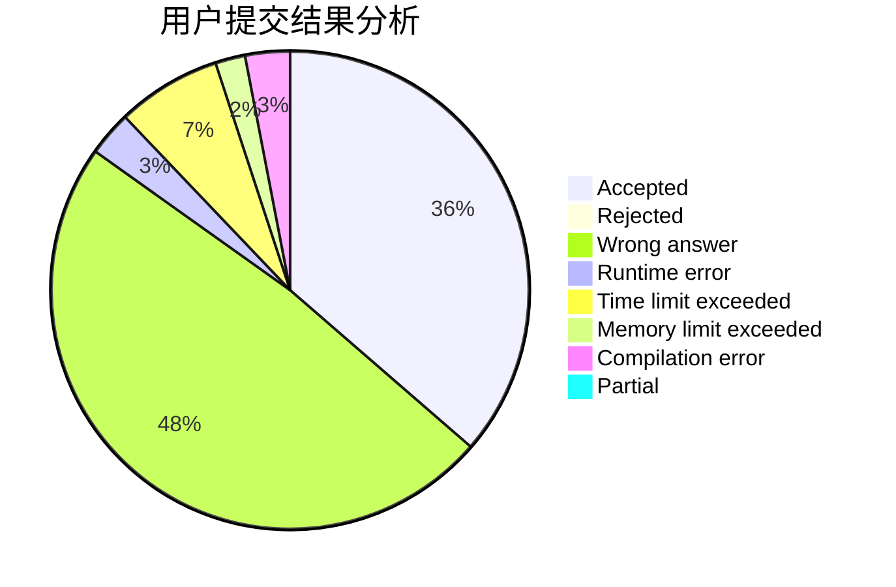
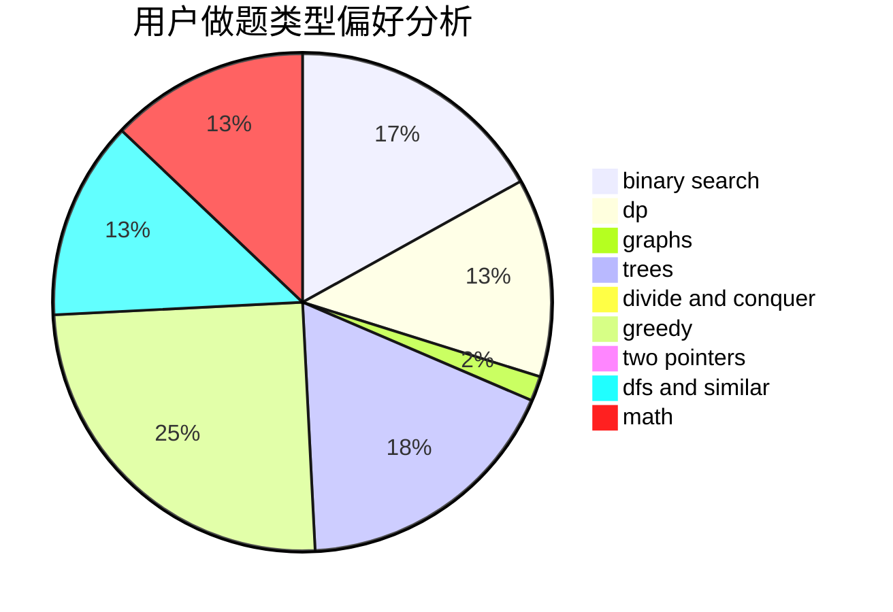

# parker0523

<!-- tabs:start -->

#### **用户提交结果分析**

#### **用户做题类型偏好分析**

<!-- tabs:end -->
# 推荐题目
[1338D](https://codeforces.com/contest/1338/problem/D)
[930A](https://codeforces.com/contest/930/problem/A)
[976A](https://codeforces.com/contest/976/problem/A)
[1277B](https://codeforces.com/contest/1277/problem/B)
[1236E](https://codeforces.com/contest/1236/problem/E)
[889D](https://codeforces.com/contest/889/problem/D)
[1194A](https://codeforces.com/contest/1194/problem/A)
[788C](https://codeforces.com/contest/788/problem/C)
[193B](https://codeforces.com/contest/193/problem/B)
[1093B](https://codeforces.com/contest/1093/problem/B)
