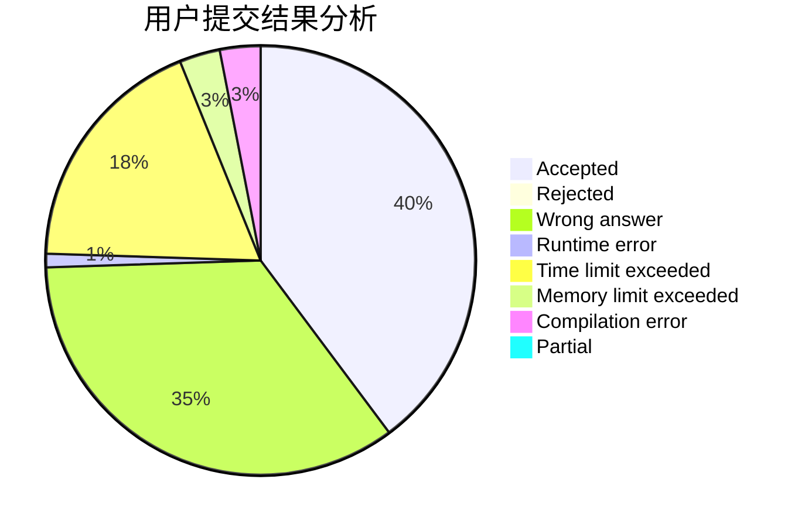
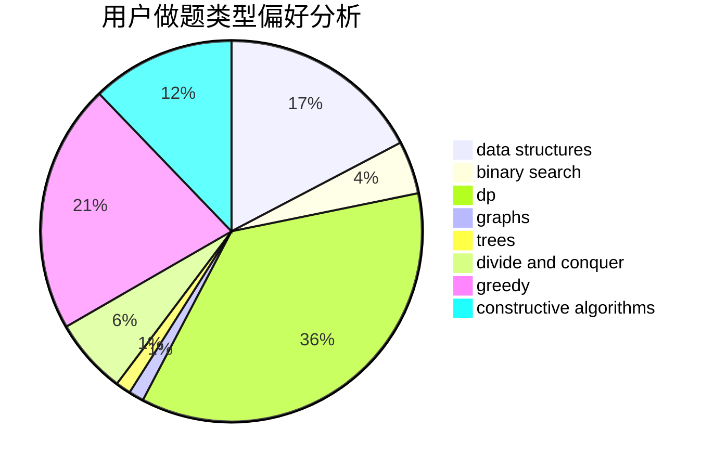
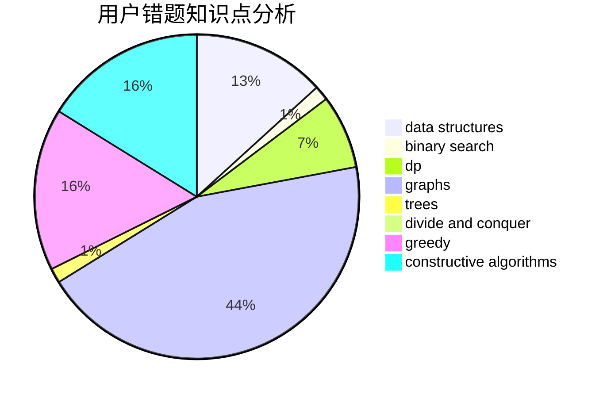

# pb0207

<!-- tabs:start -->

#### **用户提交结果分析**

#### **用户做题类型偏好分析**

#### **用户错题知识点分析**

<!-- tabs:end -->
# 推荐题目
[547D](https://codeforces.com/contest/547/problem/D)		constructive algorithms,
                        dfs and similar,
                        graphs		  
[1195E](https://codeforces.com/contest/1195/problem/E)		data structures,
                        two pointers		  
[1340F](https://codeforces.com/contest/1340/problem/F)		brute force,
                        data structures,
                        hashing		  
[1175B](https://codeforces.com/contest/1175/problem/B)		data structures,
                        expression parsing,
                        implementation		  
[266A](https://codeforces.com/contest/266/problem/A)		implementation		  
[1236B](https://codeforces.com/contest/1236/problem/B)		combinatorics,
                        math		  
[582D](https://codeforces.com/contest/582/problem/D)		dp,
                        math,
                        number theory		  
[967A](https://codeforces.com/contest/967/problem/A)		implementation		  
[1060C](https://codeforces.com/contest/1060/problem/C)		binary search,
                        implementation,
                        two pointers		  
[132E](https://codeforces.com/contest/132/problem/E)		flows,
                        graphs		  
