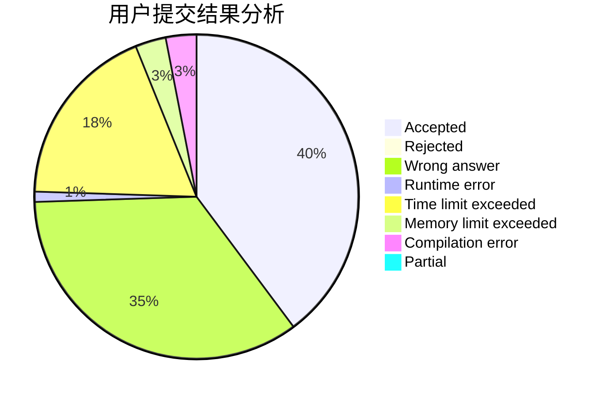
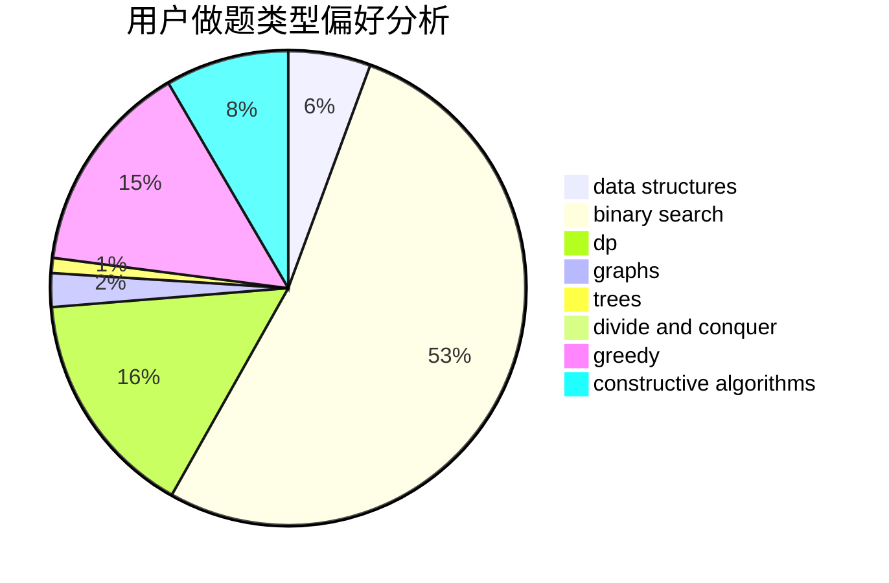
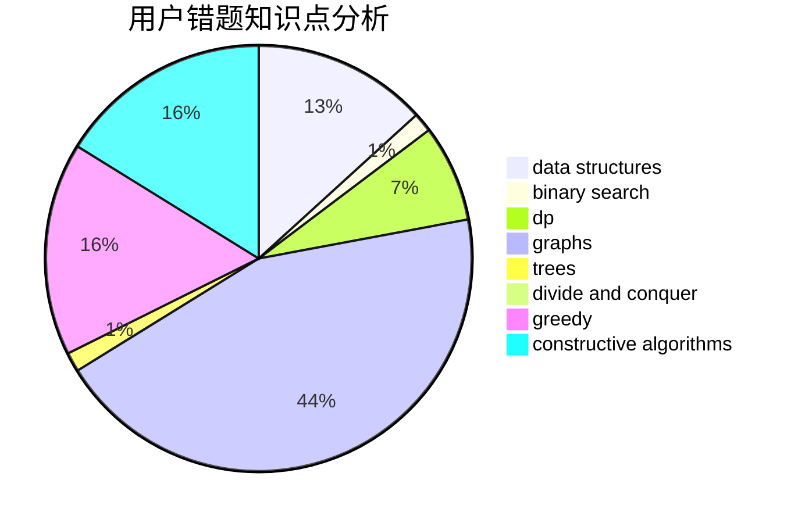

# pb0207

<!-- tabs:start -->

#### **用户提交结果分析**

#### **用户做题类型偏好分析**

#### **用户错题知识点分析**

<!-- tabs:end -->
# 推荐题目
[572A](https://codeforces.com/contest/572/problem/A)		sortings		  
[119D](https://codeforces.com/contest/119/problem/D)		hashing,
                        strings		  
[1347E](https://codeforces.com/contest/1347/problem/E)		dsu,graphs,sortings,trees		  
[1178B](https://codeforces.com/contest/1178/problem/B)		dp,
                        strings		  
[281D](https://codeforces.com/contest/281/problem/D)		dsu,graphs,sortings,trees		  
[1240E](https://codeforces.com/contest/1240/problem/E)		dsu,graphs,sortings,trees		  
[603E](https://codeforces.com/contest/603/problem/E)		data structures,
                        divide and conquer,
                        dsu,
                        math,
                        trees		  
[988D](https://codeforces.com/contest/988/problem/D)		brute force,
                        math		  
[1060F](https://codeforces.com/contest/1060/problem/F)		combinatorics,
                        dp		  
[13362](https://codeforces.com/contest/1336/problem/2)		dsu,graphs,sortings,trees		  
