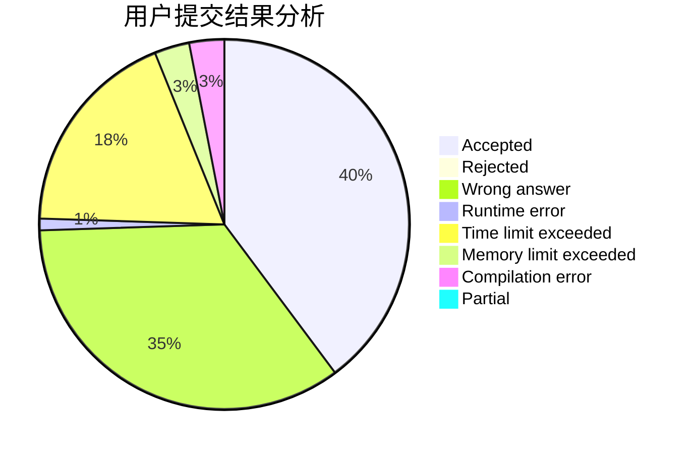
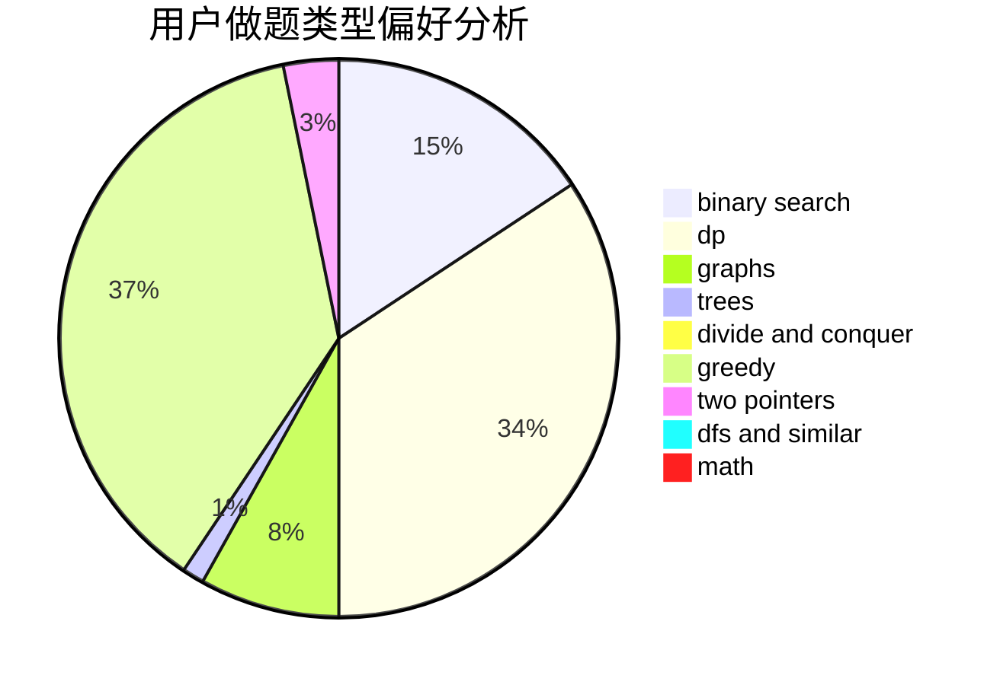

# pb0207

<!-- tabs:start -->

#### **用户提交结果分析**

#### **用户做题类型偏好分析**

<!-- tabs:end -->
# 推荐题目
[572A](https://codeforces.com/contest/572/problem/A)
[119D](https://codeforces.com/contest/119/problem/D)
[1347E](https://codeforces.com/contest/1347/problem/E)
[1178B](https://codeforces.com/contest/1178/problem/B)
[281D](https://codeforces.com/contest/281/problem/D)
[1240E](https://codeforces.com/contest/1240/problem/E)
[603E](https://codeforces.com/contest/603/problem/E)
[988D](https://codeforces.com/contest/988/problem/D)
[1060F](https://codeforces.com/contest/1060/problem/F)
[13362](https://codeforces.com/contest/1336/problem/2)
