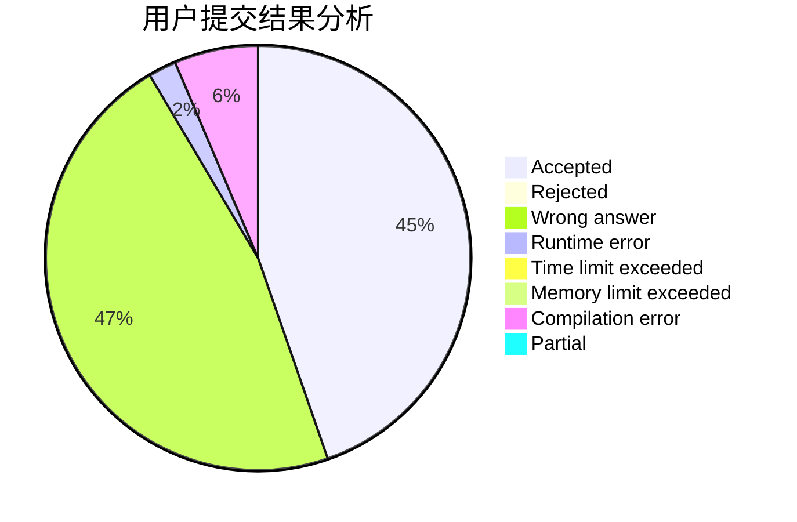
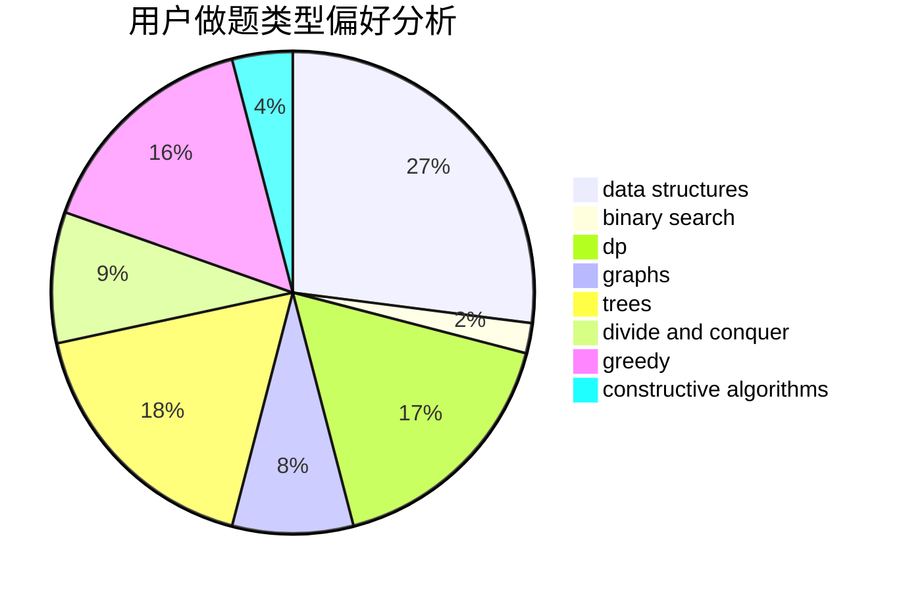
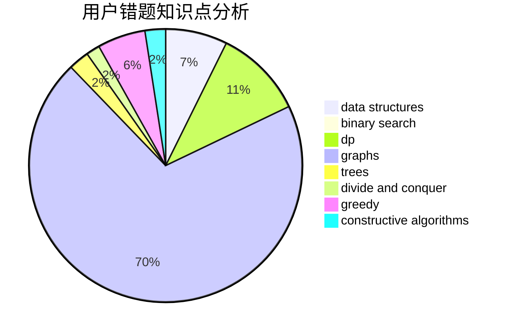

# pdx_arT

<!-- tabs:start -->

#### **用户提交结果分析**

#### **用户做题类型偏好分析**

#### **用户错题知识点分析**

<!-- tabs:end -->
# 推荐题目
[227A](https://codeforces.com/contest/227/problem/A)		geometry		  
[489F](https://codeforces.com/contest/489/problem/F)		combinatorics,
                        dp		  
[883A](https://codeforces.com/contest/883/problem/A)		implementation		  
[197D](https://codeforces.com/contest/197/problem/D)		dsu,graphs,sortings,trees		  
[412C](https://codeforces.com/contest/412/problem/C)		implementation,
                        strings		  
[1280E](https://codeforces.com/contest/1280/problem/E)		math		  
[553B](https://codeforces.com/contest/553/problem/B)		binary search,
                        combinatorics,
                        constructive algorithms,
                        greedy,
                        implementation,
                        math		  
[501C](https://codeforces.com/contest/501/problem/C)		constructive algorithms,
                        data structures,
                        greedy,
                        sortings,
                        trees		  
[306C](https://codeforces.com/contest/306/problem/C)		combinatorics,
                        number theory		  
[1343D](https://codeforces.com/contest/1343/problem/D)		brute force,
                        data structures,
                        greedy,
                        two pointers		  
