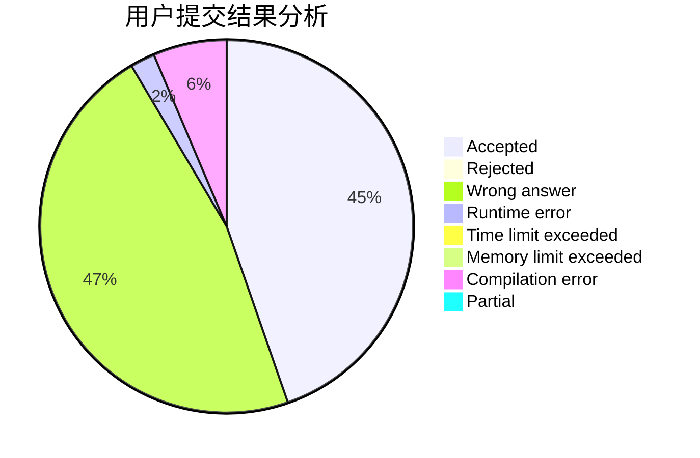
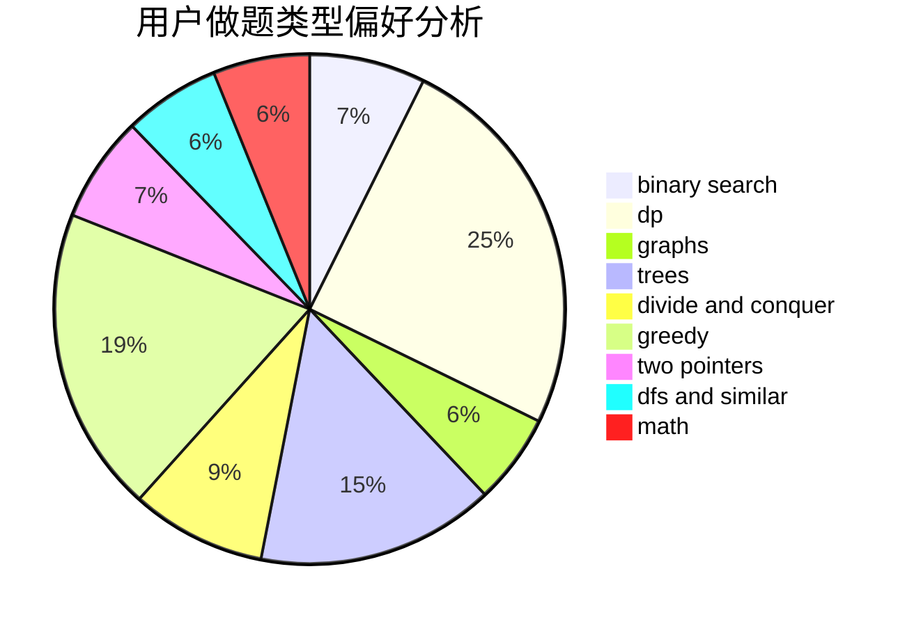

# pdx_arT

<!-- tabs:start -->

#### **用户提交结果分析**

#### **用户做题类型偏好分析**

<!-- tabs:end -->
# 推荐题目
[227A](https://codeforces.com/contest/227/problem/A)
[489F](https://codeforces.com/contest/489/problem/F)
[883A](https://codeforces.com/contest/883/problem/A)
[197D](https://codeforces.com/contest/197/problem/D)
[412C](https://codeforces.com/contest/412/problem/C)
[1280E](https://codeforces.com/contest/1280/problem/E)
[553B](https://codeforces.com/contest/553/problem/B)
[501C](https://codeforces.com/contest/501/problem/C)
[306C](https://codeforces.com/contest/306/problem/C)
[1343D](https://codeforces.com/contest/1343/problem/D)
