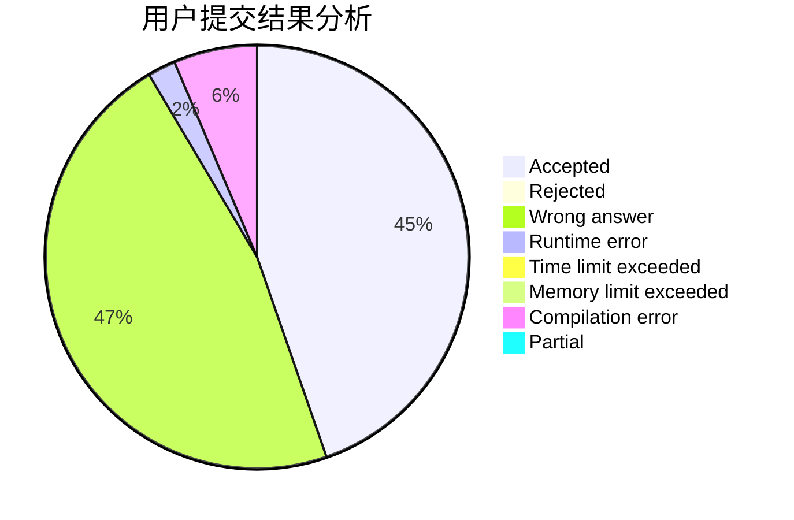
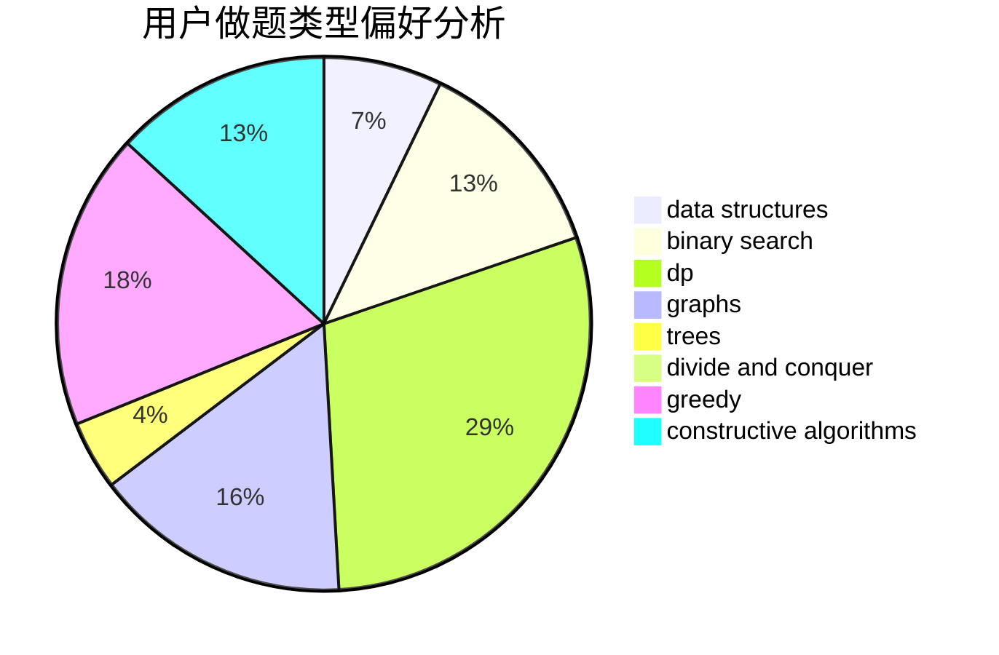
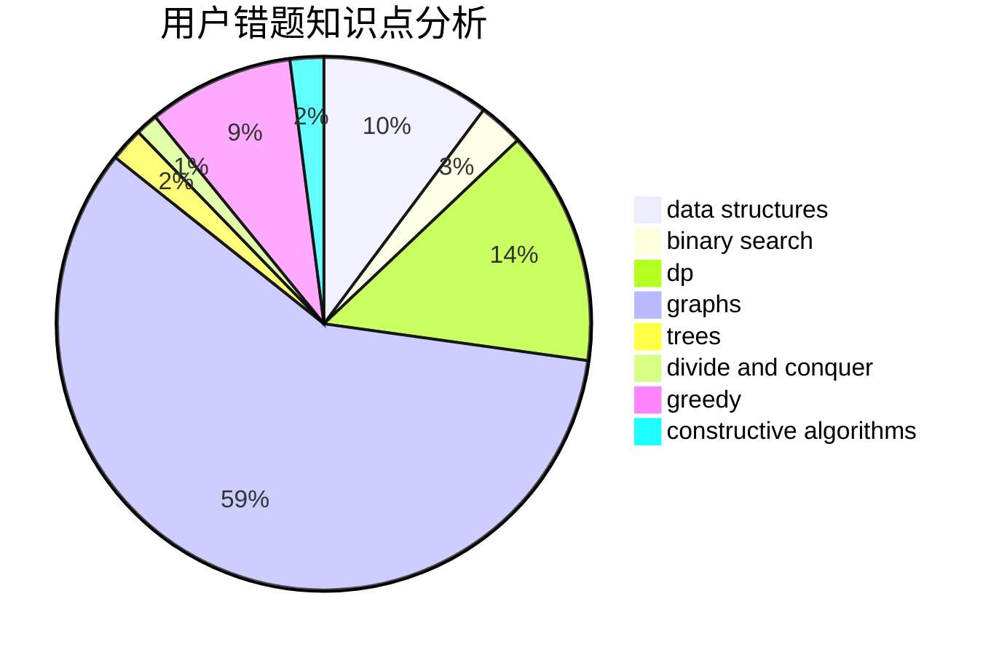

# pdx_arT

<!-- tabs:start -->

#### **用户提交结果分析**

#### **用户做题类型偏好分析**

#### **用户错题知识点分析**

<!-- tabs:end -->
# 推荐题目
[203B](https://codeforces.com/contest/203/problem/B)		brute force,
                        implementation		  
[471A](https://codeforces.com/contest/471/problem/A)		implementation		  
[862D](https://codeforces.com/contest/862/problem/D)		binary search,
                        divide and conquer,
                        interactive		  
[171A](https://codeforces.com/contest/171/problem/A)		*special problem,
                        constructive algorithms		  
[380D](https://codeforces.com/contest/380/problem/D)		combinatorics,
                        math		  
[1271C](https://codeforces.com/contest/1271/problem/C)		brute force,
                        geometry,
                        greedy,
                        implementation		  
[52A](https://codeforces.com/contest/52/problem/A)		implementation		  
[482D](https://codeforces.com/contest/482/problem/D)		combinatorics,
                        dp,
                        trees		  
[291E](https://codeforces.com/contest/291/problem/E)		*special problem,
                        dfs and similar,
                        hashing,
                        strings		  
[1336C](https://codeforces.com/contest/1336/problem/C)		dp,
                        strings		  
