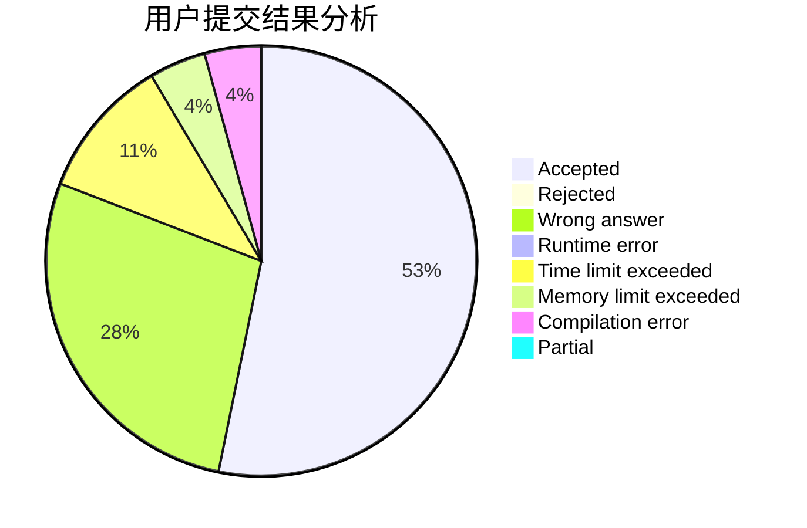
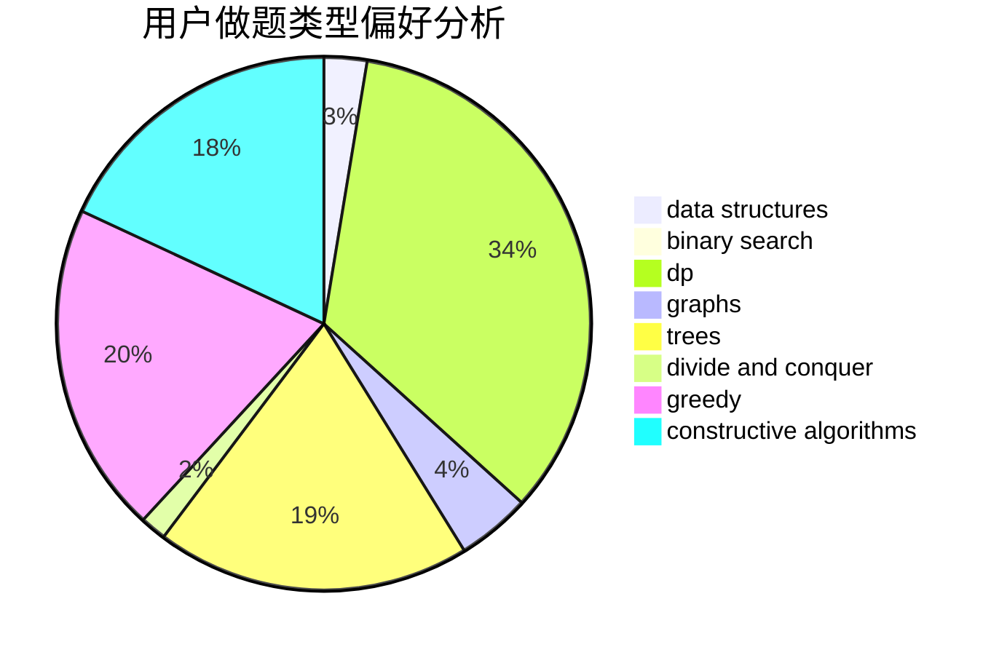
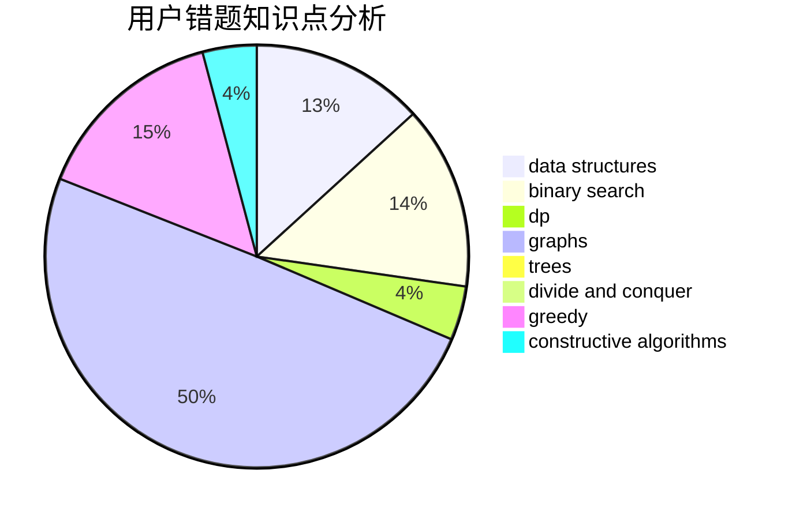

# pealfrog

<!-- tabs:start -->

#### **用户提交结果分析**

#### **用户做题类型偏好分析**

#### **用户错题知识点分析**

<!-- tabs:end -->
# 推荐题目
[548A](https://codeforces.com/contest/548/problem/A)		brute force,
                        implementation,
                        strings		  
[913A](https://codeforces.com/contest/913/problem/A)		implementation,
                        math		  
[94C](https://codeforces.com/contest/94/problem/C)		dsu,graphs,sortings,trees		  
[1105D](https://codeforces.com/contest/1105/problem/D)		dfs and similar,
                        graphs,
                        implementation,
                        shortest paths		  
[166C](https://codeforces.com/contest/166/problem/C)		greedy,
                        math,
                        sortings		  
[300C](https://codeforces.com/contest/300/problem/C)		brute force,
                        combinatorics		  
[600C](https://codeforces.com/contest/600/problem/C)		constructive algorithms,
                        greedy,
                        strings		  
[963E](https://codeforces.com/contest/963/problem/E)		math		  
[36C](https://codeforces.com/contest/36/problem/C)		geometry,
                        implementation		  
[1365B](https://codeforces.com/contest/1365/problem/B)		constructive algorithms,
                        implementation		  
