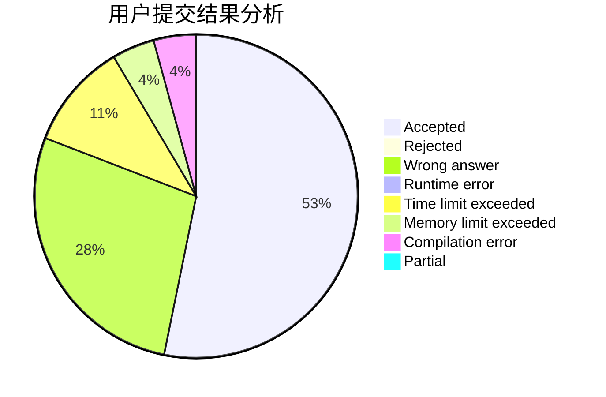
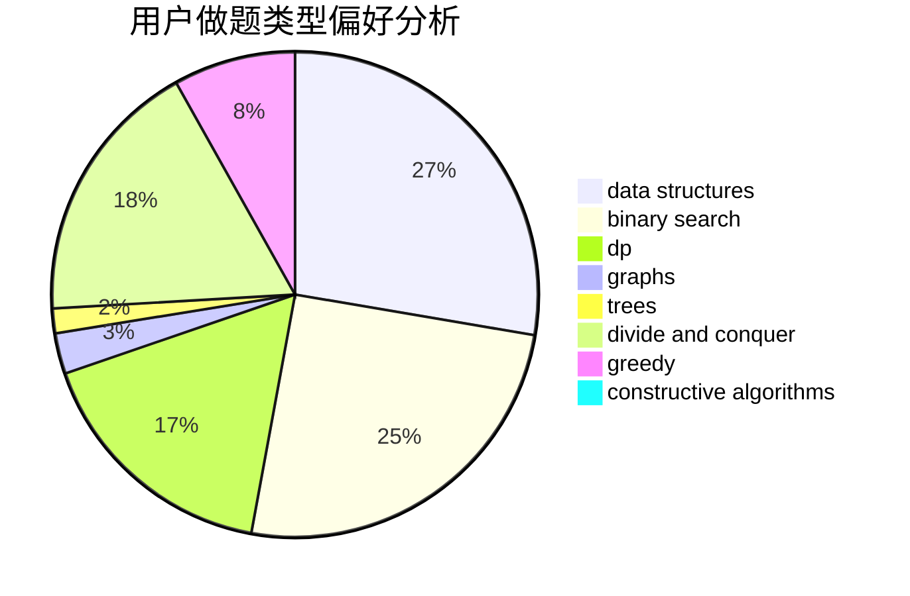
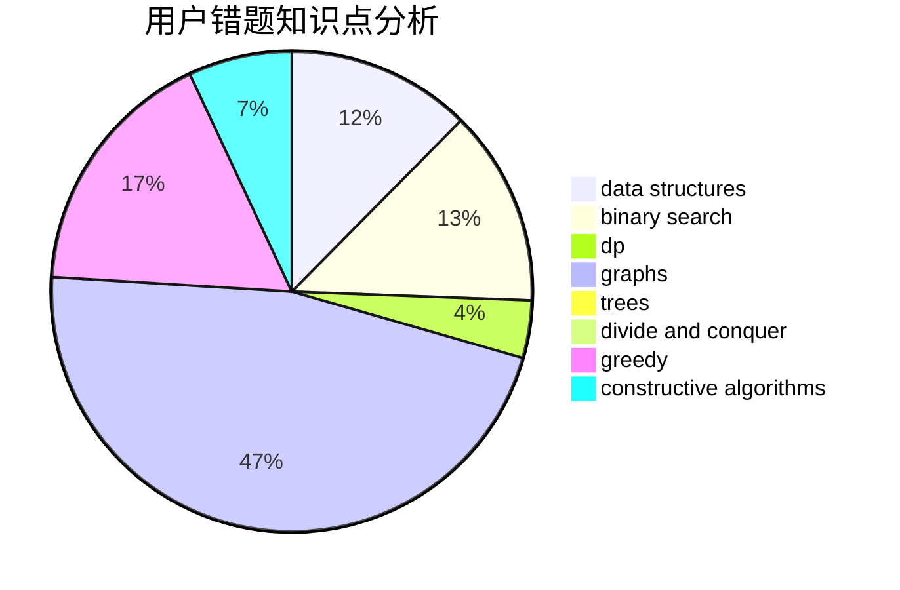

# pealfrog

<!-- tabs:start -->

#### **用户提交结果分析**

#### **用户做题类型偏好分析**

#### **用户错题知识点分析**

<!-- tabs:end -->
# 推荐题目
[522D](https://codeforces.com/contest/522/problem/D)		*special problem,
                        data structures		  
[895C](https://codeforces.com/contest/895/problem/C)		bitmasks,
                        combinatorics,
                        dp,
                        math		  
[930A](https://codeforces.com/contest/930/problem/A)		dfs and similar,
                        graphs,
                        trees		  
[1105A](https://codeforces.com/contest/1105/problem/A)		brute force,
                        implementation		  
[1510J](https://codeforces.com/contest/1510/problem/J)		constructive algorithms,
                        math		  
[286B](https://codeforces.com/contest/286/problem/B)		implementation		  
[580A](https://codeforces.com/contest/580/problem/A)		brute force,
                        dp,
                        implementation		  
[947A](https://codeforces.com/contest/947/problem/A)		dsu,graphs,sortings,trees		  
[343B](https://codeforces.com/contest/343/problem/B)		data structures,
                        greedy,
                        implementation		  
[1357C2](https://codeforces.com/contest/1357C/problem/2)		nan		  
