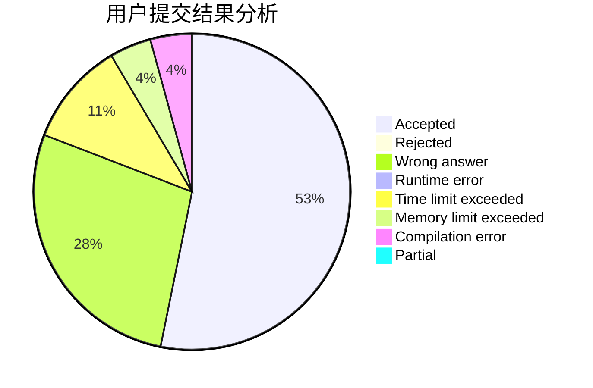
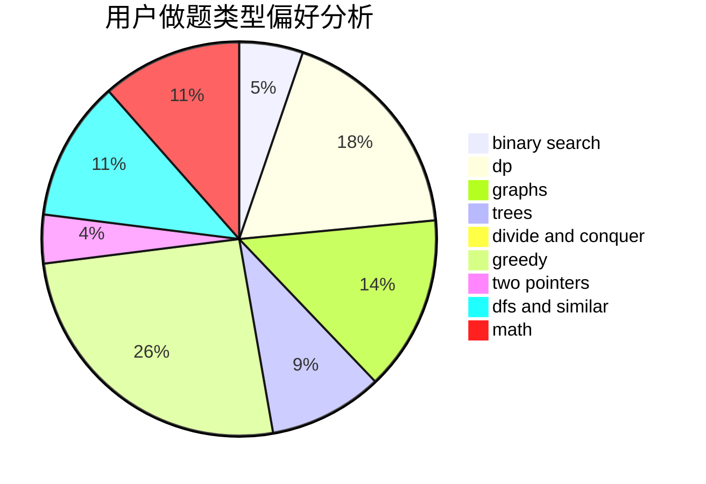

# pealfrog

<!-- tabs:start -->

#### **用户提交结果分析**

#### **用户做题类型偏好分析**

<!-- tabs:end -->
# 推荐题目
[548A](https://codeforces.com/contest/548/problem/A)
[913A](https://codeforces.com/contest/913/problem/A)
[94C](https://codeforces.com/contest/94/problem/C)
[1105D](https://codeforces.com/contest/1105/problem/D)
[166C](https://codeforces.com/contest/166/problem/C)
[300C](https://codeforces.com/contest/300/problem/C)
[600C](https://codeforces.com/contest/600/problem/C)
[963E](https://codeforces.com/contest/963/problem/E)
[36C](https://codeforces.com/contest/36/problem/C)
[1365B](https://codeforces.com/contest/1365/problem/B)
