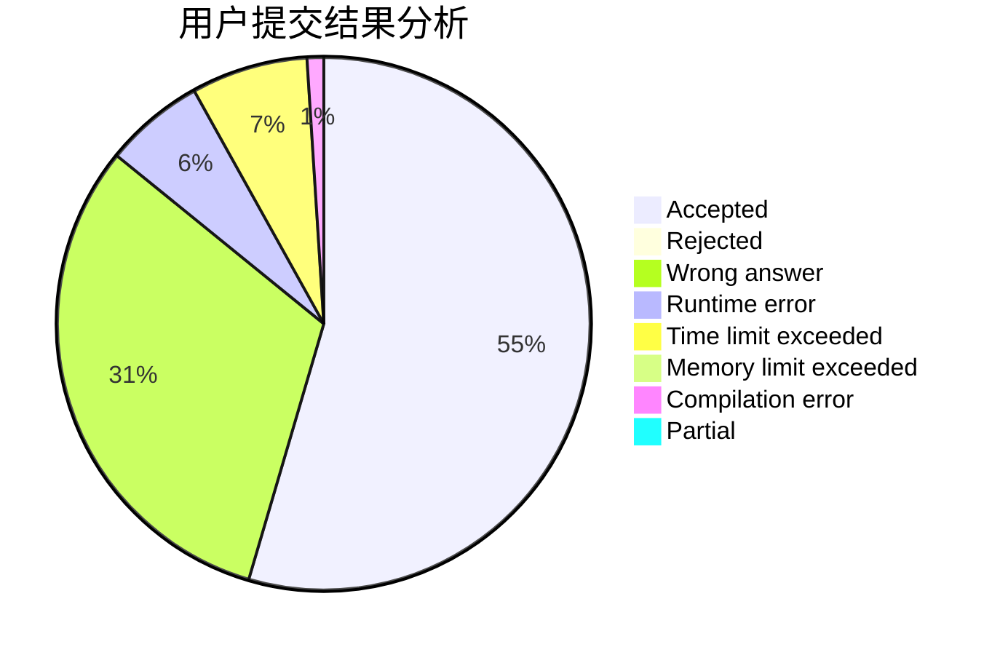
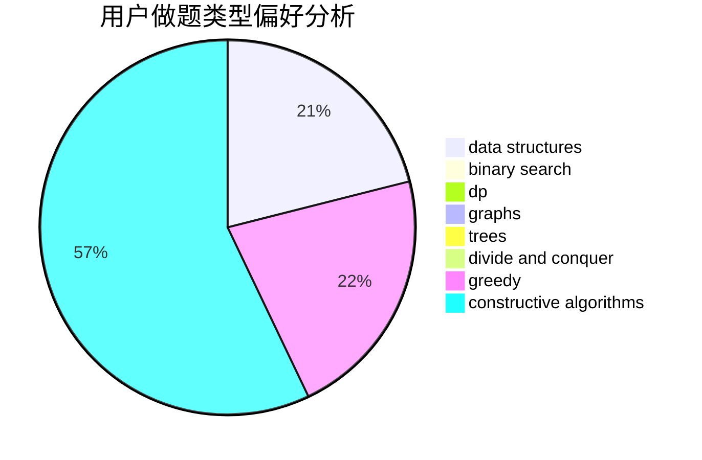
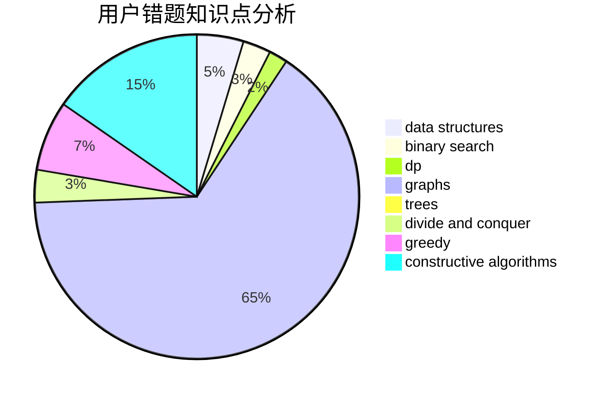

# peehs_moorhsum

<!-- tabs:start -->

#### **用户提交结果分析**

#### **用户做题类型偏好分析**

#### **用户错题知识点分析**

<!-- tabs:end -->
# 推荐题目
[136C](https://codeforces.com/contest/136/problem/C)		dsu,graphs,sortings,trees		  
[628C](https://codeforces.com/contest/628/problem/C)		greedy,
                        strings		  
[1027D](https://codeforces.com/contest/1027/problem/D)		dfs and similar,
                        graphs		  
[1436B](https://codeforces.com/contest/1436/problem/B)		constructive algorithms,
                        math		  
[356B](https://codeforces.com/contest/356/problem/B)		implementation,
                        math		  
[696C](https://codeforces.com/contest/696/problem/C)		combinatorics,
                        dp,
                        implementation,
                        math,
                        matrices		  
[1158D](https://codeforces.com/contest/1158/problem/D)		constructive algorithms,
                        geometry,
                        greedy,
                        math		  
[643D](https://codeforces.com/contest/643/problem/D)		nan		  
[165E](https://codeforces.com/contest/165/problem/E)		bitmasks,
                        brute force,
                        dfs and similar,
                        dp		  
[13672](https://codeforces.com/contest/1367/problem/2)		dsu,graphs,sortings,trees		  
