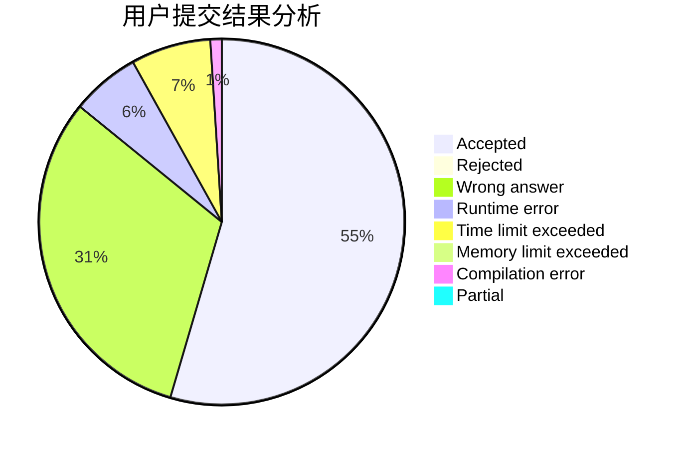
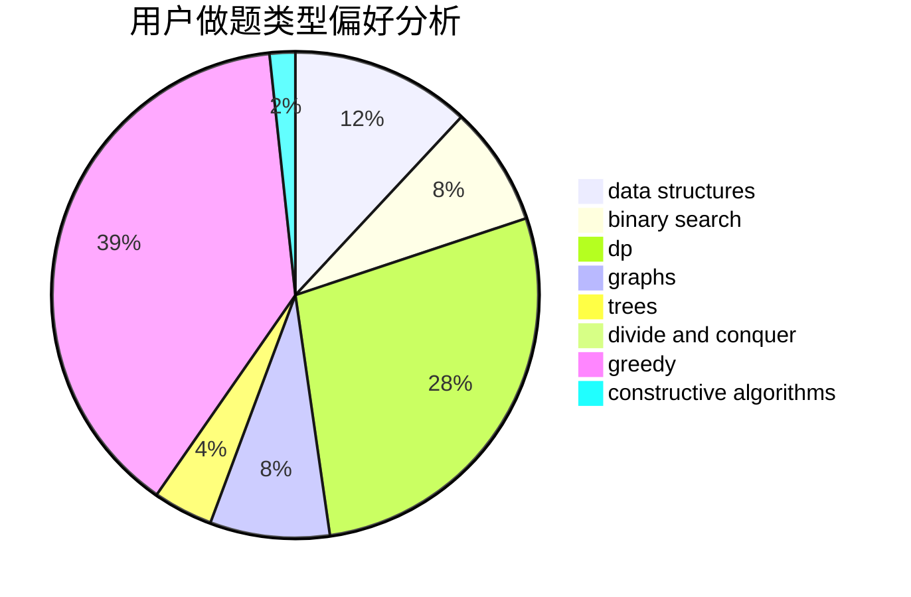
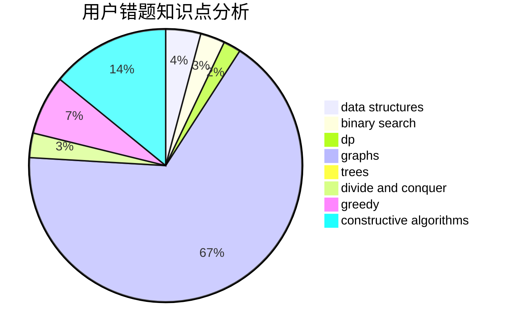

# peehs_moorhsum

<!-- tabs:start -->

#### **用户提交结果分析**

#### **用户做题类型偏好分析**

#### **用户错题知识点分析**

<!-- tabs:end -->
# 推荐题目
[1362D](https://codeforces.com/contest/1362/problem/D)		dsu,graphs,sortings,trees		  
[609C](https://codeforces.com/contest/609/problem/C)		implementation,
                        math		  
[1027A](https://codeforces.com/contest/1027/problem/A)		implementation,
                        strings		  
[1427D](https://codeforces.com/contest/1427/problem/D)		constructive algorithms,
                        implementation		  
[327A](https://codeforces.com/contest/327/problem/A)		brute force,
                        dp,
                        implementation		  
[670D2](https://codeforces.com/contest/670D/problem/2)		binary search,
                        implementation		  
[1156F](https://codeforces.com/contest/1156/problem/F)		dp,
                        math,
                        probabilities		  
[620A](https://codeforces.com/contest/620/problem/A)		implementation,
                        math		  
[1510H](https://codeforces.com/contest/1510/problem/H)		dp		  
[1359A](https://codeforces.com/contest/1359/problem/A)		brute force,
                        greedy,
                        math		  
