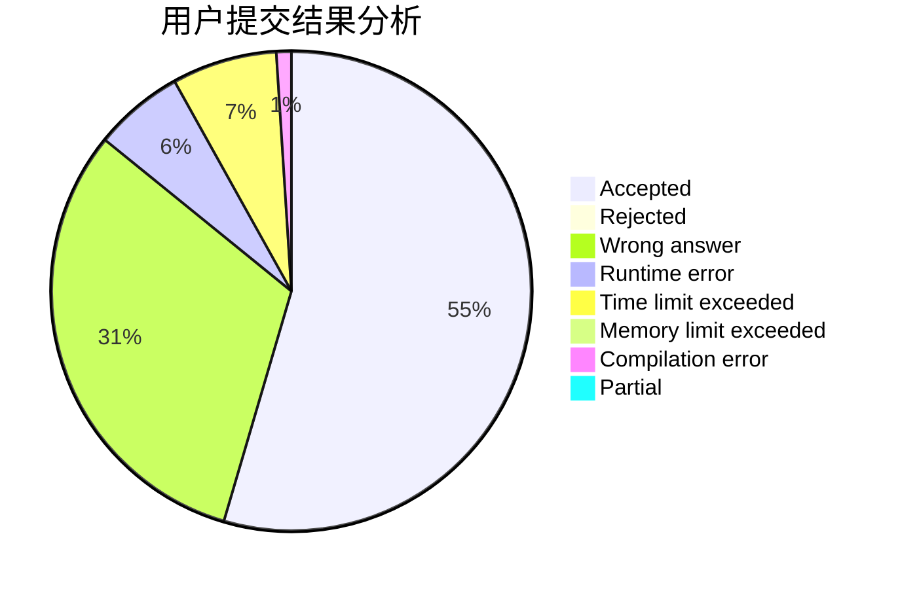
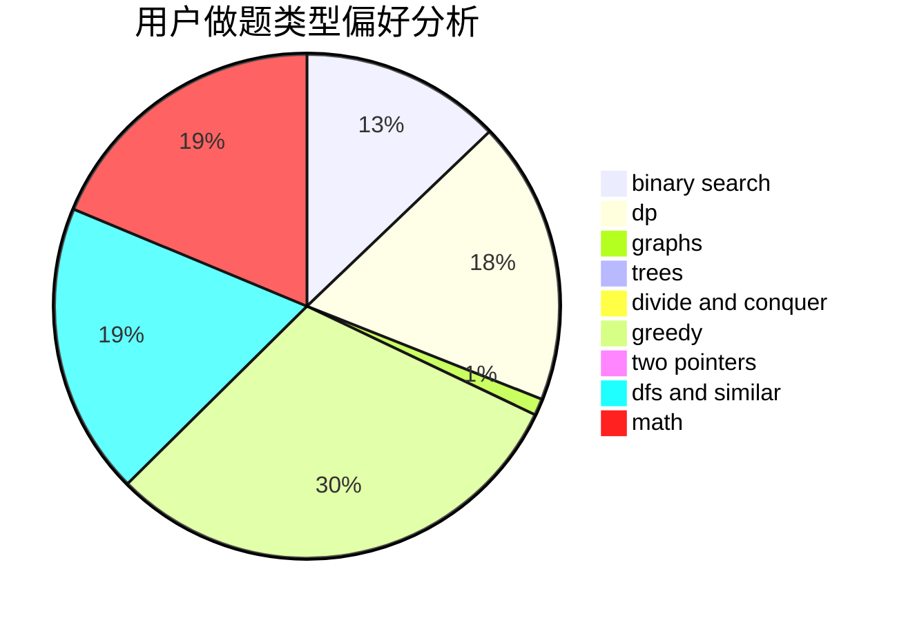

# peehs_moorhsum

<!-- tabs:start -->

#### **用户提交结果分析**

#### **用户做题类型偏好分析**

<!-- tabs:end -->
# 推荐题目
[136C](https://codeforces.com/contest/136/problem/C)
[628C](https://codeforces.com/contest/628/problem/C)
[1027D](https://codeforces.com/contest/1027/problem/D)
[1436B](https://codeforces.com/contest/1436/problem/B)
[356B](https://codeforces.com/contest/356/problem/B)
[696C](https://codeforces.com/contest/696/problem/C)
[1158D](https://codeforces.com/contest/1158/problem/D)
[643D](https://codeforces.com/contest/643/problem/D)
[165E](https://codeforces.com/contest/165/problem/E)
[13672](https://codeforces.com/contest/1367/problem/2)
