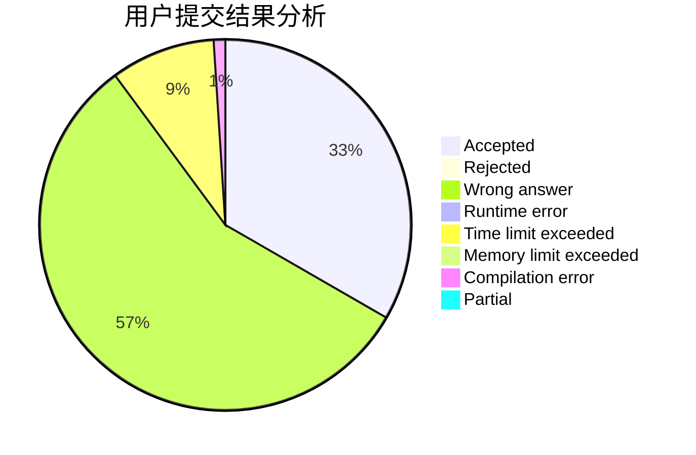
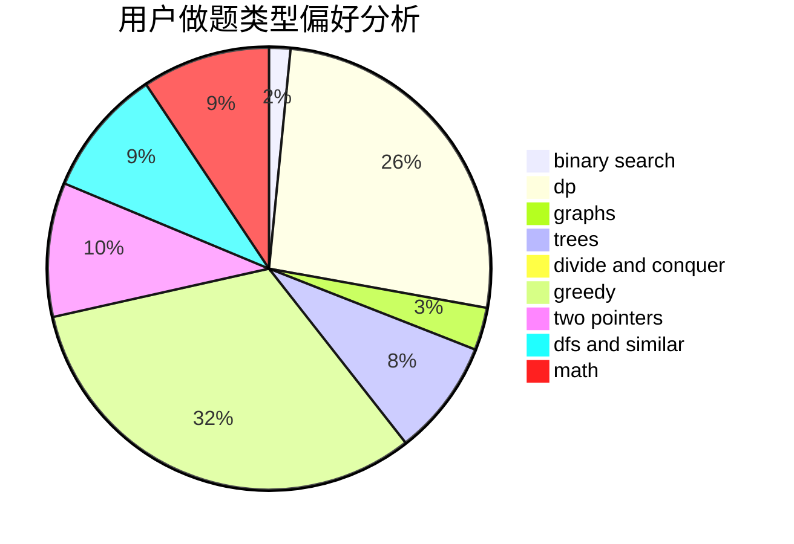

# pengym

<!-- tabs:start -->

#### **用户提交结果分析**

#### **用户做题类型偏好分析**

<!-- tabs:end -->
# 推荐题目
[580D](https://codeforces.com/contest/580/problem/D)
[1093B](https://codeforces.com/contest/1093/problem/B)
[581B](https://codeforces.com/contest/581/problem/B)
[445B](https://codeforces.com/contest/445/problem/B)
[1064F](https://codeforces.com/contest/1064/problem/F)
[1394A](https://codeforces.com/contest/1394/problem/A)
[318A](https://codeforces.com/contest/318/problem/A)
[333B](https://codeforces.com/contest/333/problem/B)
[1336A](https://codeforces.com/contest/1336/problem/A)
[472B](https://codeforces.com/contest/472/problem/B)
