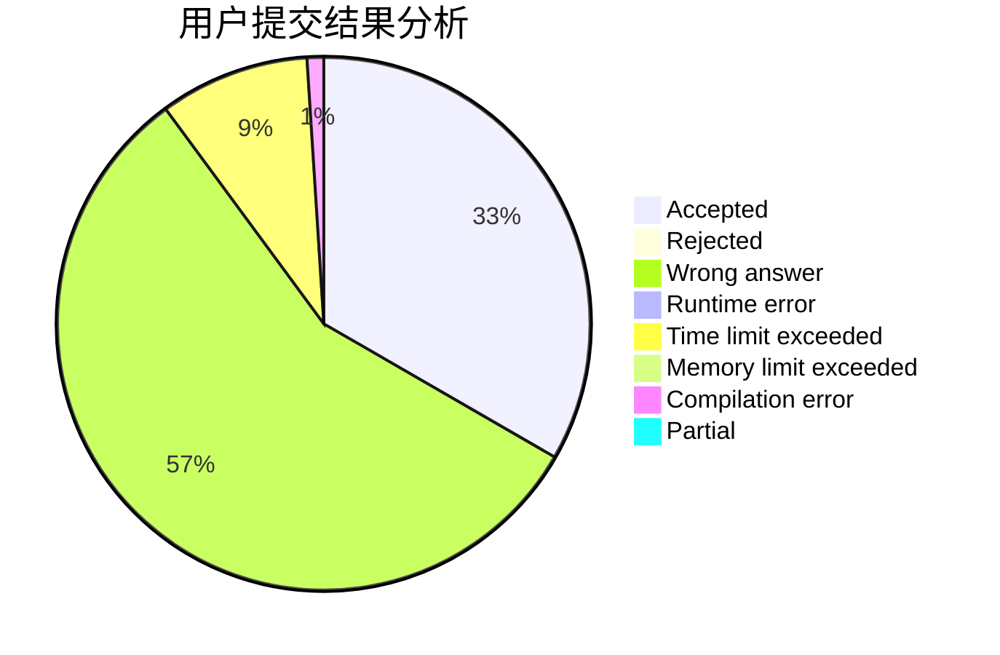
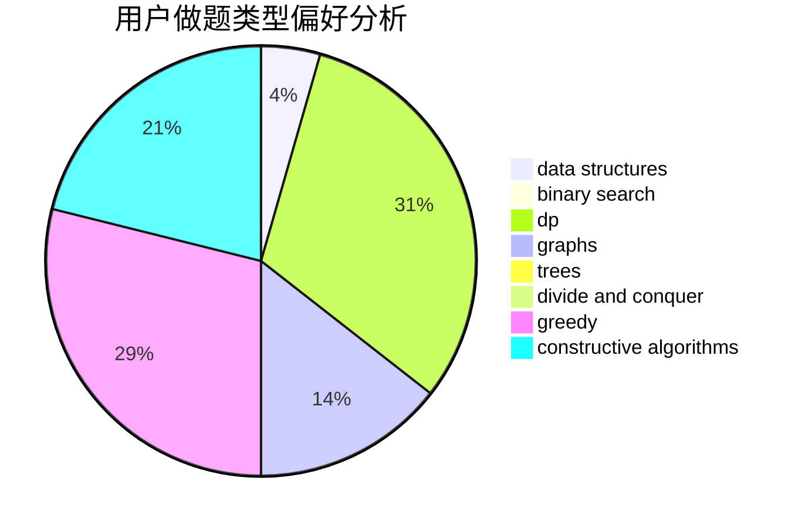

# pengym

<!-- tabs:start -->

#### **用户提交结果分析**

#### **用户做题类型偏好分析**

#### **用户错题知识点分析**

<!-- tabs:end -->
# 推荐题目
[557C](https://codeforces.com/contest/557/problem/C)		brute force,
                        data structures,
                        dp,
                        greedy,
                        math,
                        sortings		  
[1092E](https://codeforces.com/contest/1092/problem/E)		constructive algorithms,
                        dfs and similar,
                        greedy,
                        trees		  
[558D](https://codeforces.com/contest/558/problem/D)		data structures,
                        implementation,
                        sortings		  
[41D](https://codeforces.com/contest/41/problem/D)		dp		  
[1064C](https://codeforces.com/contest/1064/problem/C)		dsu,graphs,sortings,trees		  
[1384B1](https://codeforces.com/contest/1384B/problem/1)		brute force,
                        dp,
                        greedy		  
[2B](https://codeforces.com/contest/2/problem/B)		dp,
                        math		  
[30C](https://codeforces.com/contest/30/problem/C)		dp,
                        probabilities		  
[1330A](https://codeforces.com/contest/1330/problem/A)		implementation		  
[44I](https://codeforces.com/contest/44/problem/I)		brute force,
                        combinatorics		  
