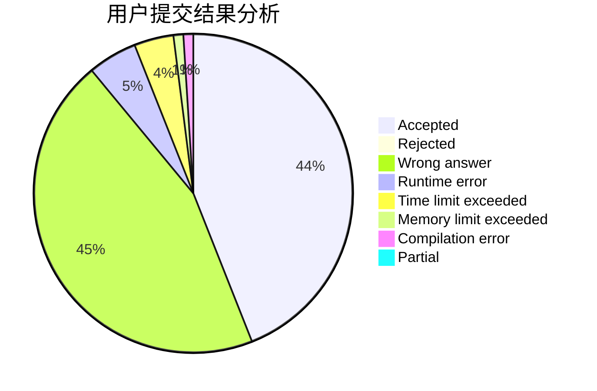
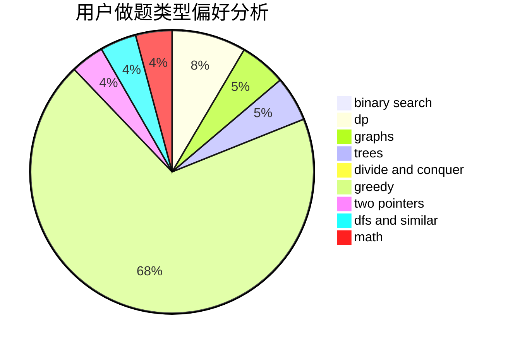

# pigstd

<!-- tabs:start -->

#### **用户提交结果分析**

#### **用户做题类型偏好分析**

<!-- tabs:end -->
# 推荐题目
[1504E](https://codeforces.com/contest/1504/problem/E)
[962F](https://codeforces.com/contest/962/problem/F)
[114D](https://codeforces.com/contest/114/problem/D)
[827D](https://codeforces.com/contest/827/problem/D)
[314C](https://codeforces.com/contest/314/problem/C)
[540C](https://codeforces.com/contest/540/problem/C)
[590A](https://codeforces.com/contest/590/problem/A)
[1005D](https://codeforces.com/contest/1005/problem/D)
[915C](https://codeforces.com/contest/915/problem/C)
[486C](https://codeforces.com/contest/486/problem/C)
