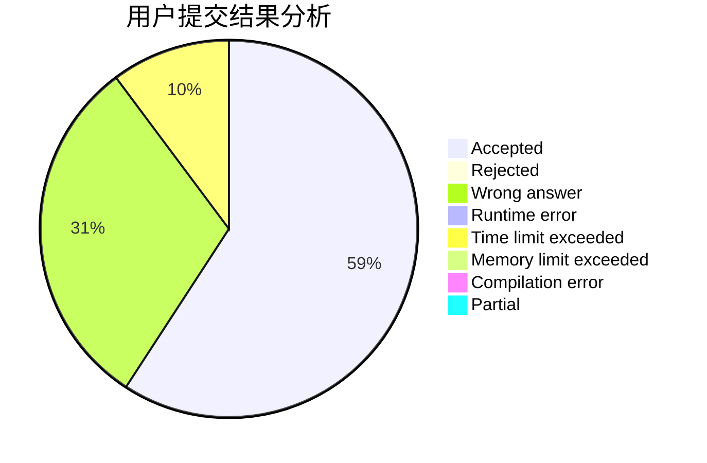
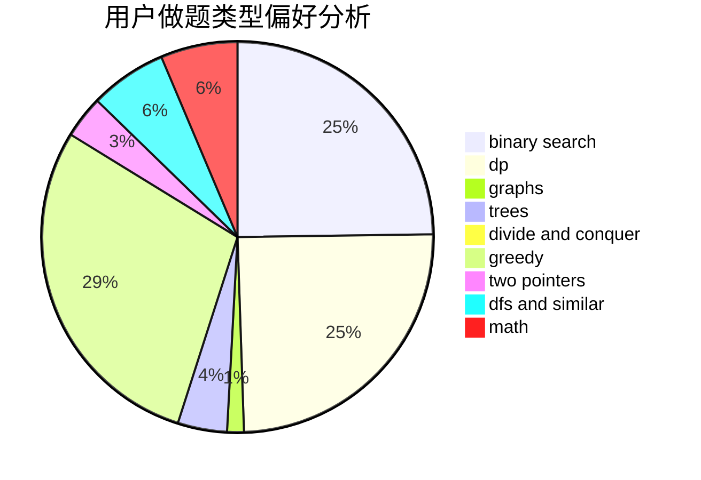

# pipixia2019

<!-- tabs:start -->

#### **用户提交结果分析**

#### **用户做题类型偏好分析**

<!-- tabs:end -->
# 推荐题目
[208A](https://codeforces.com/contest/208/problem/A)
[360E](https://codeforces.com/contest/360/problem/E)
[480E](https://codeforces.com/contest/480/problem/E)
[455B](https://codeforces.com/contest/455/problem/B)
[574B](https://codeforces.com/contest/574/problem/B)
[264E](https://codeforces.com/contest/264/problem/E)
[884F](https://codeforces.com/contest/884/problem/F)
[758E](https://codeforces.com/contest/758/problem/E)
[403E](https://codeforces.com/contest/403/problem/E)
[591D](https://codeforces.com/contest/591/problem/D)
