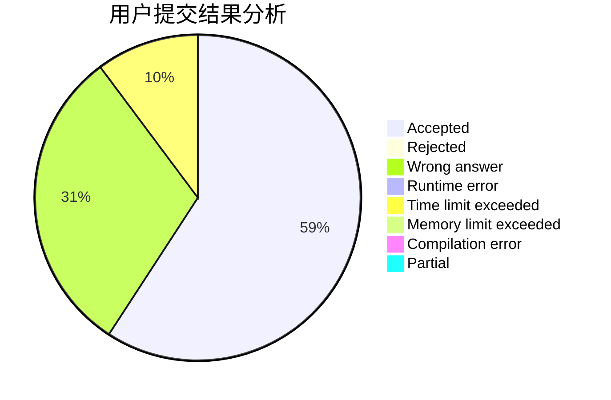
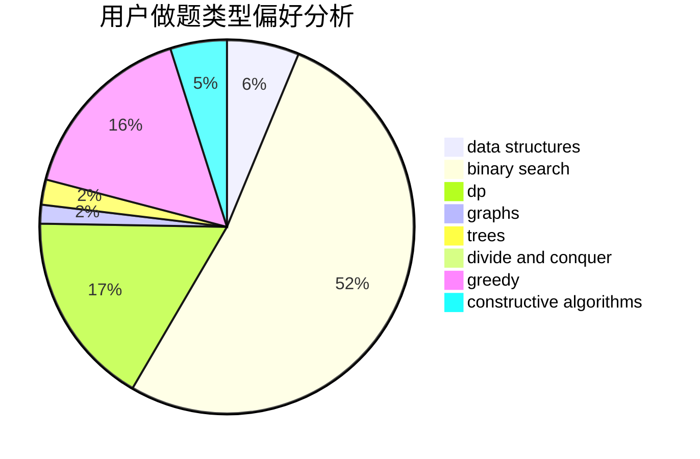

# pipixia2019

<!-- tabs:start -->

#### **用户提交结果分析**

#### **用户做题类型偏好分析**

#### **用户错题知识点分析**

<!-- tabs:end -->
# 推荐题目
[208A](https://codeforces.com/contest/208/problem/A)		strings		  
[360E](https://codeforces.com/contest/360/problem/E)		graphs,
                        greedy,
                        shortest paths		  
[480E](https://codeforces.com/contest/480/problem/E)		data structures,
                        divide and conquer		  
[455B](https://codeforces.com/contest/455/problem/B)		dfs and similar,
                        dp,
                        games,
                        implementation,
                        strings,
                        trees		  
[574B](https://codeforces.com/contest/574/problem/B)		brute force,
                        dfs and similar,
                        graphs,
                        hashing		  
[264E](https://codeforces.com/contest/264/problem/E)		data structures,
                        dp		  
[884F](https://codeforces.com/contest/884/problem/F)		flows,
                        graphs,
                        greedy		  
[758E](https://codeforces.com/contest/758/problem/E)		dfs and similar,
                        dp,
                        graphs,
                        greedy,
                        trees		  
[403E](https://codeforces.com/contest/403/problem/E)		data structures,
                        implementation,
                        trees		  
[591D](https://codeforces.com/contest/591/problem/D)		dsu,graphs,sortings,trees		  
