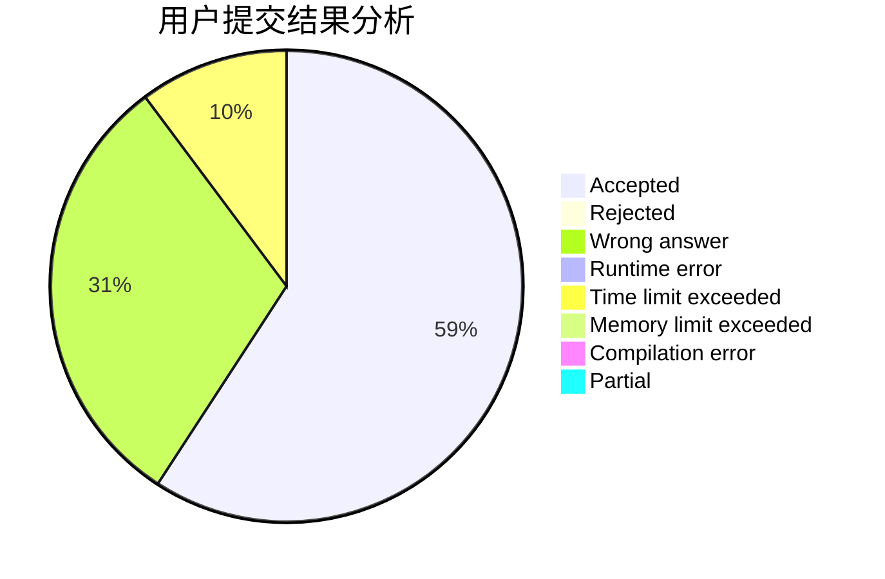
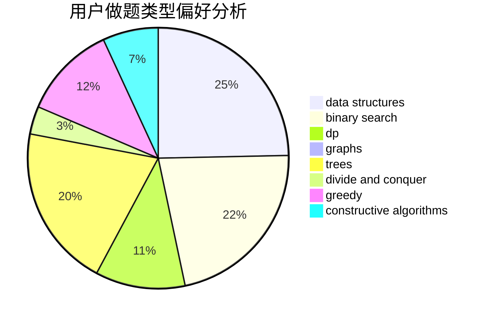

# pipixia2019

<!-- tabs:start -->

#### **用户提交结果分析**

#### **用户做题类型偏好分析**

#### **用户错题知识点分析**

<!-- tabs:end -->
# 推荐题目
[180D](https://codeforces.com/contest/180/problem/D)		greedy,
                        strings		  
[335A](https://codeforces.com/contest/335/problem/A)		binary search,
                        constructive algorithms,
                        greedy		  
[461E](https://codeforces.com/contest/461/problem/E)		binary search,
                        shortest paths,
                        strings		  
[434C](https://codeforces.com/contest/434/problem/C)		dsu,graphs,sortings,trees		  
[549C](https://codeforces.com/contest/549/problem/C)		games		  
[243D](https://codeforces.com/contest/243/problem/D)		data structures,
                        dp,
                        geometry,
                        two pointers		  
[865B](https://codeforces.com/contest/865/problem/B)		binary search,
                        sortings,
                        ternary search		  
[737A](https://codeforces.com/contest/737/problem/A)		dsu,graphs,sortings,trees		  
[375D](https://codeforces.com/contest/375/problem/D)		data structures,
                        dfs and similar,
                        trees		  
[571C](https://codeforces.com/contest/571/problem/C)		constructive algorithms,
                        dfs and similar,
                        graphs,
                        greedy		  
