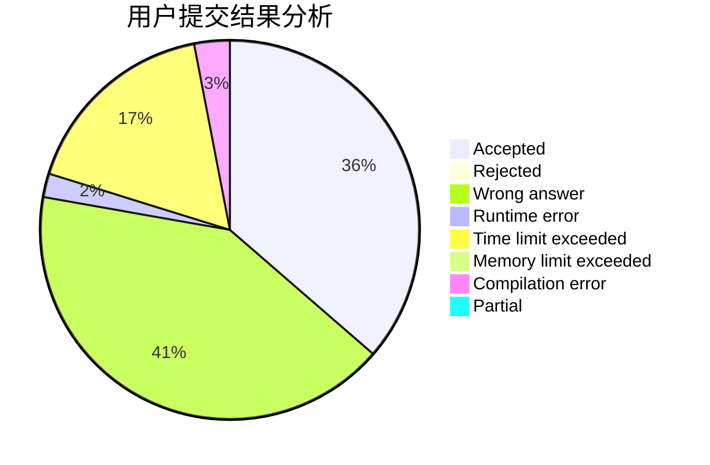
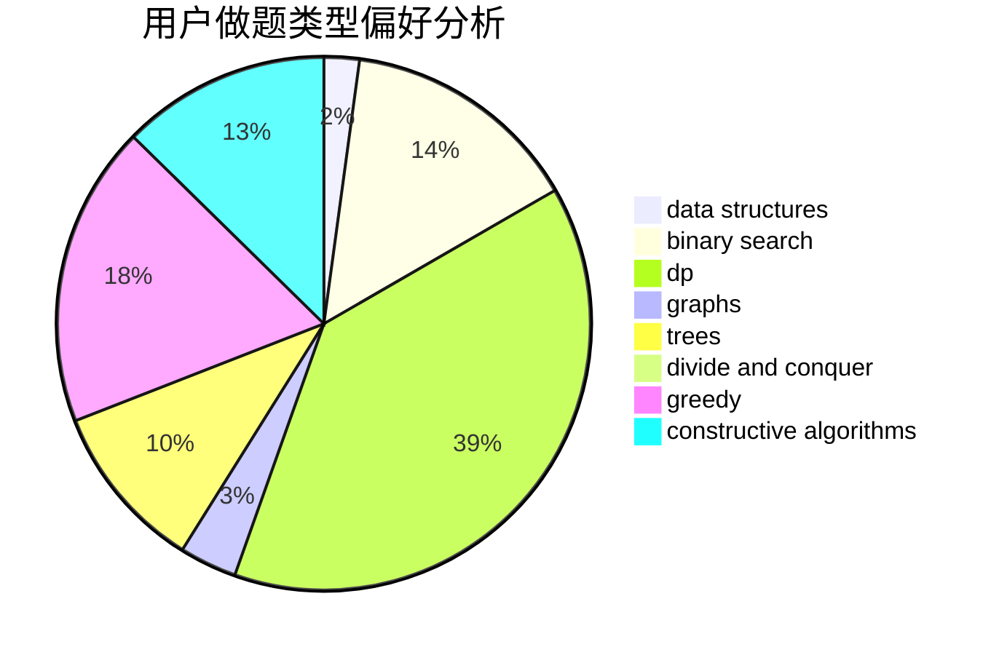
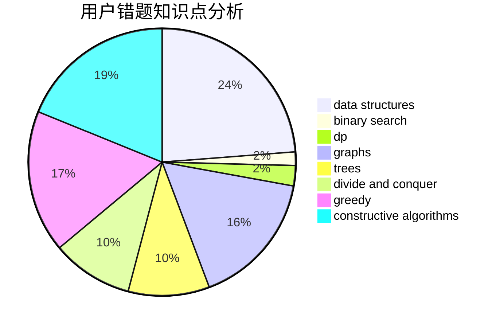

# ButterflyDew

<!-- tabs:start -->

#### **用户提交结果分析**

#### **用户做题类型偏好分析**

#### **用户错题知识点分析**

<!-- tabs:end -->
# 推荐题目
[1238C](https://codeforces.com/contest/1238/problem/C)		dp,
                        greedy,
                        math		  
[552C](https://codeforces.com/contest/552/problem/C)		brute force,
                        dp,
                        greedy,
                        math,
                        meet-in-the-middle,
                        number theory		  
[592C](https://codeforces.com/contest/592/problem/C)		math		  
[225E](https://codeforces.com/contest/225/problem/E)		math,
                        number theory		  
[10151](https://codeforces.com/contest/1015/problem/1)		dsu,graphs,sortings,trees		  
[592A](https://codeforces.com/contest/592/problem/A)		implementation		  
[478A](https://codeforces.com/contest/478/problem/A)		implementation		  
[591C](https://codeforces.com/contest/591/problem/C)		dsu,graphs,sortings,trees		  
[551E](https://codeforces.com/contest/551/problem/E)		binary search,
                        data structures,
                        implementation		  
[1142D](https://codeforces.com/contest/1142/problem/D)		dp		  
