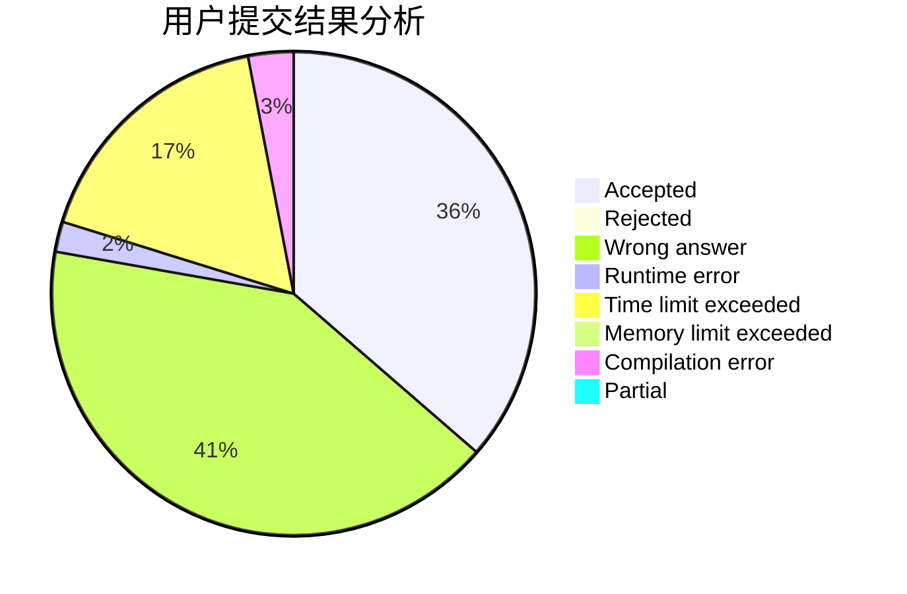
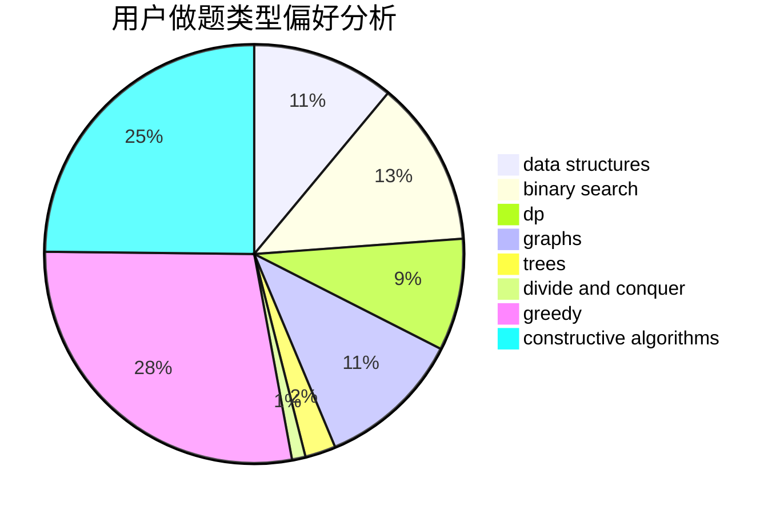
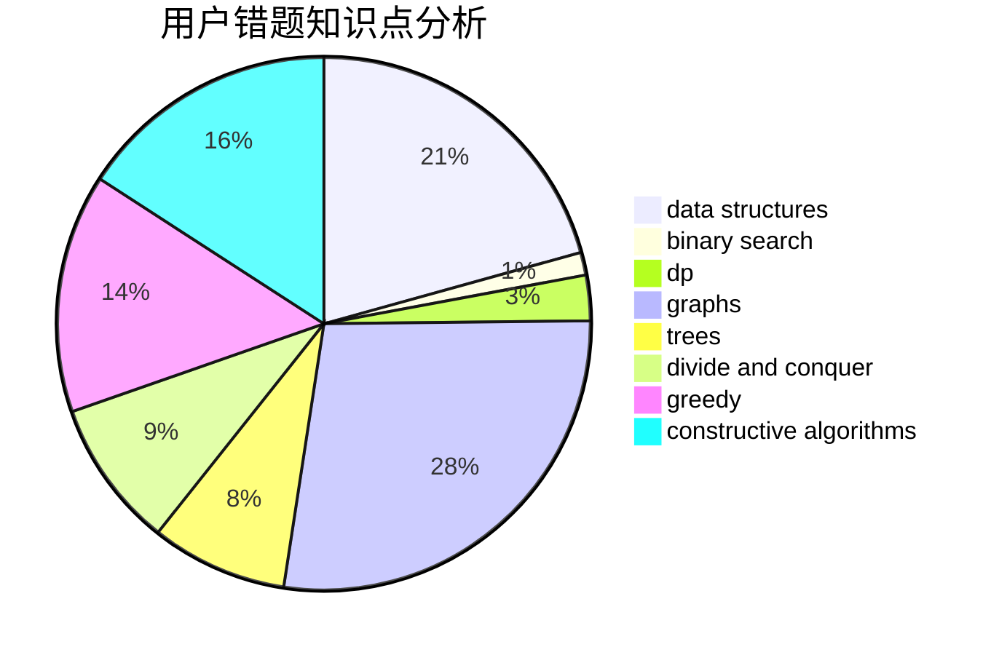

# ButterflyDew

<!-- tabs:start -->

#### **用户提交结果分析**

#### **用户做题类型偏好分析**

#### **用户错题知识点分析**

<!-- tabs:end -->
# 推荐题目
[122B](https://codeforces.com/contest/122/problem/B)		brute force,
                        implementation		  
[528B](https://codeforces.com/contest/528/problem/B)		dsu,graphs,sortings,trees		  
[572A](https://codeforces.com/contest/572/problem/A)		sortings		  
[200C](https://codeforces.com/contest/200/problem/C)		brute force,
                        implementation		  
[1013C](https://codeforces.com/contest/1013/problem/C)		dsu,graphs,sortings,trees		  
[571D](https://codeforces.com/contest/571/problem/D)		binary search,
                        data structures,
                        dsu,
                        trees		  
[459B](https://codeforces.com/contest/459/problem/B)		combinatorics,
                        implementation,
                        sortings		  
[571A](https://codeforces.com/contest/571/problem/A)		combinatorics,
                        implementation,
                        math		  
[527E](https://codeforces.com/contest/527/problem/E)		dfs and similar,
                        graphs		  
[1140F](https://codeforces.com/contest/1140/problem/F)		data structures,
                        divide and conquer,
                        dsu		  
