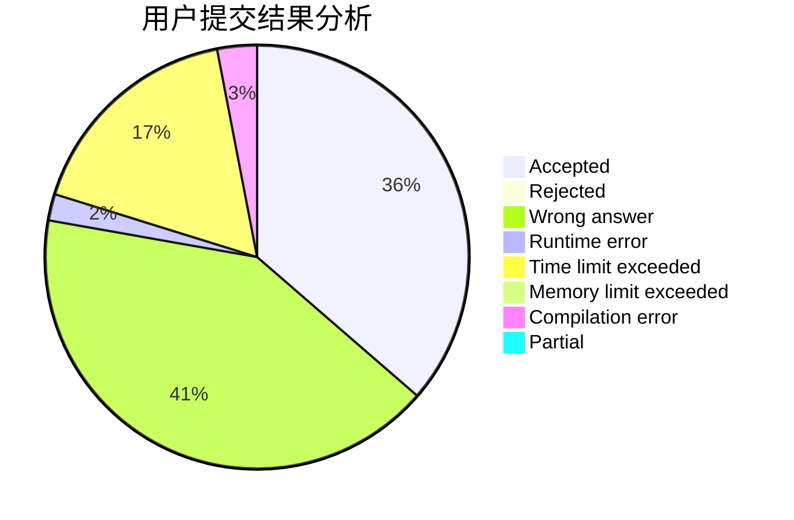
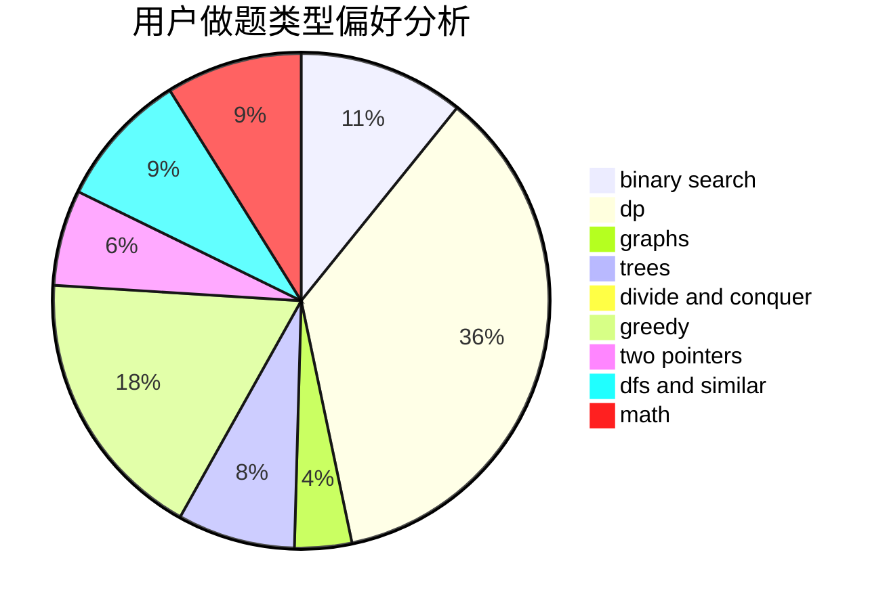

# ButterflyDew

<!-- tabs:start -->

#### **用户提交结果分析**

#### **用户做题类型偏好分析**

<!-- tabs:end -->
# 推荐题目
[1238C](https://codeforces.com/contest/1238/problem/C)
[552C](https://codeforces.com/contest/552/problem/C)
[592C](https://codeforces.com/contest/592/problem/C)
[225E](https://codeforces.com/contest/225/problem/E)
[10151](https://codeforces.com/contest/1015/problem/1)
[592A](https://codeforces.com/contest/592/problem/A)
[478A](https://codeforces.com/contest/478/problem/A)
[591C](https://codeforces.com/contest/591/problem/C)
[551E](https://codeforces.com/contest/551/problem/E)
[1142D](https://codeforces.com/contest/1142/problem/D)
