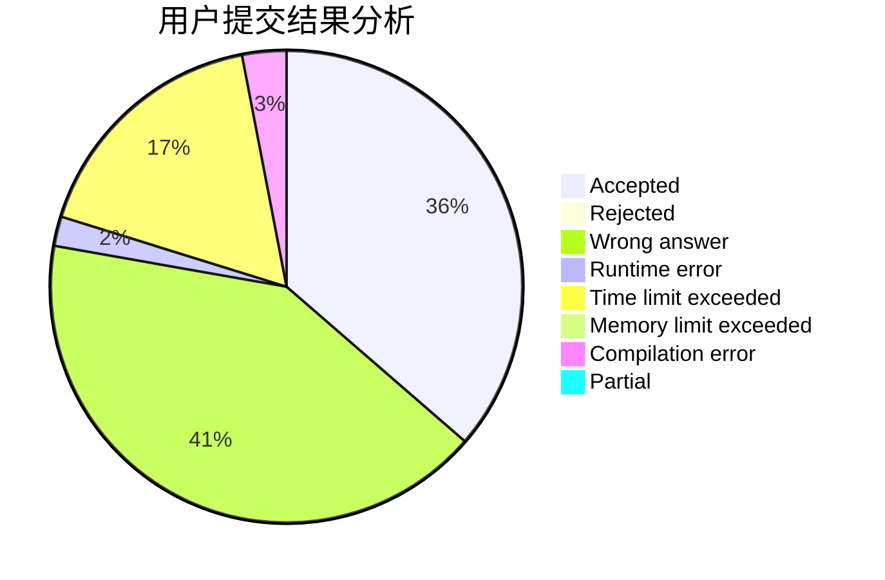
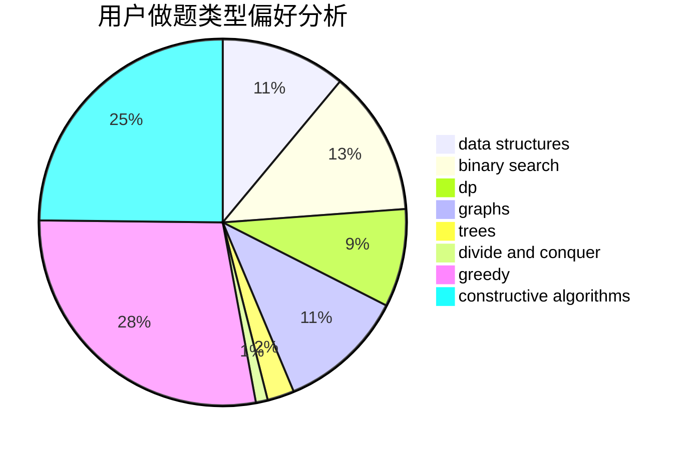
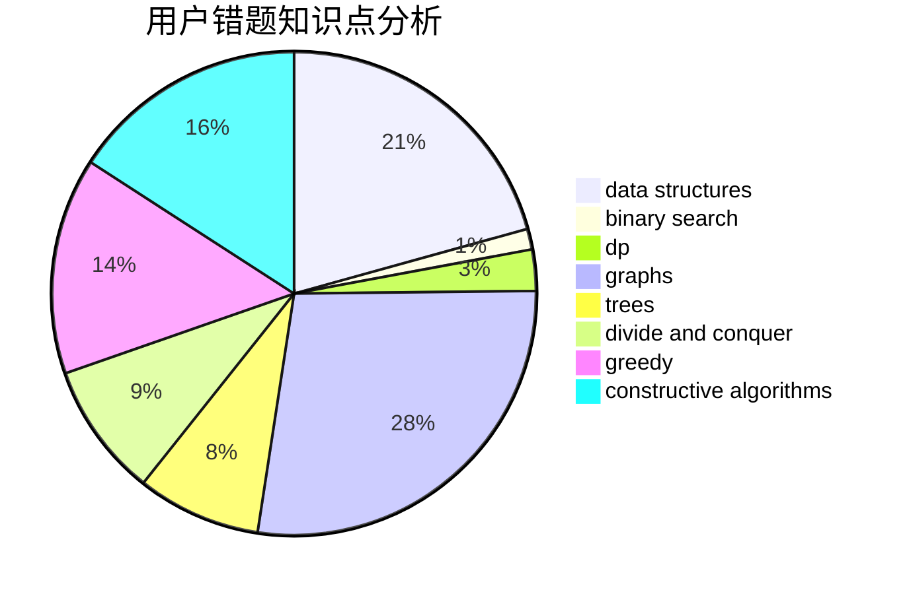

# ButterflyDew
<!-- tabs:start -->
#### **用户提交结果分析**

#### **用户做题类型偏好分析**

#### **用户错题知识点分析**

<!-- tabs:end -->
# 推荐题目
[Extending Set of Points](http://codeforces.com/problemset/problem/1140/F)		data structures,
                        divide and conquer,
                        dsu		  
[Data Center Drama](http://codeforces.com/problemset/problem/527/E)		dfs and similar,
                        graphs		  
[Arrays](http://codeforces.com/problemset/problem/572/A)		sortings		  
[Football Championship](http://codeforces.com/problemset/problem/200/C)		brute force,
                        implementation		  
[Wall Bars](http://codeforces.com/problemset/problem/268/D)		dp		  
[Watto and Mechanism](http://codeforces.com/problemset/problem/514/C)		binary search,
                        data structures,
                        hashing,
                        string suffix structures,
                        strings		  
[Coffee and Coursework (Easy version)](http://codeforces.com/problemset/problem/1118/D1)		brute force,
                        greedy		  
[Bear and Bowling](http://codeforces.com/problemset/problem/573/E)		data structures,
                        greedy		  
[Photo of The Sky](https://codeforces.com/contest/1013/problem/C)		brute force,
                        implementation,
                        math,
                        sortings		  
[Run for beer](http://codeforces.com/problemset/problem/575/G)		dfs and similar,
                        shortest paths		  
<!-- tabs:start -->
#### **data structures**
[Extending Set of Points](http://codeforces.com/problemset/problem/1140/F)		data structures,
                        divide and conquer,
                        dsu		  
[Data Center Drama](http://codeforces.com/problemset/problem/514/C)		binary search,
                        data structures,
                        hashing,
                        string suffix structures,
                        strings		  
[Arrays](http://codeforces.com/problemset/problem/573/E)		data structures,
                        greedy		  
[Football Championship](http://codeforces.com/problemset/problem/367/A)		data structures,
                        implementation		  
[Wall Bars](http://codeforces.com/problemset/problem/571/D)		binary search,
                        data structures,
                        dsu,
                        trees		  
[Watto and Mechanism](http://codeforces.com/problemset/problem/573/B)		binary search,
                        data structures,
                        dp,
                        math		  
[Coffee and Coursework (Easy version)](http://codeforces.com/problemset/problem/575/A)		data structures,
                        math,
                        matrices		  
[Bear and Bowling](https://codeforces.com/contest/574/problem/D)		binary search,
                        data structures,
                        dp,
                        math		  
[Photo of The Sky](http://codeforces.com/problemset/problem/1340/A)		brute force,
                        data structures,
                        greedy,
                        implementation		  
[Run for beer](http://codeforces.com/problemset/problem/1110/F)		data structures,
                        trees		  
#### **binary search**
[Extending Set of Points](http://codeforces.com/problemset/problem/514/C)		binary search,
                        data structures,
                        hashing,
                        string suffix structures,
                        strings		  
[Data Center Drama](https://codeforces.com/contest/1261/problem/C)		binary search,
                        graphs,
                        graphs,
                        shortest paths		  
[Arrays](http://codeforces.com/problemset/problem/571/D)		binary search,
                        data structures,
                        dsu,
                        trees		  
[Football Championship](http://codeforces.com/problemset/problem/573/B)		binary search,
                        data structures,
                        dp,
                        math		  
[Wall Bars](http://codeforces.com/problemset/problem/309/A)		binary search,
                        math,
                        two pointers		  
[Watto and Mechanism](https://codeforces.com/contest/574/problem/D)		binary search,
                        data structures,
                        dp,
                        math		  
[Coffee and Coursework (Easy version)](http://codeforces.com/problemset/problem/1108/F)		binary search,
                        dsu,
                        graphs,
                        greedy		  
[Bear and Bowling](http://codeforces.com/problemset/problem/1442/E)		binary search,
                        constructive algorithms,
                        dfs and similar,
                        dp,
                        greedy,
                        trees		  
[Photo of The Sky](http://codeforces.com/problemset/problem/1492/C)		binary search,
                        data structures,
                        dp,
                        greedy,
                        two pointers		  
[Run for beer](http://codeforces.com/problemset/problem/1463/D)		binary search,
                        constructive algorithms,
                        greedy,
                        two pointers		  
#### **dp**
[Extending Set of Points](http://codeforces.com/problemset/problem/268/D)		dp		  
[Data Center Drama](http://codeforces.com/problemset/problem/106/C)		dp		  
[Arrays](http://codeforces.com/problemset/problem/1384/B1)		brute force,
                        dp,
                        greedy		  
[Football Championship](http://codeforces.com/problemset/problem/1239/E)		dp,
                        implementation		  
[Wall Bars](http://codeforces.com/problemset/problem/1107/E)		dp		  
[Watto and Mechanism](http://codeforces.com/problemset/problem/353/E)		dp,
                        graph matchings,
                        greedy		  
[Coffee and Coursework (Easy version)](http://codeforces.com/problemset/problem/1237/F)		combinatorics,
                        dp		  
[Bear and Bowling](http://codeforces.com/problemset/problem/573/B)		binary search,
                        data structures,
                        dp,
                        math		  
[Photo of The Sky](https://codeforces.com/contest/574/problem/D)		binary search,
                        data structures,
                        dp,
                        math		  
[Run for beer](http://codeforces.com/problemset/problem/1113/A)		dp,
                        greedy,
                        math		  
#### **graph**
[Extending Set of Points](http://codeforces.com/problemset/problem/527/E)		dfs and similar,
                        graphs		  
[Data Center Drama](https://codeforces.com/contest/1261/problem/C)		binary search,
                        graphs,
                        graphs,
                        shortest paths		  
[Arrays](http://codeforces.com/problemset/problem/575/B)		dfs and similar,
                        graphs,
                        trees		  
[Football Championship](http://codeforces.com/problemset/problem/353/E)		dp,
                        graph matchings,
                        greedy		  
[Wall Bars](http://codeforces.com/problemset/problem/574/B)		brute force,
                        dfs and similar,
                        graphs,
                        hashing		  
[Watto and Mechanism](http://codeforces.com/problemset/problem/575/C)		bitmasks,
                        brute force,
                        graph matchings		  
[Coffee and Coursework (Easy version)](http://codeforces.com/problemset/problem/1267/F)		graphs		  
[Bear and Bowling](http://codeforces.com/problemset/problem/1368/E)		constructive algorithms,
                        graphs,
                        greedy		  
[Photo of The Sky](http://codeforces.com/problemset/problem/1108/F)		binary search,
                        dsu,
                        graphs,
                        greedy		  
[Run for beer](http://codeforces.com/problemset/problem/571/C)		constructive algorithms,
                        dfs and similar,
                        graphs,
                        greedy		  
#### **trees**
[Extending Set of Points](http://codeforces.com/problemset/problem/575/B)		dfs and similar,
                        graphs,
                        trees		  
[Data Center Drama](http://codeforces.com/problemset/problem/571/D)		binary search,
                        data structures,
                        dsu,
                        trees		  
[Arrays](http://codeforces.com/problemset/problem/1110/F)		data structures,
                        trees		  
[Football Championship](http://codeforces.com/problemset/problem/1009/F)		data structures,
                        dsu,
                        trees		  
[Wall Bars](http://codeforces.com/problemset/problem/573/C)		constructive algorithms,
                        dfs and similar,
                        trees		  
[Watto and Mechanism](http://codeforces.com/problemset/problem/161/D)		dfs and similar,
                        dp,
                        trees		  
[Coffee and Coursework (Easy version)](http://codeforces.com/problemset/problem/1325/C)		constructive algorithms,
                        dfs and similar,
                        greedy,
                        trees		  
[Bear and Bowling](http://codeforces.com/problemset/problem/1481/F)		dp,
                        greedy,
                        trees		  
[Photo of The Sky](http://codeforces.com/problemset/problem/1442/E)		binary search,
                        constructive algorithms,
                        dfs and similar,
                        dp,
                        greedy,
                        trees		  
[Run for beer](http://codeforces.com/problemset/problem/1479/D)		binary search,
                        bitmasks,
                        brute force,
                        data structures,
                        probabilities,
                        trees		  
#### **divide and conquer**
[Extending Set of Points](http://codeforces.com/problemset/problem/1140/F)		data structures,
                        divide and conquer,
                        dsu		  
[Data Center Drama](http://codeforces.com/problemset/problem/1156/E)		data structures,
                        divide and conquer,
                        dsu,
                        two pointers		  
[Arrays](http://codeforces.com/problemset/problem/573/D)		data structures,
                        divide and conquer,
                        dp		  
[Football Championship](http://codeforces.com/problemset/problem/1461/D)		binary search,
                        brute force,
                        data structures,
                        divide and conquer,
                        implementation,
                        sortings		  
[Wall Bars](http://codeforces.com/problemset/problem/1466/G)		combinatorics,
                        divide and conquer,
                        hashing,
                        math,
                        string suffix structures,
                        strings		  
[Watto and Mechanism](http://codeforces.com/problemset/problem/1490/D)		dfs and similar,
                        divide and conquer,
                        implementation		  
[Coffee and Coursework (Easy version)](https://codeforces.com/contest/1483/problem/C)		data structures,
                        divide and conquer,
                        dp		  
[Bear and Bowling](http://codeforces.com/problemset/problem/1491/E)		brute force,
                        dfs and similar,
                        divide and conquer,
                        number theory,
                        trees		  
[Photo of The Sky](http://codeforces.com/problemset/problem/1303/G)		data structures,
                        divide and conquer,
                        geometry,
                        trees		  
[Run for beer](http://codeforces.com/problemset/problem/1494/D)		constructive algorithms,
                        data structures,
                        dfs and similar,
                        divide and conquer,
                        dsu,
                        greedy,
                        sortings,
                        trees		  
#### **greedy**
[Extending Set of Points](http://codeforces.com/problemset/problem/1118/D1)		brute force,
                        greedy		  
[Data Center Drama](http://codeforces.com/problemset/problem/573/E)		data structures,
                        greedy		  
[Arrays](http://codeforces.com/problemset/problem/1313/B)		constructive algorithms,
                        greedy,
                        implementation,
                        math		  
[Football Championship](http://codeforces.com/problemset/problem/1187/C)		constructive algorithms,
                        greedy,
                        implementation		  
[Wall Bars](http://codeforces.com/problemset/problem/1384/B1)		brute force,
                        dp,
                        greedy		  
[Watto and Mechanism](http://codeforces.com/problemset/problem/1082/B)		greedy		  
[Coffee and Coursework (Easy version)](http://codeforces.com/problemset/problem/494/A)		greedy		  
[Bear and Bowling](http://codeforces.com/problemset/problem/353/E)		dp,
                        graph matchings,
                        greedy		  
[Photo of The Sky](http://codeforces.com/problemset/problem/574/A)		greedy,
                        implementation		  
[Run for beer](http://codeforces.com/problemset/problem/1113/A)		dp,
                        greedy,
                        math		  
#### **constructive algorithms**
[Extending Set of Points](http://codeforces.com/problemset/problem/1313/B)		constructive algorithms,
                        greedy,
                        implementation,
                        math		  
[Data Center Drama](http://codeforces.com/problemset/problem/1187/C)		constructive algorithms,
                        greedy,
                        implementation		  
[Arrays](http://codeforces.com/problemset/problem/1401/A)		constructive algorithms,
                        math		  
[Football Championship](http://codeforces.com/problemset/problem/1368/E)		constructive algorithms,
                        graphs,
                        greedy		  
[Wall Bars](http://codeforces.com/problemset/problem/301/A)		constructive algorithms		  
[Watto and Mechanism](http://codeforces.com/problemset/problem/571/C)		constructive algorithms,
                        dfs and similar,
                        graphs,
                        greedy		  
[Coffee and Coursework (Easy version)](http://codeforces.com/problemset/problem/1108/D)		constructive algorithms,
                        dp,
                        greedy		  
[Bear and Bowling](https://codeforces.com/contest/1150/problem/C)		constructive algorithms,
                        greedy,
                        math,
                        number theory		  
[Photo of The Sky](http://codeforces.com/problemset/problem/573/C)		constructive algorithms,
                        dfs and similar,
                        trees		  
[Run for beer](http://codeforces.com/problemset/problem/1325/C)		constructive algorithms,
                        dfs and similar,
                        greedy,
                        trees		  
#### **sortings**
[Extending Set of Points](http://codeforces.com/problemset/problem/572/A)		sortings		  
[Data Center Drama](https://codeforces.com/contest/1013/problem/C)		brute force,
                        implementation,
                        math,
                        sortings		  
[Arrays](http://codeforces.com/problemset/problem/334/B)		sortings		  
[Football Championship](http://codeforces.com/problemset/problem/459/B)		combinatorics,
                        implementation,
                        sortings		  
[Wall Bars](https://codeforces.com/contest/528/problem/B)		data structures,
                        dp,
                        greedy,
                        implementation,
                        sortings		  
[Watto and Mechanism](http://codeforces.com/problemset/problem/1110/B)		greedy,
                        sortings		  
[Coffee and Coursework (Easy version)](https://codeforces.com/contest/1496/problem/C)		geometry,
                        greedy,
                        math,
                        sortings		  
[Bear and Bowling](http://codeforces.com/problemset/problem/1495/A)		geometry,
                        greedy,
                        math,
                        sortings		  
[Photo of The Sky](http://codeforces.com/problemset/problem/1497/A)		brute force,
                        data structures,
                        greedy,
                        sortings		  
[Run for beer](http://codeforces.com/problemset/problem/1427/A)		math,
                        sortings		  
<!-- tabs:end -->
