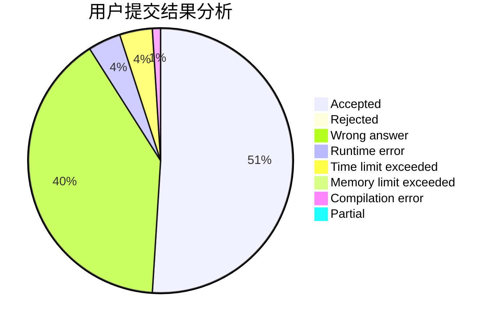
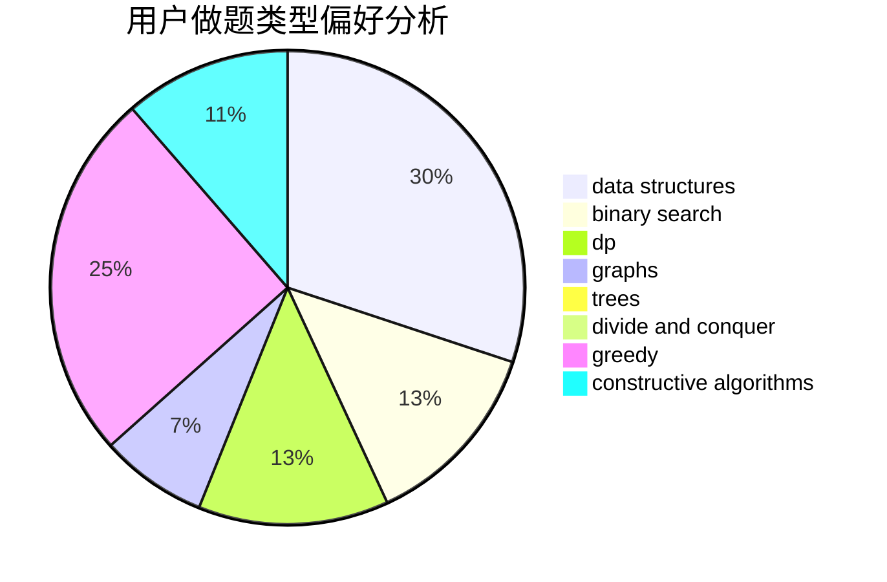
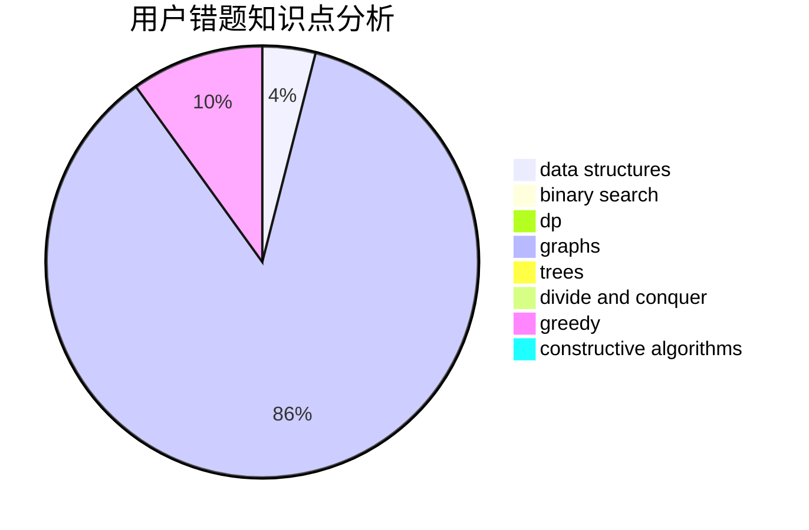

# pkq2006

<!-- tabs:start -->

#### **用户提交结果分析**

#### **用户做题类型偏好分析**

#### **用户错题知识点分析**

<!-- tabs:end -->
# 推荐题目
[782A](https://codeforces.com/contest/782/problem/A)		dsu,graphs,sortings,trees		  
[1209F](https://codeforces.com/contest/1209/problem/F)		data structures,
                        dfs and similar,
                        graphs,
                        shortest paths,
                        strings,
                        trees		  
[549C](https://codeforces.com/contest/549/problem/C)		games		  
[730J](https://codeforces.com/contest/730/problem/J)		dp		  
[737B](https://codeforces.com/contest/737/problem/B)		dsu,graphs,sortings,trees		  
[701C](https://codeforces.com/contest/701/problem/C)		binary search,
                        strings,
                        two pointers		  
[1147B](https://codeforces.com/contest/1147/problem/B)		brute force,
                        strings		  
[268B](https://codeforces.com/contest/268/problem/B)		implementation,
                        math		  
[1405B](https://codeforces.com/contest/1405/problem/B)		constructive algorithms,
                        implementation		  
[1487G](https://codeforces.com/contest/1487/problem/G)		combinatorics,
                        dp,
                        fft,
                        math		  
