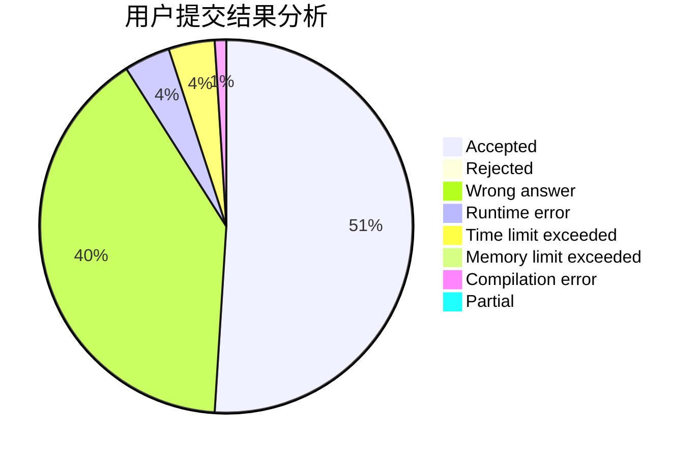
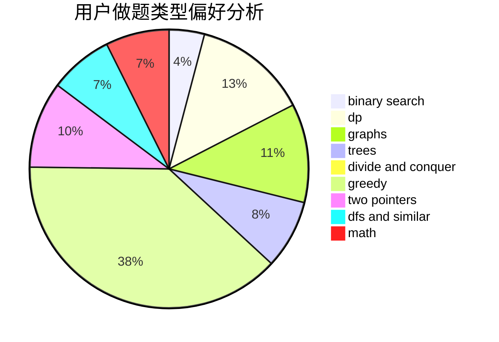

# pkq2006

<!-- tabs:start -->

#### **用户提交结果分析**

#### **用户做题类型偏好分析**

<!-- tabs:end -->
# 推荐题目
[782A](https://codeforces.com/contest/782/problem/A)
[1209F](https://codeforces.com/contest/1209/problem/F)
[549C](https://codeforces.com/contest/549/problem/C)
[730J](https://codeforces.com/contest/730/problem/J)
[737B](https://codeforces.com/contest/737/problem/B)
[701C](https://codeforces.com/contest/701/problem/C)
[1147B](https://codeforces.com/contest/1147/problem/B)
[268B](https://codeforces.com/contest/268/problem/B)
[1405B](https://codeforces.com/contest/1405/problem/B)
[1487G](https://codeforces.com/contest/1487/problem/G)
