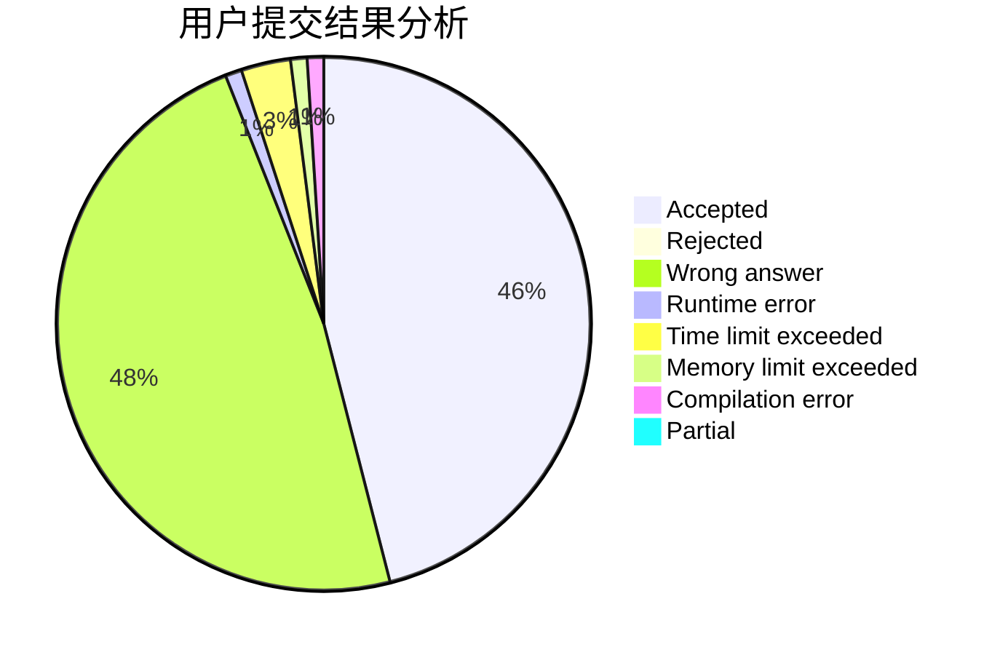
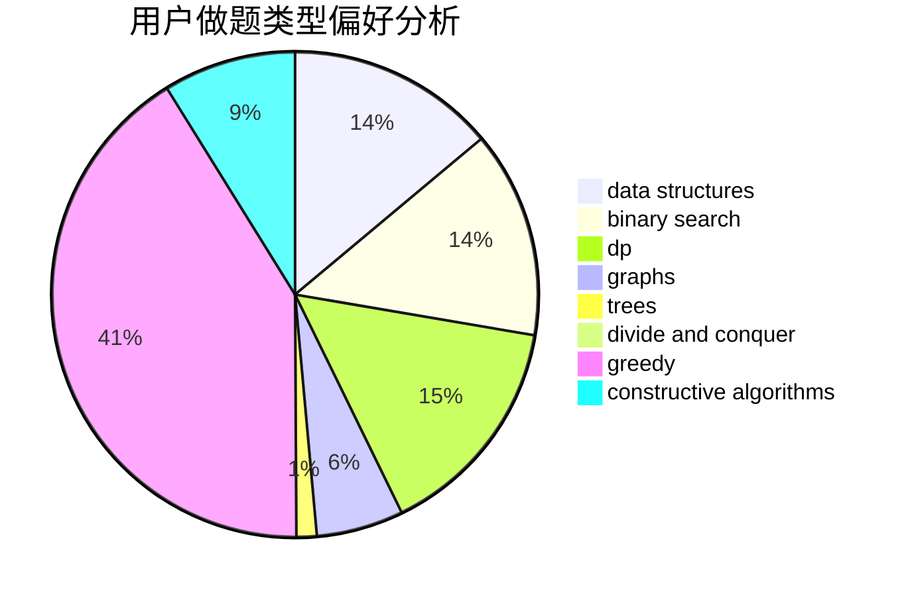
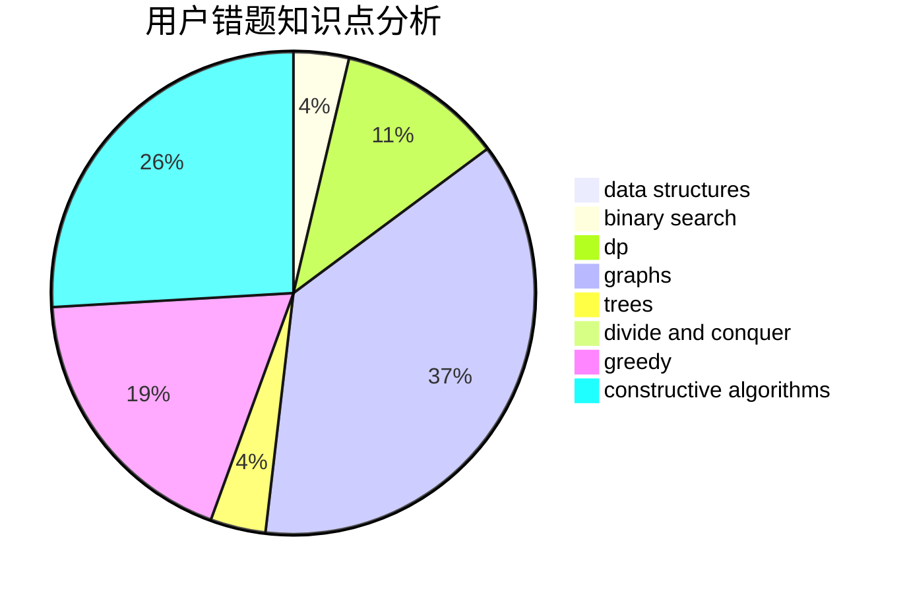

# pla233

<!-- tabs:start -->

#### **用户提交结果分析**

#### **用户做题类型偏好分析**

#### **用户错题知识点分析**

<!-- tabs:end -->
# 推荐题目
[849B](https://codeforces.com/contest/849/problem/B)		brute force,
                        geometry		  
[872B](https://codeforces.com/contest/872/problem/B)		dsu,graphs,sortings,trees		  
[739C](https://codeforces.com/contest/739/problem/C)		data structures		  
[1090D](https://codeforces.com/contest/1090/problem/D)		constructive algorithms		  
[764B](https://codeforces.com/contest/764/problem/B)		constructive algorithms,
                        implementation		  
[180D](https://codeforces.com/contest/180/problem/D)		greedy,
                        strings		  
[1276C](https://codeforces.com/contest/1276/problem/C)		brute force,
                        combinatorics,
                        constructive algorithms,
                        data structures,
                        greedy,
                        math		  
[1079D](https://codeforces.com/contest/1079/problem/D)		dsu,graphs,sortings,trees		  
[1058D](https://codeforces.com/contest/1058/problem/D)		dsu,graphs,sortings,trees		  
[176D](https://codeforces.com/contest/176/problem/D)		dp		  
