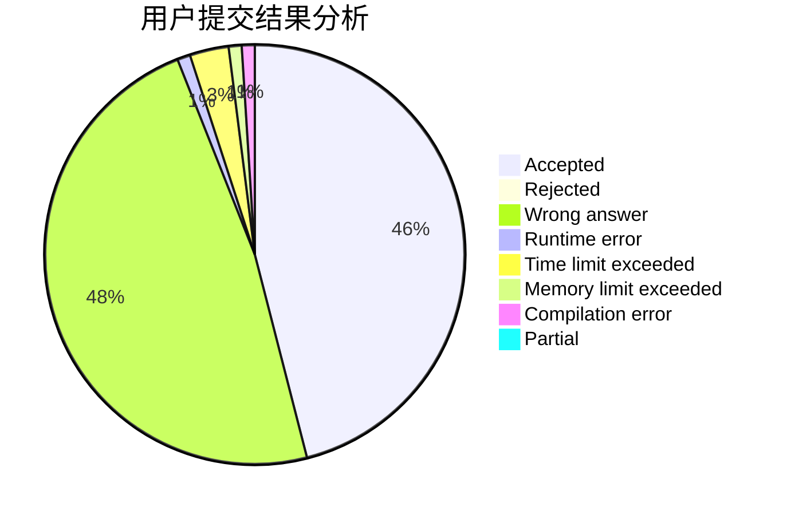
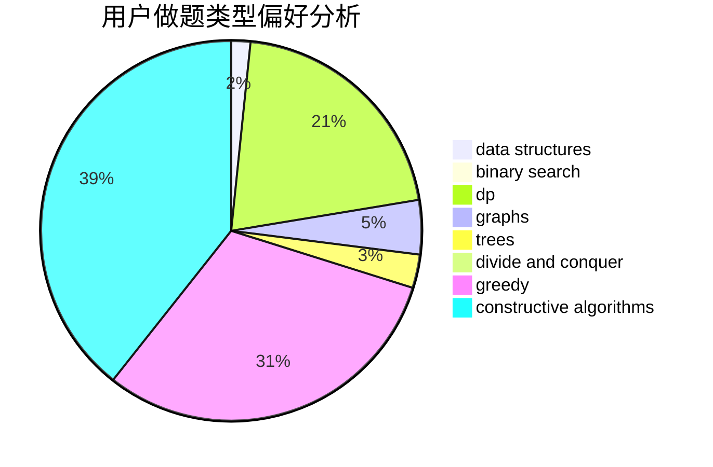
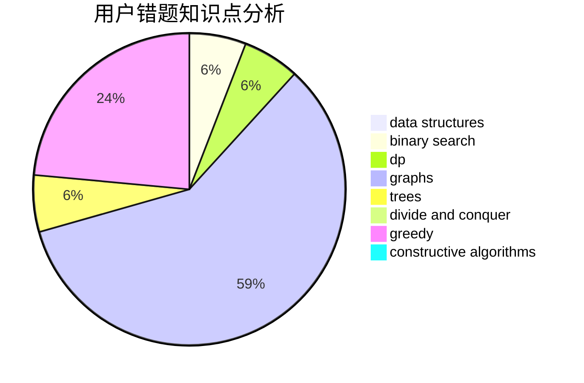

# pla233

<!-- tabs:start -->

#### **用户提交结果分析**

#### **用户做题类型偏好分析**

#### **用户错题知识点分析**

<!-- tabs:end -->
# 推荐题目
[868D](https://codeforces.com/contest/868/problem/D)		bitmasks,
                        brute force,
                        dp,
                        implementation,
                        strings		  
[893D](https://codeforces.com/contest/893/problem/D)		data structures,
                        dp,
                        greedy,
                        implementation		  
[75C](https://codeforces.com/contest/75/problem/C)		binary search,
                        number theory		  
[1091A](https://codeforces.com/contest/1091/problem/A)		brute force,
                        implementation,
                        math		  
[782E](https://codeforces.com/contest/782/problem/E)		dsu,graphs,sortings,trees		  
[208A](https://codeforces.com/contest/208/problem/A)		strings		  
[1282D](https://codeforces.com/contest/1282/problem/D)		constructive algorithms,
                        interactive,
                        strings		  
[107C](https://codeforces.com/contest/107/problem/C)		bitmasks,
                        dp		  
[1059B](https://codeforces.com/contest/1059/problem/B)		implementation		  
[201C](https://codeforces.com/contest/201/problem/C)		dp		  
