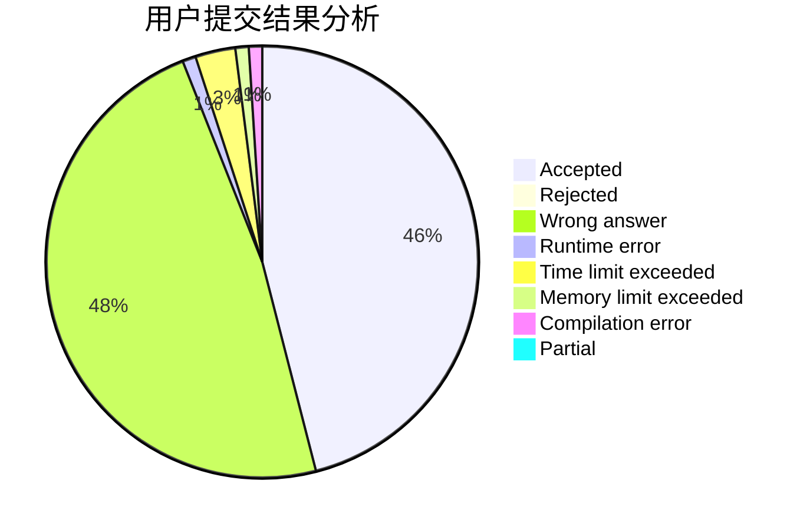
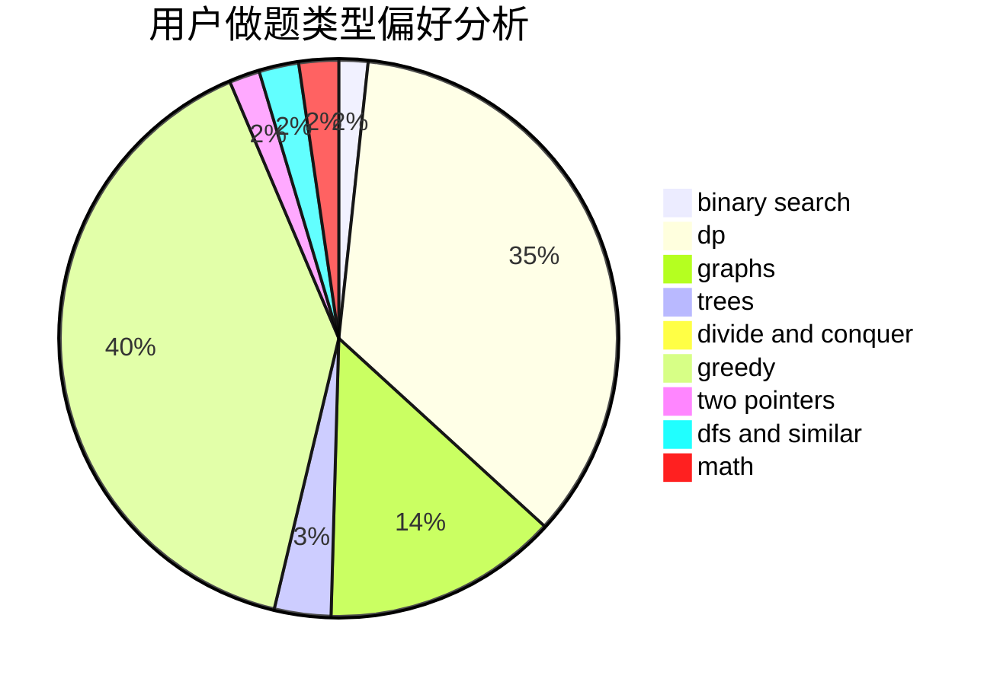

# pla233

<!-- tabs:start -->

#### **用户提交结果分析**

#### **用户做题类型偏好分析**

<!-- tabs:end -->
# 推荐题目
[868D](https://codeforces.com/contest/868/problem/D)
[893D](https://codeforces.com/contest/893/problem/D)
[75C](https://codeforces.com/contest/75/problem/C)
[1091A](https://codeforces.com/contest/1091/problem/A)
[782E](https://codeforces.com/contest/782/problem/E)
[208A](https://codeforces.com/contest/208/problem/A)
[1282D](https://codeforces.com/contest/1282/problem/D)
[107C](https://codeforces.com/contest/107/problem/C)
[1059B](https://codeforces.com/contest/1059/problem/B)
[201C](https://codeforces.com/contest/201/problem/C)
