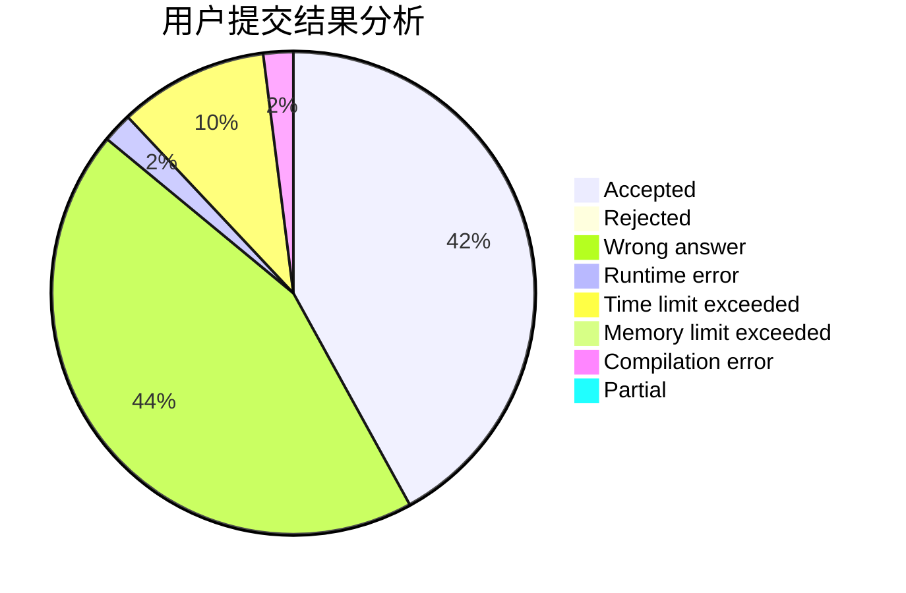
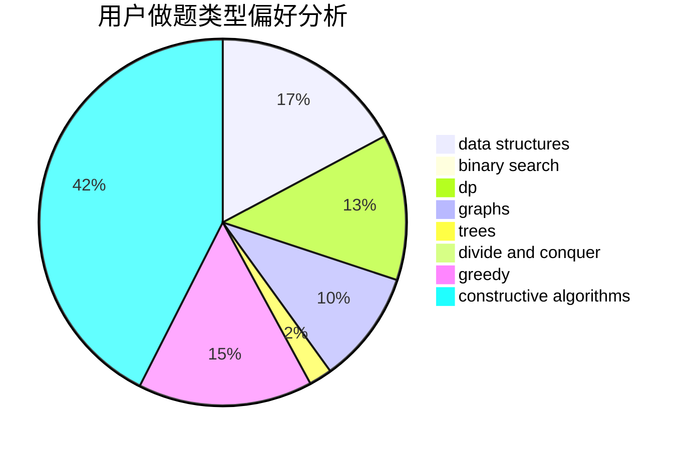
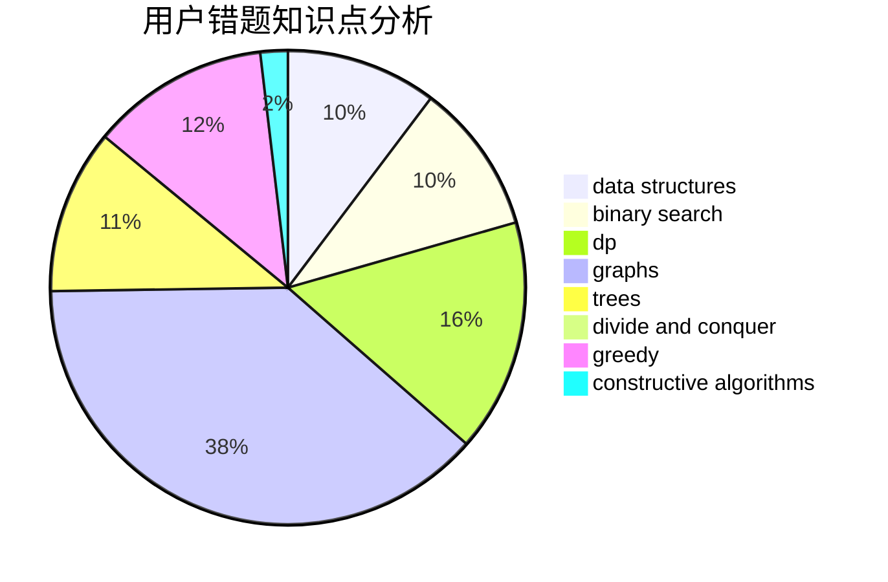

# playerzhou

<!-- tabs:start -->

#### **用户提交结果分析**

#### **用户做题类型偏好分析**

#### **用户错题知识点分析**

<!-- tabs:end -->
# 推荐题目
[7C](https://codeforces.com/contest/7/problem/C)		math,
                        number theory		  
[600D](https://codeforces.com/contest/600/problem/D)		geometry		  
[787D](https://codeforces.com/contest/787/problem/D)		dsu,graphs,sortings,trees		  
[1363D](https://codeforces.com/contest/1363/problem/D)		binary search,
                        implementation,
                        interactive,
                        math		  
[612C](https://codeforces.com/contest/612/problem/C)		data structures,
                        expression parsing,
                        math		  
[887B](https://codeforces.com/contest/887/problem/B)		brute force,
                        implementation		  
[1071C](https://codeforces.com/contest/1071/problem/C)		dsu,graphs,sortings,trees		  
[80B](https://codeforces.com/contest/80/problem/B)		geometry,
                        math		  
[1167C](https://codeforces.com/contest/1167/problem/C)		dfs and similar,
                        dsu,
                        graphs		  
[288E](https://codeforces.com/contest/288/problem/E)		dp,
                        implementation,
                        math		  
