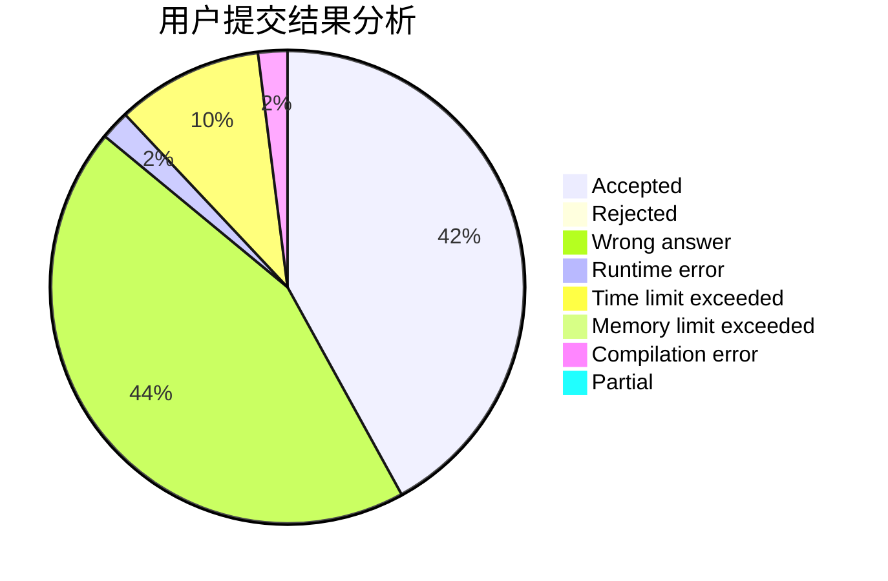
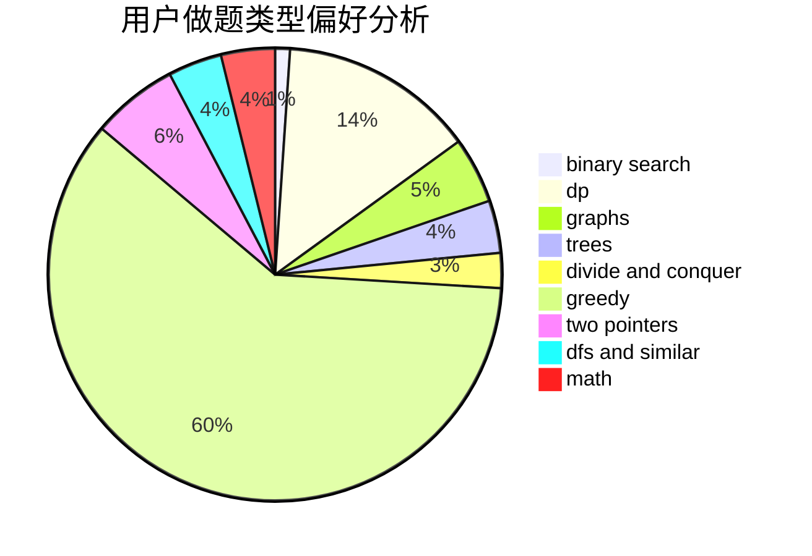

# playerzhou

<!-- tabs:start -->

#### **用户提交结果分析**

#### **用户做题类型偏好分析**

<!-- tabs:end -->
# 推荐题目
[814D](https://codeforces.com/contest/814/problem/D)
[61E](https://codeforces.com/contest/61/problem/E)
[803D](https://codeforces.com/contest/803/problem/D)
[1370C](https://codeforces.com/contest/1370/problem/C)
[631E](https://codeforces.com/contest/631/problem/E)
[906C](https://codeforces.com/contest/906/problem/C)
[1072B](https://codeforces.com/contest/1072/problem/B)
[827F](https://codeforces.com/contest/827/problem/F)
[11722](https://codeforces.com/contest/1172/problem/2)
[303A](https://codeforces.com/contest/303/problem/A)
