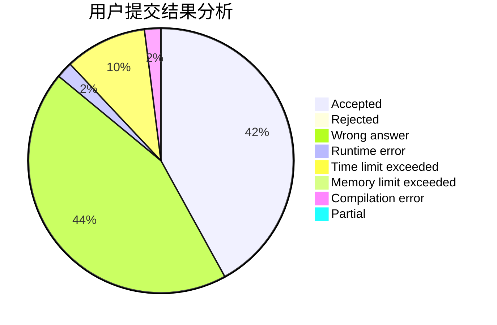
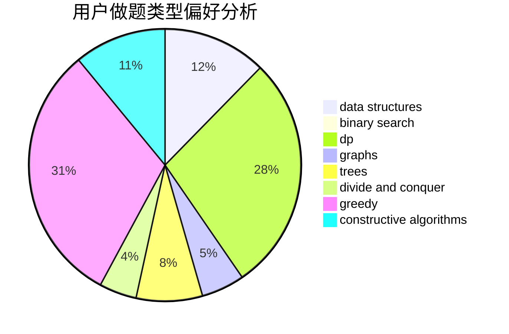
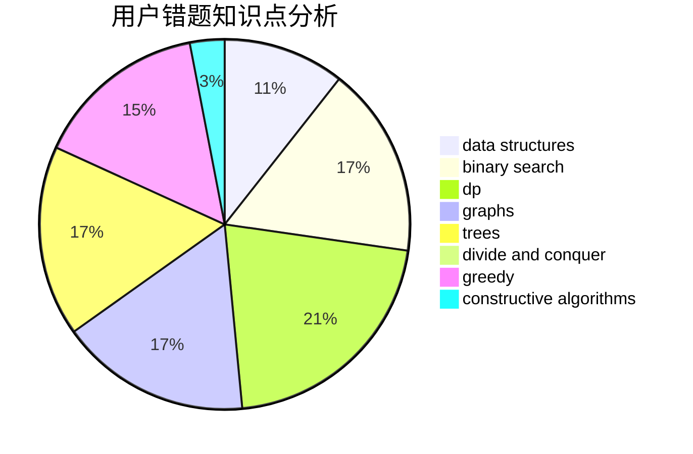

# playerzhou

<!-- tabs:start -->

#### **用户提交结果分析**

#### **用户做题类型偏好分析**

#### **用户错题知识点分析**

<!-- tabs:end -->
# 推荐题目
[814D](https://codeforces.com/contest/814/problem/D)		dfs and similar,
                        dp,
                        geometry,
                        greedy,
                        trees		  
[61E](https://codeforces.com/contest/61/problem/E)		data structures,
                        trees		  
[803D](https://codeforces.com/contest/803/problem/D)		binary search,
                        greedy		  
[1370C](https://codeforces.com/contest/1370/problem/C)		games,
                        math,
                        number theory		  
[631E](https://codeforces.com/contest/631/problem/E)		data structures,
                        dp,
                        geometry		  
[906C](https://codeforces.com/contest/906/problem/C)		bitmasks,
                        brute force,
                        dp,
                        graphs		  
[1072B](https://codeforces.com/contest/1072/problem/B)		dsu,graphs,sortings,trees		  
[827F](https://codeforces.com/contest/827/problem/F)		data structures,
                        dp,
                        graphs,
                        shortest paths		  
[11722](https://codeforces.com/contest/1172/problem/2)		dsu,graphs,sortings,trees		  
[303A](https://codeforces.com/contest/303/problem/A)		constructive algorithms,
                        implementation,
                        math		  
