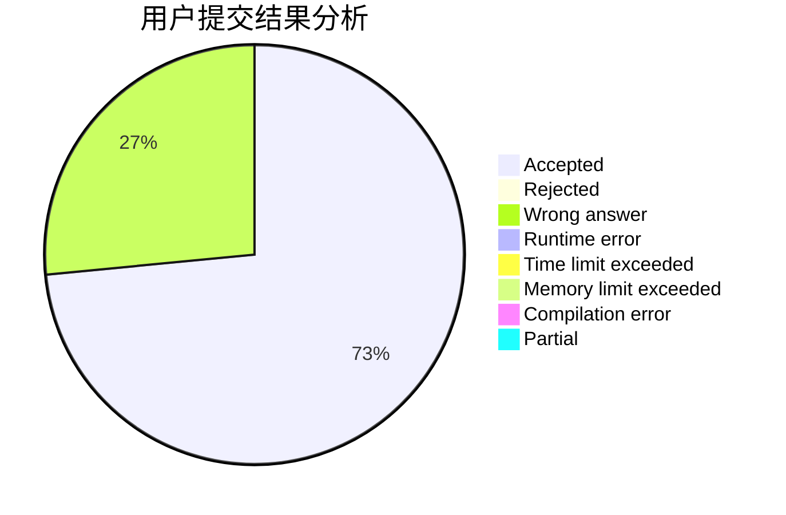
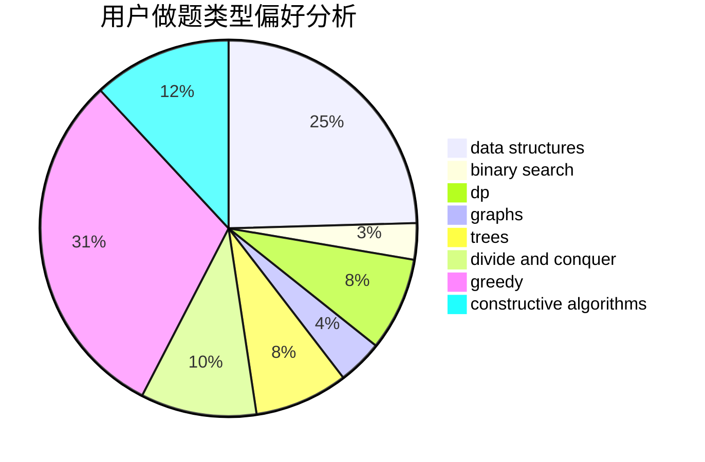
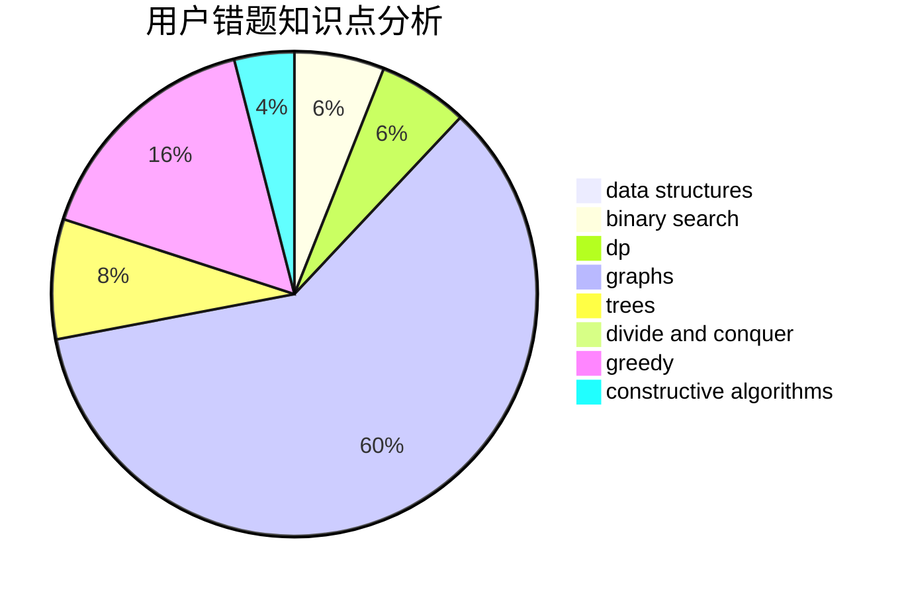

# playerzmr

<!-- tabs:start -->

#### **用户提交结果分析**

#### **用户做题类型偏好分析**

#### **用户错题知识点分析**

<!-- tabs:end -->
# 推荐题目
[709B](https://codeforces.com/contest/709/problem/B)		greedy,
                        implementation,
                        sortings		  
[1271A](https://codeforces.com/contest/1271/problem/A)		brute force,
                        greedy,
                        math		  
[1081C](https://codeforces.com/contest/1081/problem/C)		combinatorics,
                        dp,
                        math		  
[617B](https://codeforces.com/contest/617/problem/B)		combinatorics		  
[603A](https://codeforces.com/contest/603/problem/A)		dp,
                        greedy,
                        math		  
[1038C](https://codeforces.com/contest/1038/problem/C)		greedy,
                        sortings		  
[107A](https://codeforces.com/contest/107/problem/A)		dfs and similar,
                        graphs		  
[736D](https://codeforces.com/contest/736/problem/D)		math,
                        matrices		  
[838E](https://codeforces.com/contest/838/problem/E)		dp		  
[76D](https://codeforces.com/contest/76/problem/D)		dp,
                        greedy,
                        math		  
