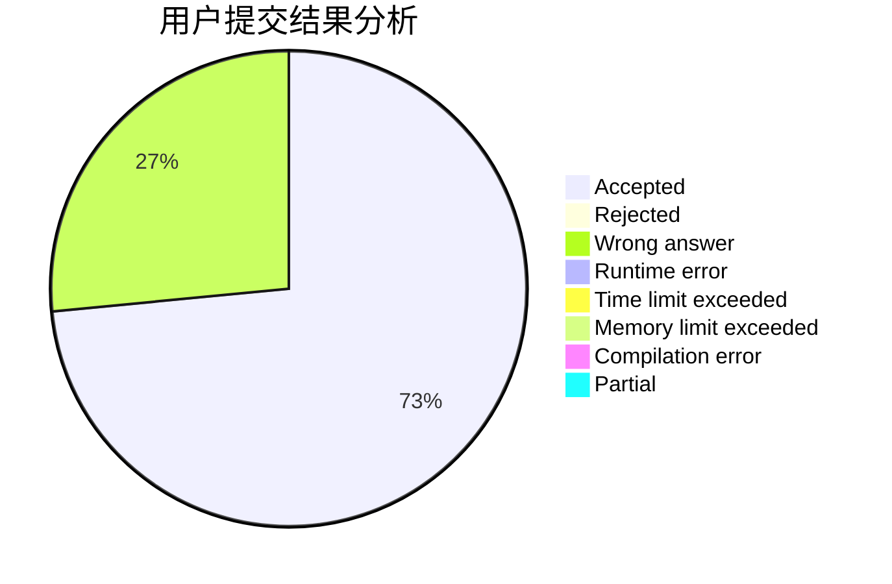
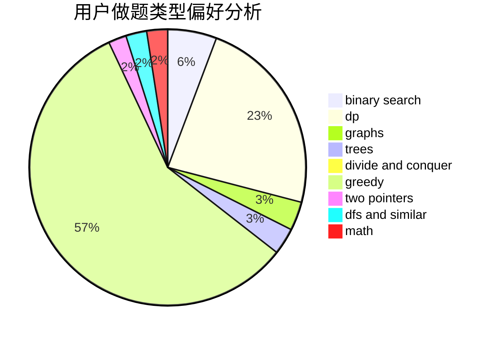

# playerzmr

<!-- tabs:start -->

#### **用户提交结果分析**

#### **用户做题类型偏好分析**

<!-- tabs:end -->
# 推荐题目
[729C](https://codeforces.com/contest/729/problem/C)
[1280C](https://codeforces.com/contest/1280/problem/C)
[1081F](https://codeforces.com/contest/1081/problem/F)
[635A](https://codeforces.com/contest/635/problem/A)
[621D](https://codeforces.com/contest/621/problem/D)
[1039A](https://codeforces.com/contest/1039/problem/A)
[107D](https://codeforces.com/contest/107/problem/D)
[758B](https://codeforces.com/contest/758/problem/B)
[856E](https://codeforces.com/contest/856/problem/E)
[78C](https://codeforces.com/contest/78/problem/C)
