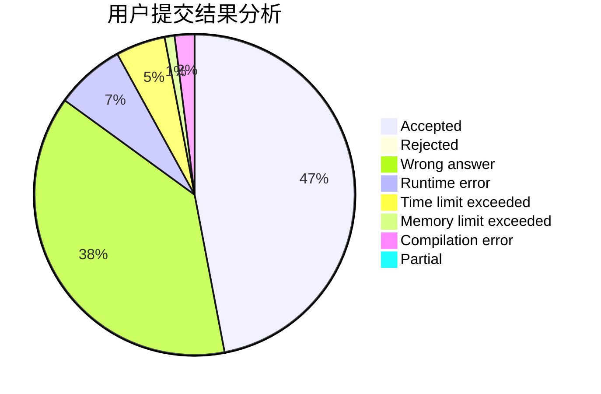
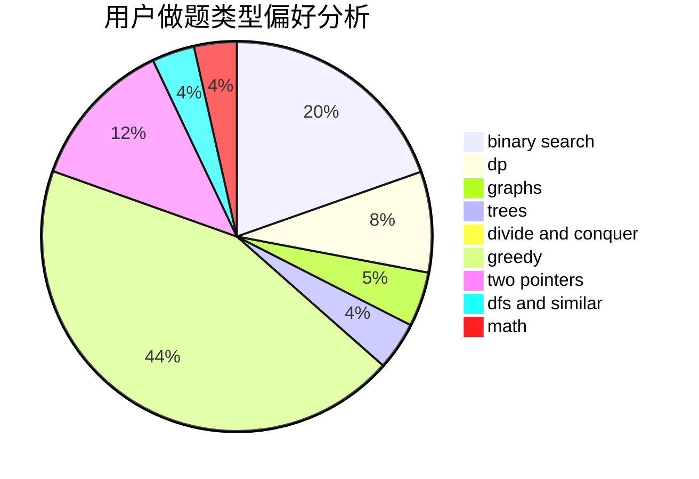

# playf

<!-- tabs:start -->

#### **用户提交结果分析**

#### **用户做题类型偏好分析**

<!-- tabs:end -->
# 推荐题目
[375D](https://codeforces.com/contest/375/problem/D)
[13771](https://codeforces.com/contest/1377/problem/1)
[908H](https://codeforces.com/contest/908/problem/H)
[1382E](https://codeforces.com/contest/1382/problem/E)
[1415C](https://codeforces.com/contest/1415/problem/C)
[425A](https://codeforces.com/contest/425/problem/A)
[1360B](https://codeforces.com/contest/1360/problem/B)
[478E](https://codeforces.com/contest/478/problem/E)
[933A](https://codeforces.com/contest/933/problem/A)
[771C](https://codeforces.com/contest/771/problem/C)
