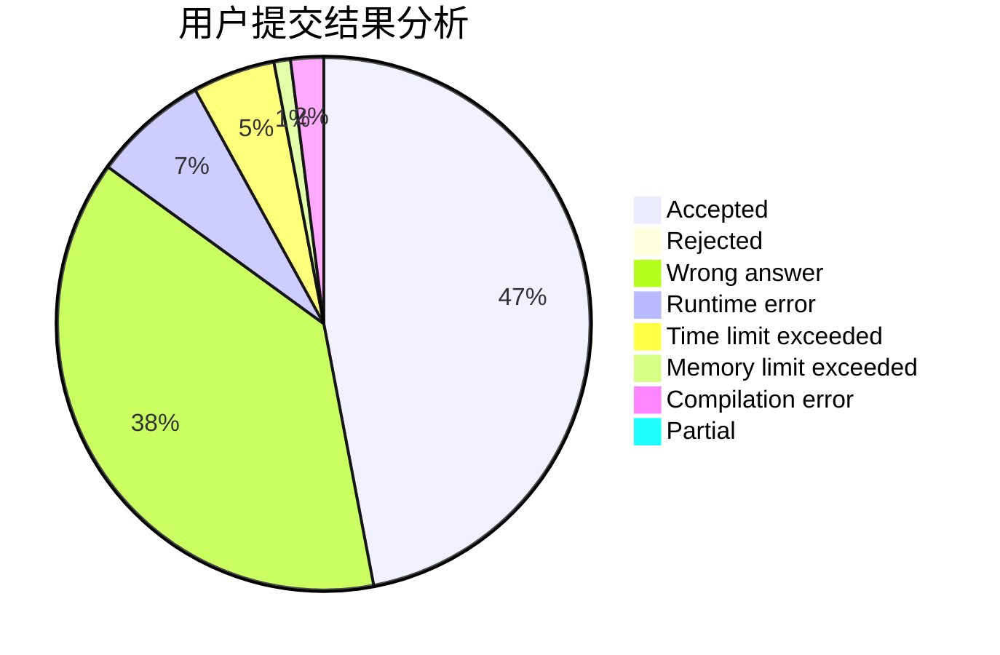
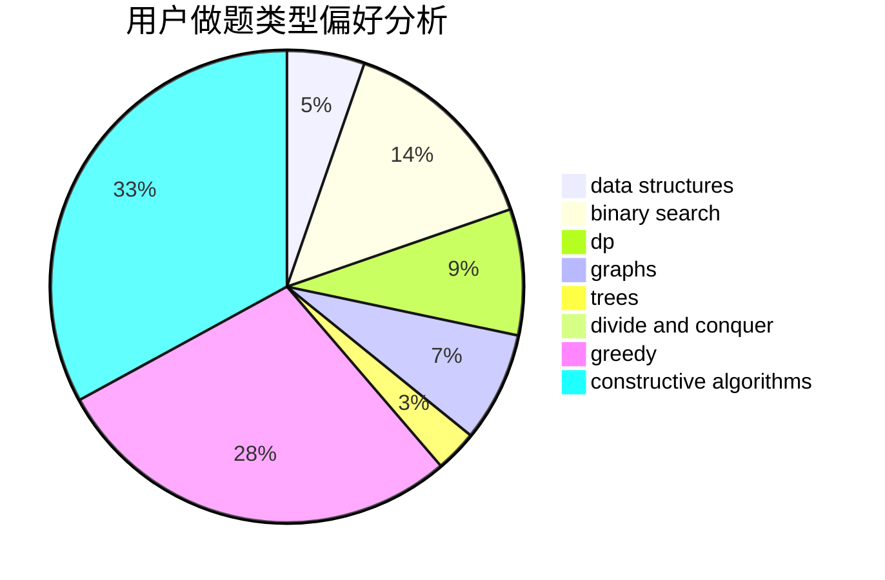
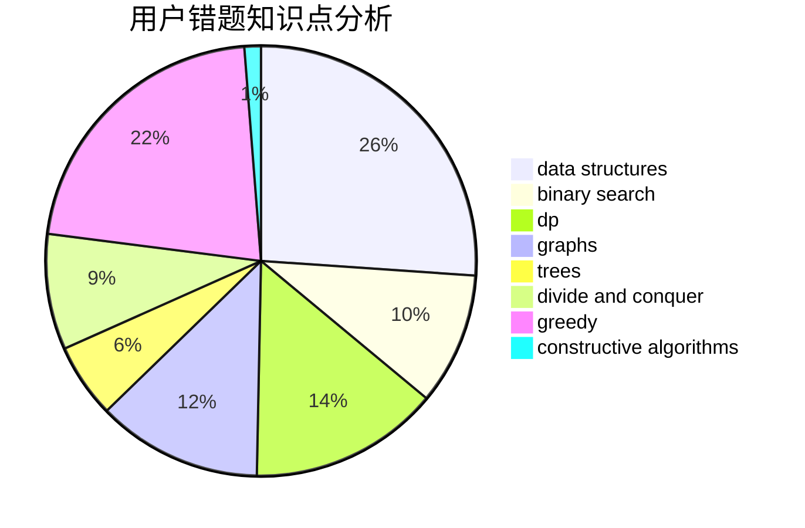

# playf

<!-- tabs:start -->

#### **用户提交结果分析**

#### **用户做题类型偏好分析**

#### **用户错题知识点分析**

<!-- tabs:end -->
# 推荐题目
[375D](https://codeforces.com/contest/375/problem/D)		data structures,
                        dfs and similar,
                        trees		  
[13771](https://codeforces.com/contest/1377/problem/1)		dsu,graphs,sortings,trees		  
[908H](https://codeforces.com/contest/908/problem/H)		nan		  
[1382E](https://codeforces.com/contest/1382/problem/E)		dsu,graphs,sortings,trees		  
[1415C](https://codeforces.com/contest/1415/problem/C)		brute force,
                        dp,
                        implementation		  
[425A](https://codeforces.com/contest/425/problem/A)		brute force,
                        sortings		  
[1360B](https://codeforces.com/contest/1360/problem/B)		greedy,
                        sortings		  
[478E](https://codeforces.com/contest/478/problem/E)		brute force,
                        dfs and similar,
                        meet-in-the-middle,
                        sortings		  
[933A](https://codeforces.com/contest/933/problem/A)		dp		  
[771C](https://codeforces.com/contest/771/problem/C)		dfs and similar,
                        dp,
                        trees		  
