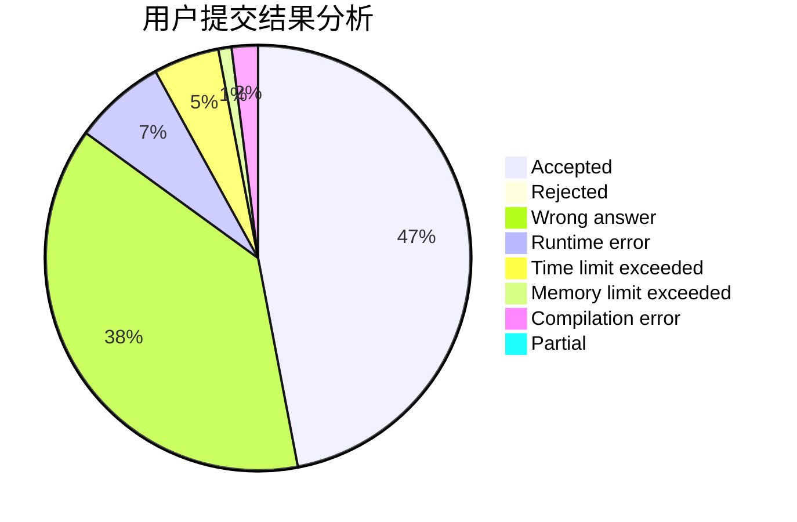
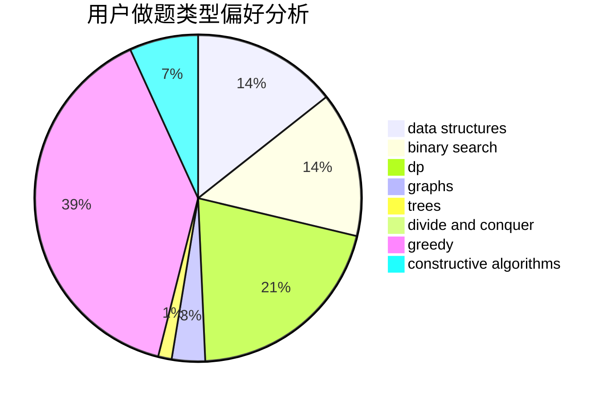
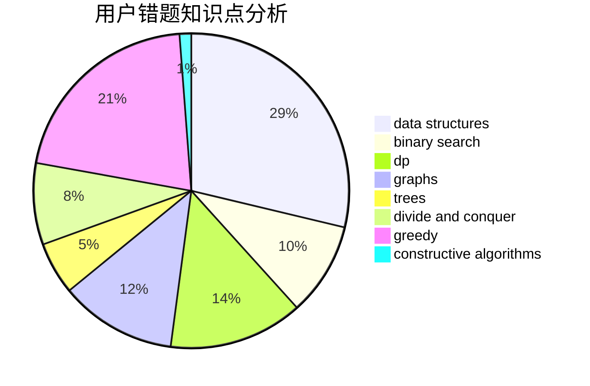

# playf

<!-- tabs:start -->

#### **用户提交结果分析**

#### **用户做题类型偏好分析**

#### **用户错题知识点分析**

<!-- tabs:end -->
# 推荐题目
[348D](https://codeforces.com/contest/348/problem/D)		dp,
                        matrices		  
[1369F](https://codeforces.com/contest/1369/problem/F)		dfs and similar,
                        dp,
                        games		  
[889E](https://codeforces.com/contest/889/problem/E)		binary search,
                        dp,
                        math		  
[1374A](https://codeforces.com/contest/1374/problem/A)		math		  
[1404A](https://codeforces.com/contest/1404/problem/A)		implementation,
                        strings		  
[398C](https://codeforces.com/contest/398/problem/C)		constructive algorithms		  
[1353D](https://codeforces.com/contest/1353/problem/D)		constructive algorithms,
                        data structures,
                        sortings		  
[45A](https://codeforces.com/contest/45/problem/A)		implementation		  
[914B](https://codeforces.com/contest/914/problem/B)		games,
                        greedy,
                        implementation		  
[750G](https://codeforces.com/contest/750/problem/G)		bitmasks,
                        brute force,
                        combinatorics,
                        dp		  
