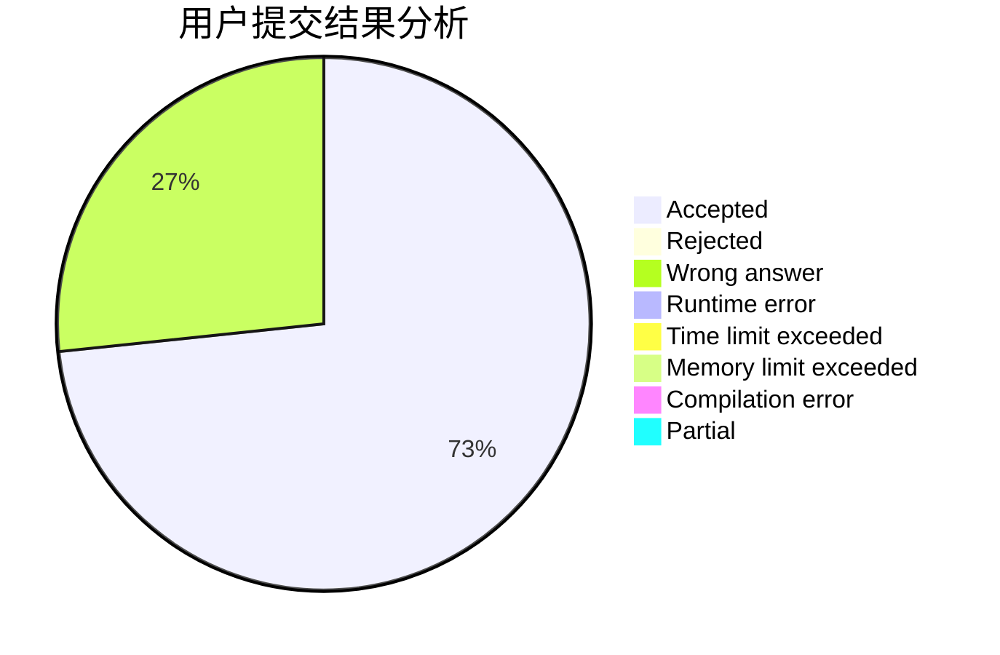
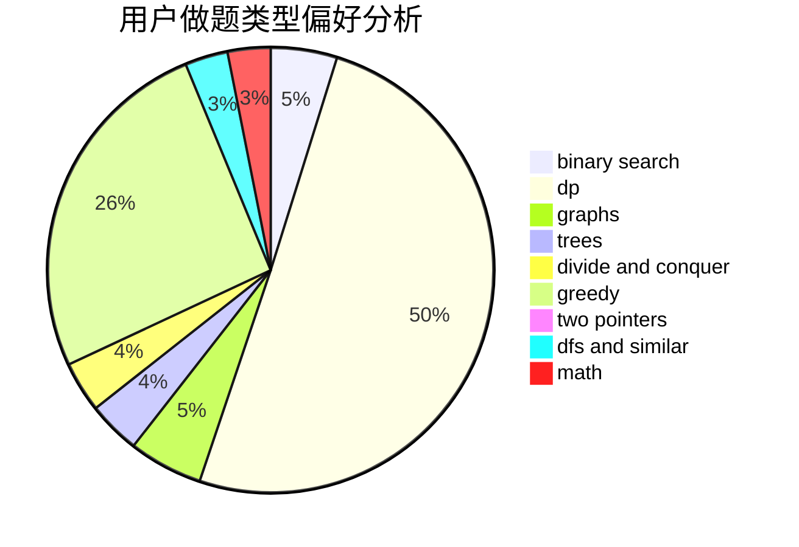

# pmt2018

<!-- tabs:start -->

#### **用户提交结果分析**

#### **用户做题类型偏好分析**

<!-- tabs:end -->
# 推荐题目
[20A](https://codeforces.com/contest/20/problem/A)
[909A](https://codeforces.com/contest/909/problem/A)
[1380F](https://codeforces.com/contest/1380/problem/F)
[453D](https://codeforces.com/contest/453/problem/D)
[891B](https://codeforces.com/contest/891/problem/B)
[1260F](https://codeforces.com/contest/1260/problem/F)
[1266A](https://codeforces.com/contest/1266/problem/A)
[660D](https://codeforces.com/contest/660/problem/D)
[11302](https://codeforces.com/contest/1130/problem/2)
[118A](https://codeforces.com/contest/118/problem/A)
