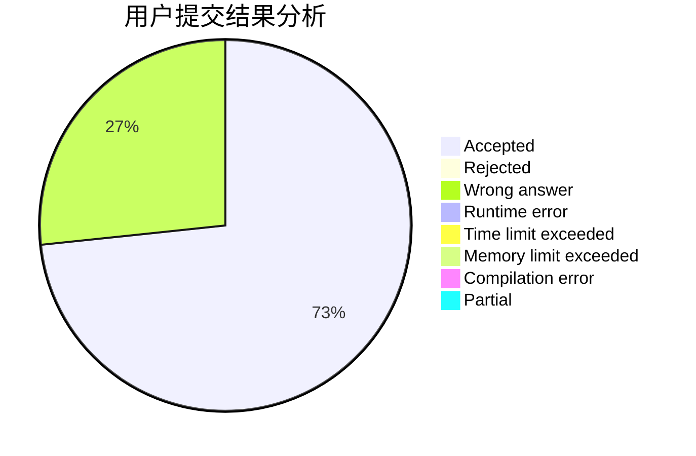
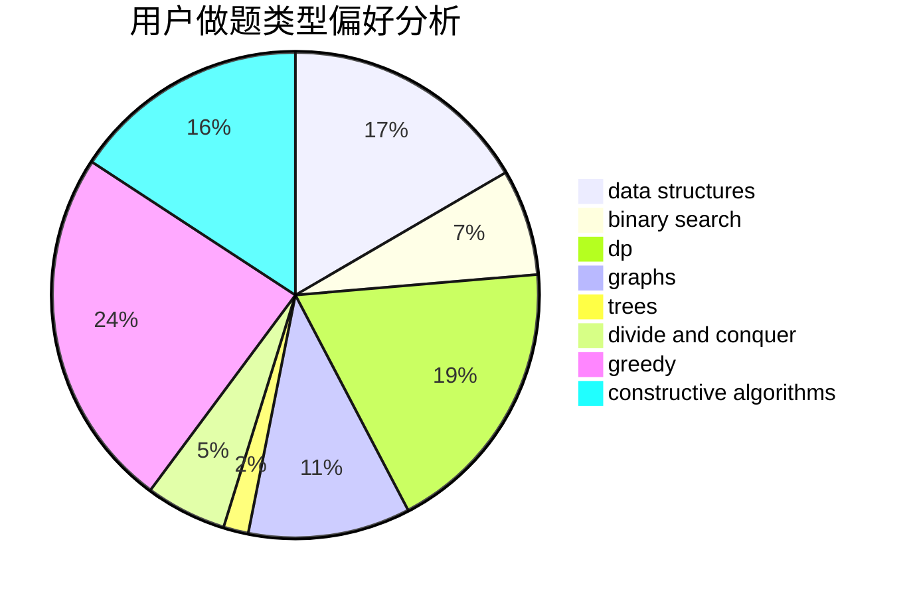
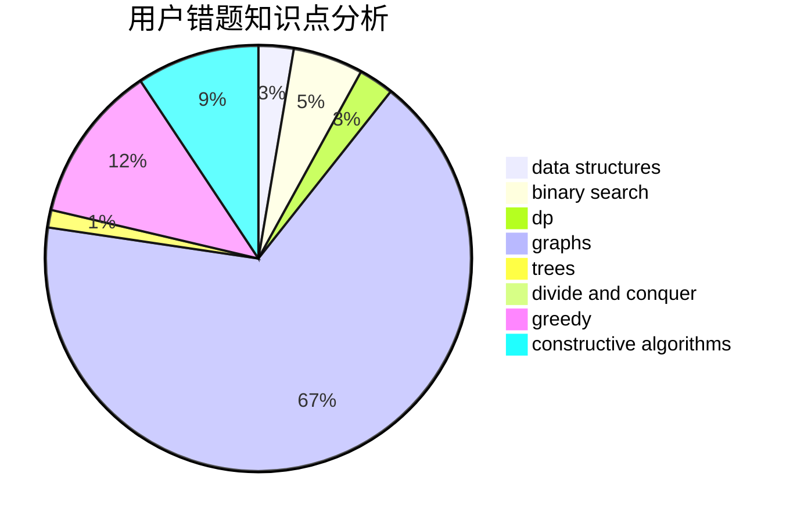

# pmt2018

<!-- tabs:start -->

#### **用户提交结果分析**

#### **用户做题类型偏好分析**

#### **用户错题知识点分析**

<!-- tabs:end -->
# 推荐题目
[20A](https://codeforces.com/contest/20/problem/A)		implementation		  
[909A](https://codeforces.com/contest/909/problem/A)		brute force,
                        greedy,
                        sortings		  
[1380F](https://codeforces.com/contest/1380/problem/F)		data structures,
                        dp,
                        matrices		  
[453D](https://codeforces.com/contest/453/problem/D)		dp,
                        matrices		  
[891B](https://codeforces.com/contest/891/problem/B)		constructive algorithms,
                        greedy		  
[1260F](https://codeforces.com/contest/1260/problem/F)		data structures,
                        trees		  
[1266A](https://codeforces.com/contest/1266/problem/A)		chinese remainder theorem,
                        math		  
[660D](https://codeforces.com/contest/660/problem/D)		geometry		  
[11302](https://codeforces.com/contest/1130/problem/2)		dsu,graphs,sortings,trees		  
[118A](https://codeforces.com/contest/118/problem/A)		implementation,
                        strings		  
