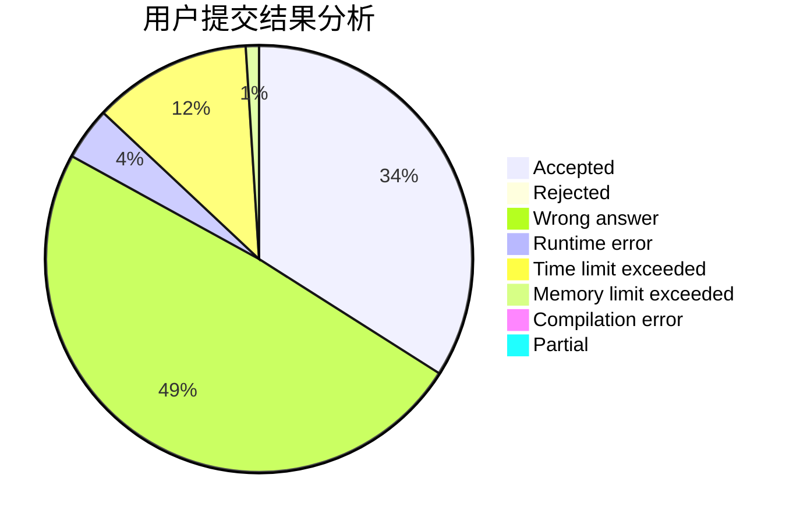
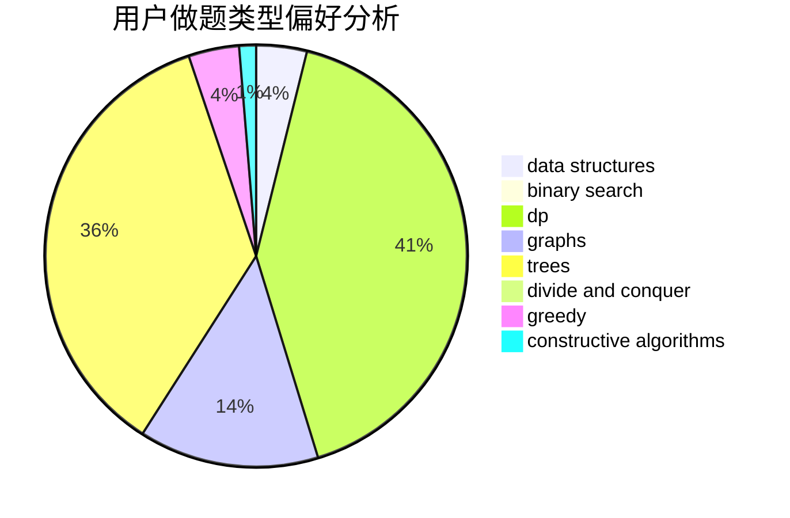
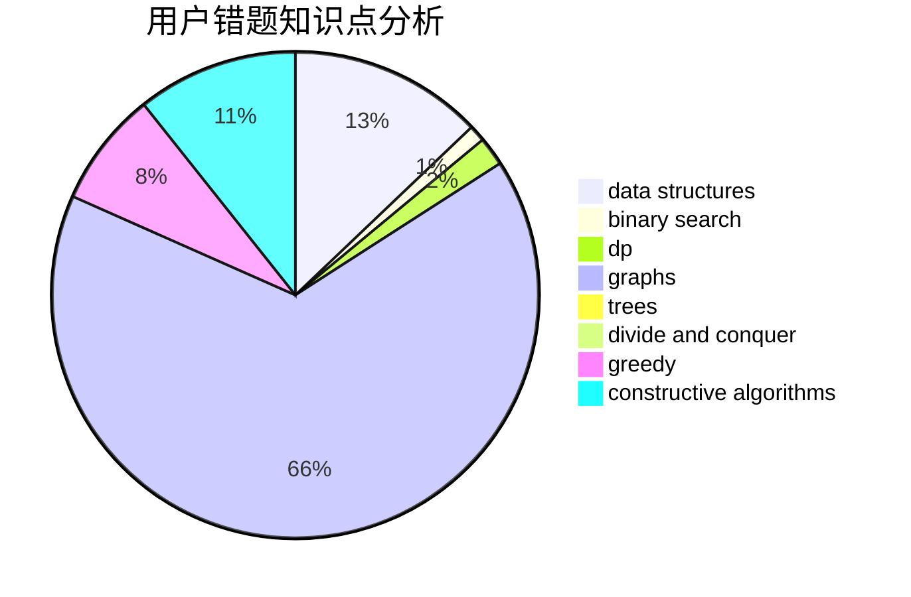

# pnershy13

<!-- tabs:start -->

#### **用户提交结果分析**

#### **用户做题类型偏好分析**

#### **用户错题知识点分析**

<!-- tabs:end -->
# 推荐题目
[1166D](https://codeforces.com/contest/1166/problem/D)		binary search,
                        brute force,
                        greedy,
                        math		  
[1280A](https://codeforces.com/contest/1280/problem/A)		implementation,
                        math		  
[59E](https://codeforces.com/contest/59/problem/E)		graphs,
                        shortest paths		  
[988A](https://codeforces.com/contest/988/problem/A)		brute force,
                        implementation		  
[1037G](https://codeforces.com/contest/1037/problem/G)		games		  
[1284E](https://codeforces.com/contest/1284/problem/E)		combinatorics,
                        geometry,
                        math,
                        sortings		  
[551A](https://codeforces.com/contest/551/problem/A)		brute force,
                        implementation,
                        sortings		  
[513A](https://codeforces.com/contest/513/problem/A)		constructive algorithms,
                        math		  
[811B](https://codeforces.com/contest/811/problem/B)		implementation,
                        sortings		  
[833C](https://codeforces.com/contest/833/problem/C)		brute force,
                        combinatorics,
                        greedy,
                        math		  
