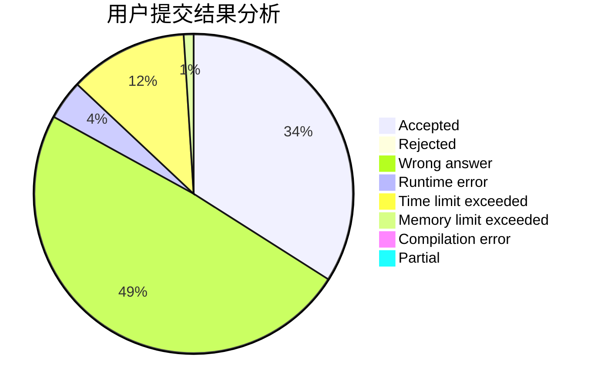
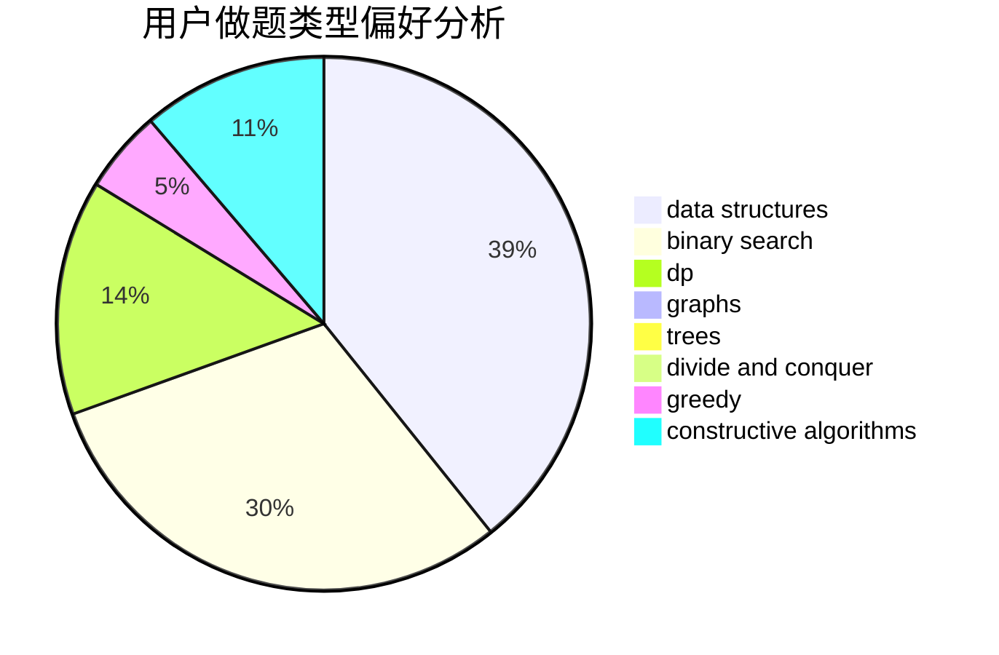
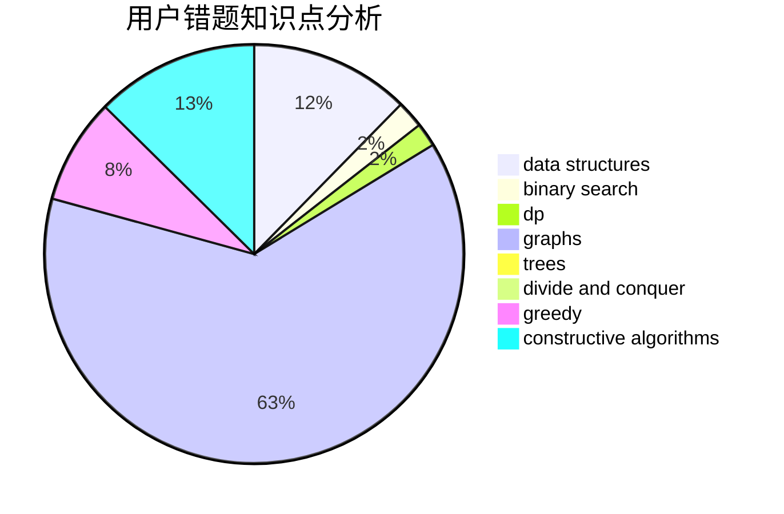

# pnershy13

<!-- tabs:start -->

#### **用户提交结果分析**

#### **用户做题类型偏好分析**

#### **用户错题知识点分析**

<!-- tabs:end -->
# 推荐题目
[1164M](https://codeforces.com/contest/1164/problem/M)		dsu,graphs,sortings,trees		  
[1270H](https://codeforces.com/contest/1270/problem/H)		data structures		  
[578F](https://codeforces.com/contest/578/problem/F)		matrices,
                        trees		  
[966B](https://codeforces.com/contest/966/problem/B)		dsu,graphs,sortings,trees		  
[1037D](https://codeforces.com/contest/1037/problem/D)		dfs and similar,
                        graphs,
                        shortest paths,
                        trees		  
[1278C](https://codeforces.com/contest/1278/problem/C)		data structures,
                        dp,
                        greedy,
                        implementation		  
[526G](https://codeforces.com/contest/526/problem/G)		greedy,
                        trees		  
[493D](https://codeforces.com/contest/493/problem/D)		constructive algorithms,
                        games,
                        math		  
[797C](https://codeforces.com/contest/797/problem/C)		data structures,
                        greedy,
                        strings		  
[814E](https://codeforces.com/contest/814/problem/E)		combinatorics,
                        dp,
                        graphs,
                        shortest paths		  
