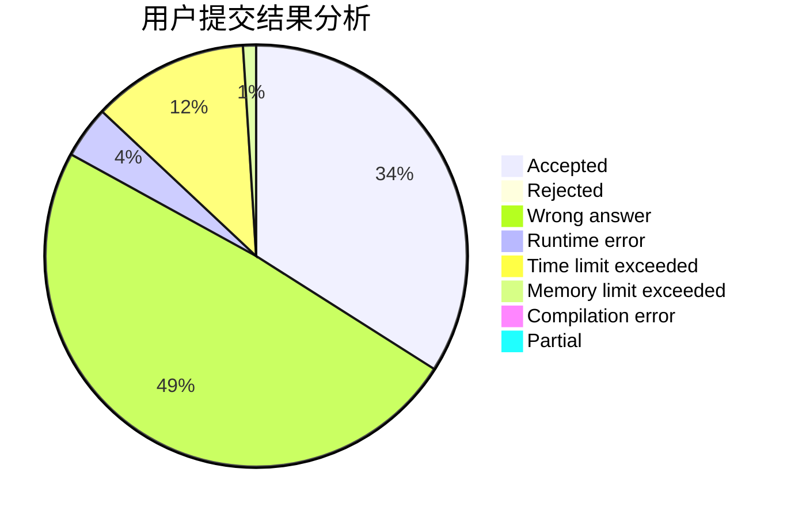
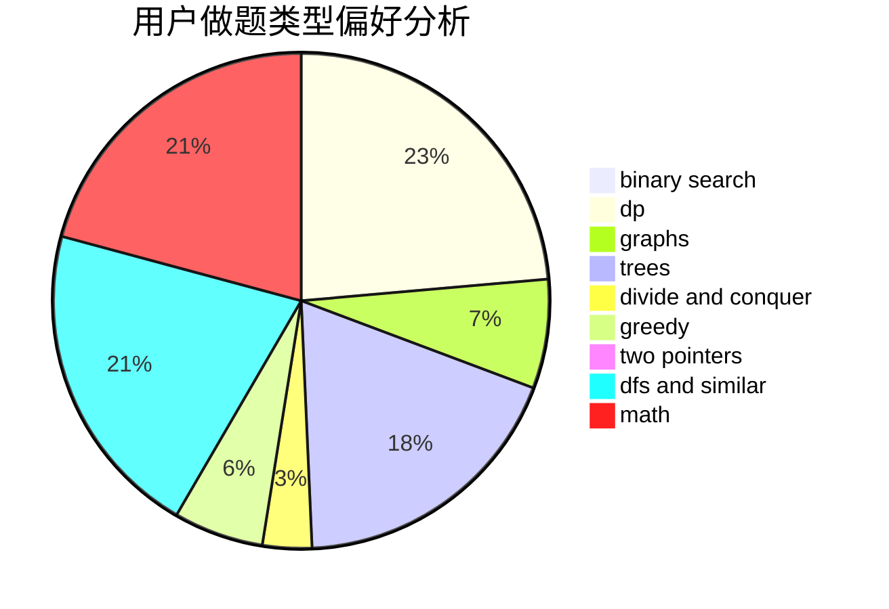

# pnershy13

<!-- tabs:start -->

#### **用户提交结果分析**

#### **用户做题类型偏好分析**

<!-- tabs:end -->
# 推荐题目
[1166D](https://codeforces.com/contest/1166/problem/D)
[1280A](https://codeforces.com/contest/1280/problem/A)
[59E](https://codeforces.com/contest/59/problem/E)
[988A](https://codeforces.com/contest/988/problem/A)
[1037G](https://codeforces.com/contest/1037/problem/G)
[1284E](https://codeforces.com/contest/1284/problem/E)
[551A](https://codeforces.com/contest/551/problem/A)
[513A](https://codeforces.com/contest/513/problem/A)
[811B](https://codeforces.com/contest/811/problem/B)
[833C](https://codeforces.com/contest/833/problem/C)
