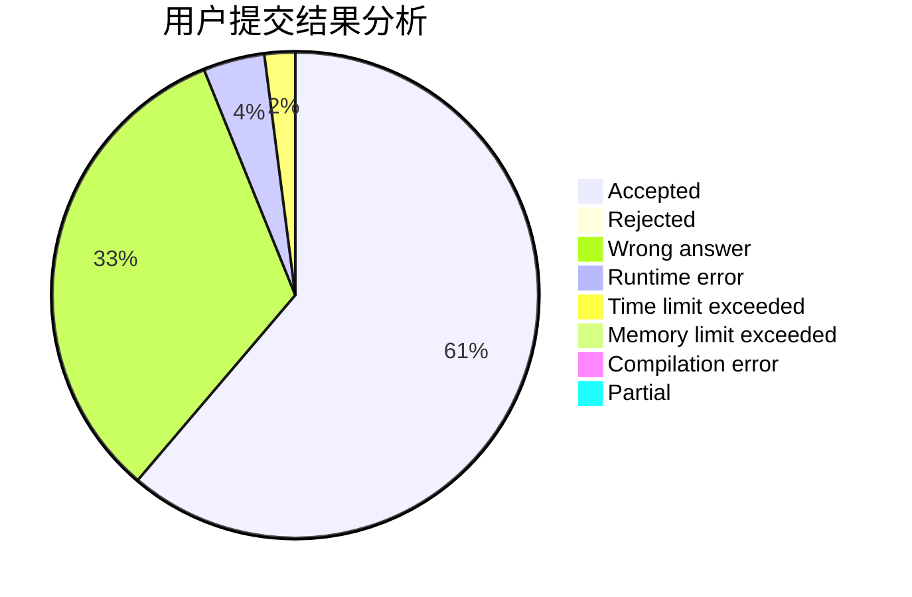
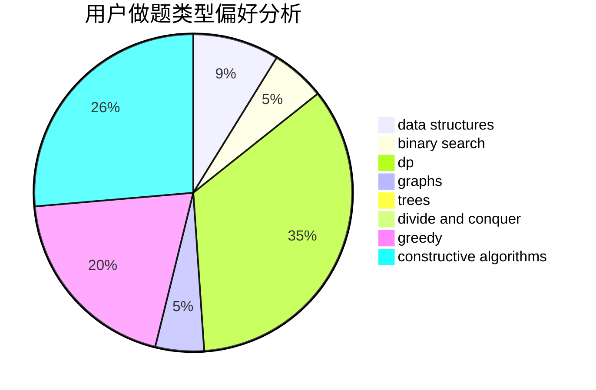
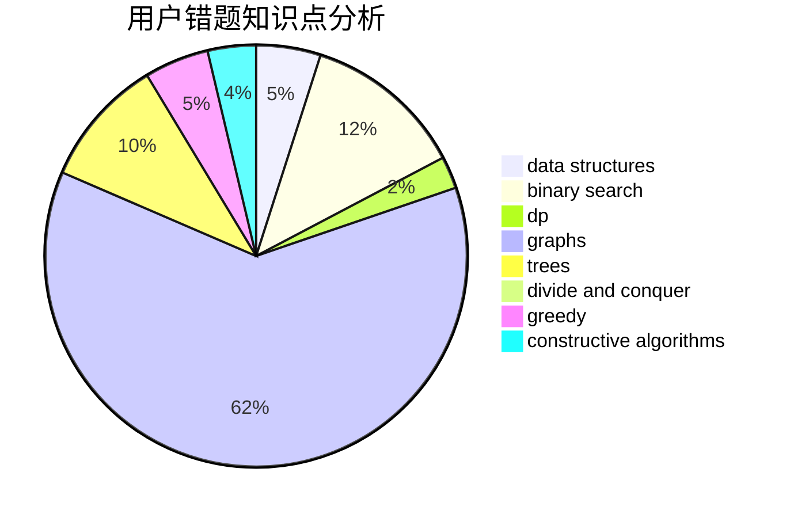

# polkmn

<!-- tabs:start -->

#### **用户提交结果分析**

#### **用户做题类型偏好分析**

#### **用户错题知识点分析**

<!-- tabs:end -->
# 推荐题目
[1432C](https://codeforces.com/contest/1432/problem/C)		dsu,graphs,sortings,trees		  
[516E](https://codeforces.com/contest/516/problem/E)		math,
                        number theory		  
[581B](https://codeforces.com/contest/581/problem/B)		implementation,
                        math		  
[112A](https://codeforces.com/contest/112/problem/A)		implementation,
                        strings		  
[723C](https://codeforces.com/contest/723/problem/C)		greedy		  
[736E](https://codeforces.com/contest/736/problem/E)		constructive algorithms,
                        flows,
                        greedy,
                        math		  
[1346E](https://codeforces.com/contest/1346/problem/E)		*special problem,
                        dp,
                        graphs		  
[1132D](https://codeforces.com/contest/1132/problem/D)		binary search,
                        greedy		  
[405A](https://codeforces.com/contest/405/problem/A)		greedy,
                        implementation,
                        sortings		  
[1C](https://codeforces.com/contest/1/problem/C)		geometry,
                        math		  
